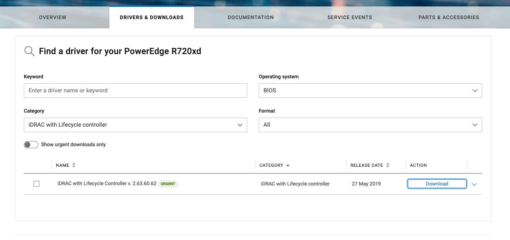
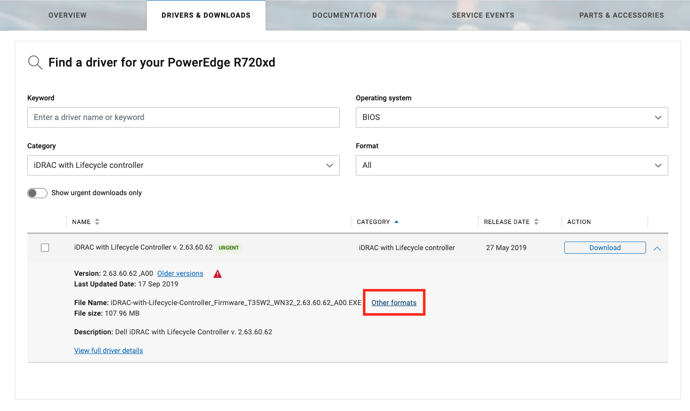
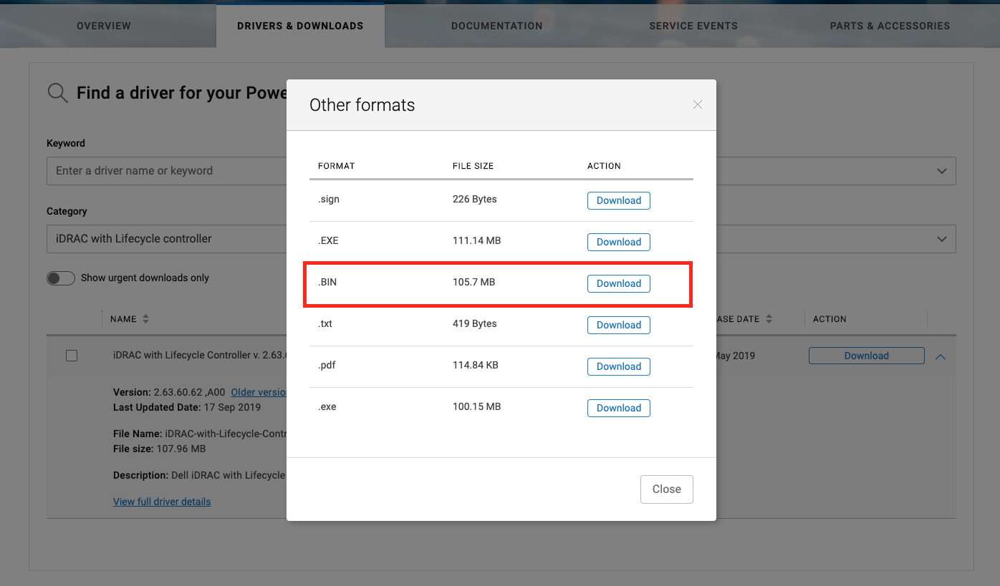
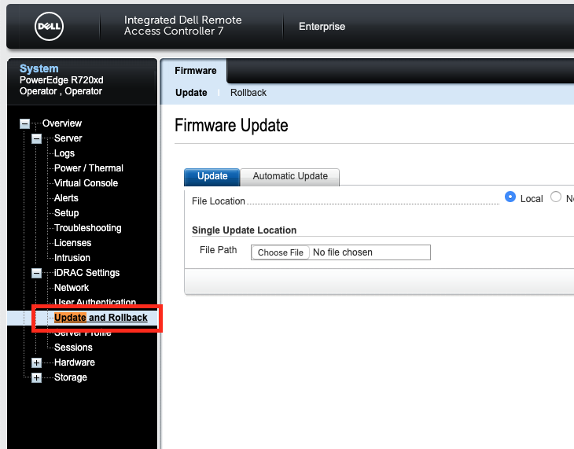
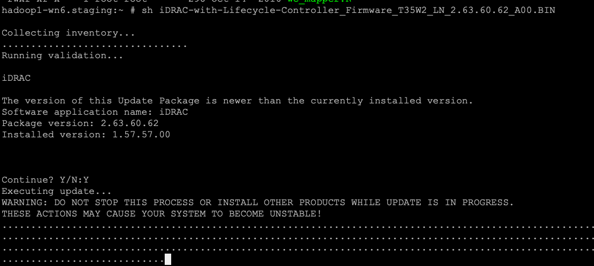

Upgrade Dell iDRAC Firmware
###########################

Download iDRAC Firmware
=======================

Find firmware to download
-------------------------

* https://www.dell.com/support/home/us/en/04/?app=drivers
* Select BIOS as operating systems and search by DRAC

Select firmware format
----------------------

* On Download button click on **V** and select other format

Upgrade iDRAC firmware through iDRAC
====================================

Upgrade iDRAC firmware through Linux
====================================

