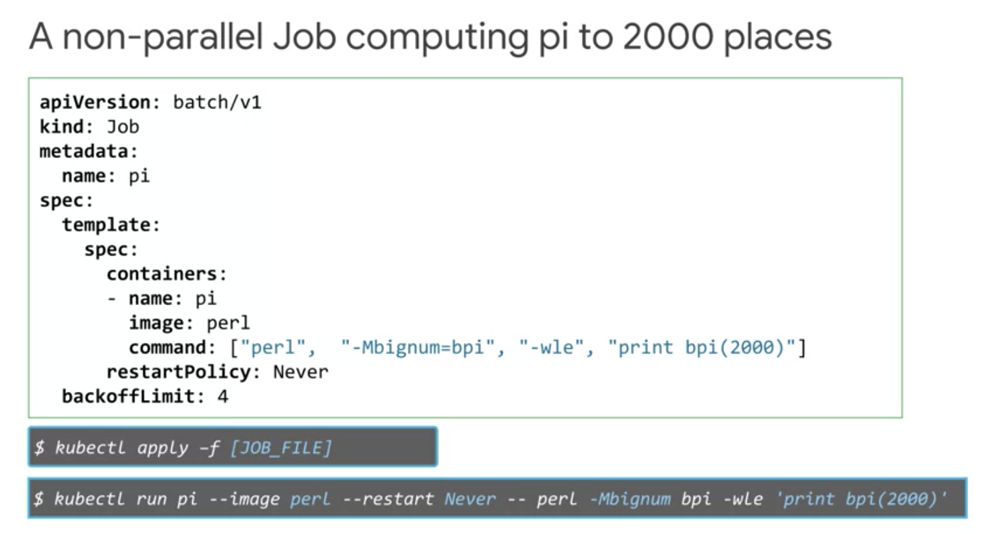
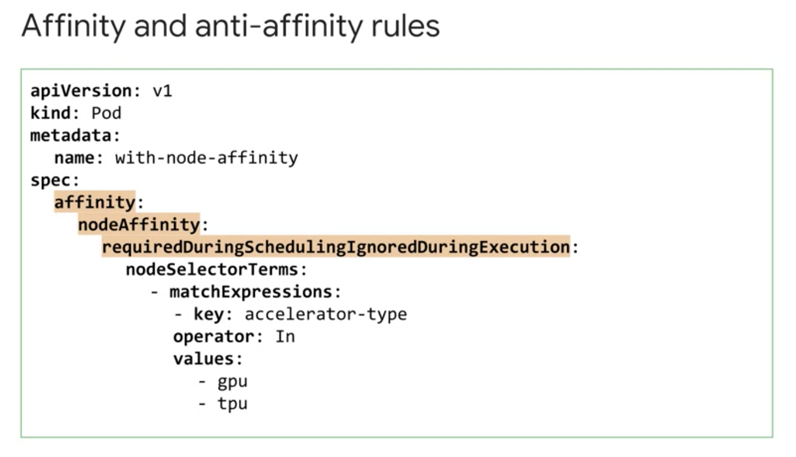
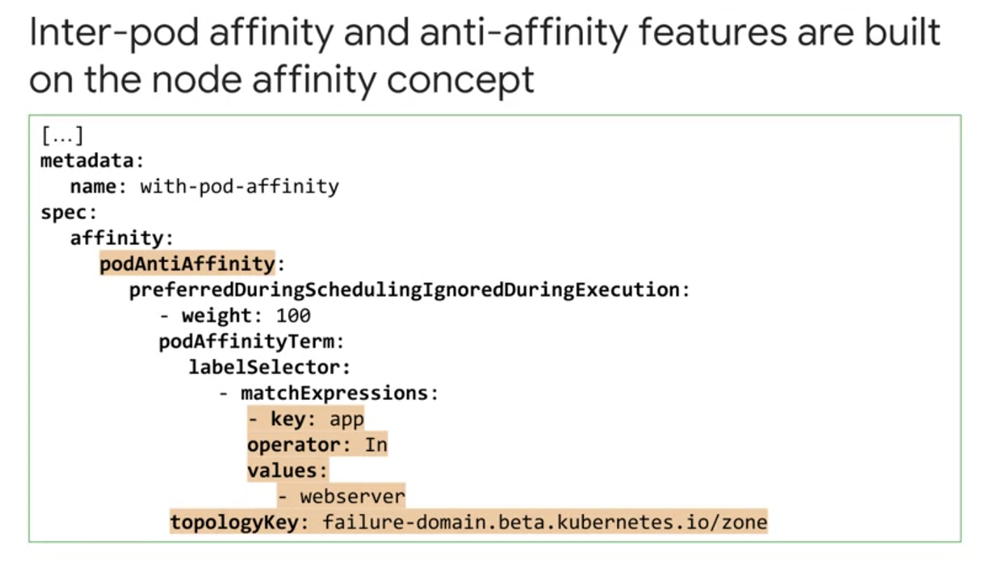
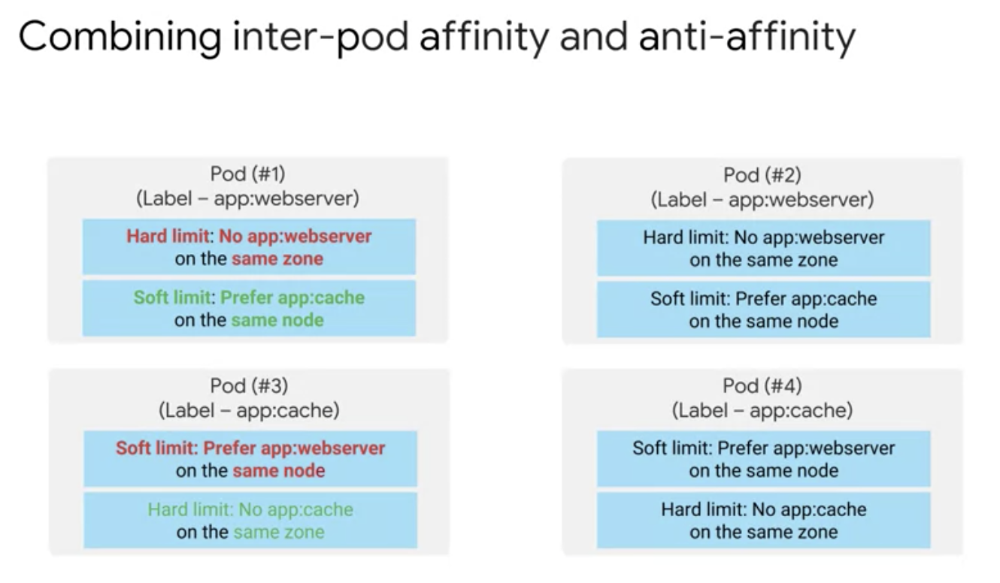
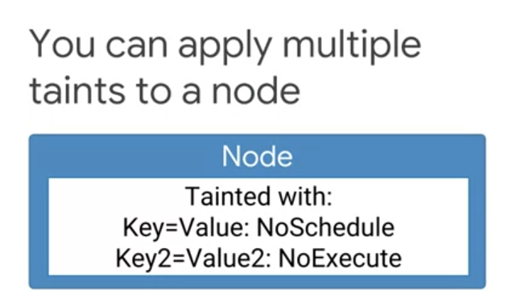

Google Cloud Kubernetes Workload
================================

kubectl autocomplete
--------------------

https://kubernetes.io/docs/reference/kubectl/cheatsheet/#kubectl-autocomplete

kubectl command
---------------

Summary
>>>>>>>

* kubectl is a utility used by admin to control Kubernetes cluster
* kubectl is composed of serveral parts, such as command, type, name, and optional flags

.. image:: ./images/gcp_k8e_workload/kubectl_cmd.png

kubctl config
>>>>>>>>>>>>>

* relies on config file: **$HOME/.kube/config**
* config file contains

  * target cluster name
  * credentials for the cluster
  
* to see current config,

.. code-block:: bash

  kubectl config view
  
  
retrieve credentials for cluster
>>>>>>>>>>>>>>>>>>>>>>>>>>>>>>>>

.. code-block::

  gcloud containers clusters \
  get-credentials [cluster_name] \
  --zone [ZONE_NAME]
  

Introspection
-------------

kubectl get
>>>>>>>>>>>

* Pod phases:

  * Pending
  * Running
  * Successed
  * Failed
  * Unkown
  * CrahLoopBackOff

kubectl describe
>>>>>>>>>>>>>>>>

kubectl exec
>>>>>>>>>>>>

Running a command within a pod

.. code-block:: bash

  # kubectl exec -it [pod_name] -- [command]
  # -i is for std input
  # -t tells std input is TTY
  # -c is to attch to specfic pod
  kubectl exec -it demo -- /bin/bash

kubectl logs
>>>>>>>>>>>>

Cluster
-------

Create cluster
>>>>>>>>>>>>>>

.. code-block:: bash

  # ref: https://cloud.google.com/sdk/gcloud/reference/container/clusters/create
  gcloud container clusters create $my_cluster --num-nodes 3 --zone $my_zone --enable-ip-alias
  

Increase Node in cluster
>>>>>>>>>>>>>>>>>>>>>>>>

.. code-block:: bash

  gcloud container clusters resize $my_cluster --zone $my_zone --size=4
  

Connect to GKE cluster
>>>>>>>>>>>>>>>>>>>>>>

.. code-block:: bash

  $ gcloud container clusters get-credentials $my_cluster --zone $my_zone
  Fetching cluster endpoint and auth data.
  kubeconfig entry generated for standard-cluster-1.
  
  
Inspect GKE cluster
>>>>>>>>>>>>>>>>>>>

.. code-block:: bash

  # print content of the kubeconfig
  kubectl config view
  # print cluster information
  kubectl cluster-info
  # print out the active context
  kubectl config current-context
  # print out some details for all the cluster contexts in the kubeconfig file
  kubectl config get-contexts
  # change active context
  kubectl config use-context gke_${GOOGLE_CLOUD_PROJECT}_us-central1-a_standard-cluster-1
  

Enable kubectl command hint
>>>>>>>>>>>>>>>>>>>>>>>>>>>

.. code-block:: bash

  source <(kubectl completion bash)
  

Deploy Pods
>>>>>>>>>>>>

.. code-block:: bash

  $ kubectl run nginx-1 --image nginx:latest
  
  $ kubectl get pods
  NAME                      READY   STATUS    RESTARTS   AGE
  nginx-1-6866cfb98-ckpq8   1/1     Running   0          36s
  
  $ kubectl describe pod nginx-1-6866cfb98-ckpq8

Copy file to container
>>>>>>>>>>>>>>>>>>>>>>

.. code-block:: bash

  kubectl cp ~/test.html $my_nginx_pod:/usr/share/nginx/html/test.html
  

Expose Pod for testing
>>>>>>>>>>>>>>>>>>>>>>

.. code-block:: bash

  $ kubectl expose pod $my_nginx_pod --port 80 --type LoadBalancer
  service/nginx-1-6866cfb98-ckpq8 exposed

  $ kubectl get services
  NAME                      TYPE           CLUSTER-IP     EXTERNAL-IP   PORT(S)        AGE
  kubernetes                ClusterIP      10.12.0.1      <none>        443/TCP        21m
  nginx-1-6866cfb98-ckpq8   LoadBalancer   10.12.10.222   <pending>     80:31652/TCP   9s
  

Deploy Pods with config
>>>>>>>>>>>>>>>>>>>>>>>

.. code-block:: bash

    $ git clone https://github.com/GoogleCloudPlatformTraining/training-data-analyst
    $ cd ~/training-data-analyst/courses/ak8s/04_GKE_Shell/

    # sample config
    $ cat new-nginx-pod.yaml 
    apiVersion: v1
    kind: Pod
    metadata:
      name: new-nginx
      labels:
        name: new-nginx
    spec:
      containers:
      - name: new-nginx
        image: nginx
        ports:
        - containerPort: 80
        
    # deploy pod
    $ kubectl apply -f ./new-nginx-pod.yaml

Check running pods
>>>>>>>>>>>>>>>>>>

.. code-block:: bash

  $ kubectl get pods
  NAME                      READY   STATUS    RESTARTS   AGE
  new-nginx                 1/1     Running   0          14s
  nginx-1-6866cfb98-ckpq8   1/1     Running   0          15m

Connect to container in pod
>>>>>>>>>>>>>>>>>>>>>>>>>>>

.. code-block:: bash

  # connecting container in pod
  # if there is more than one container, then -c can be used to connect to specific conatiner.
  $ kubectl exec -it new-nginx /bin/bash

Port-forwarding
>>>>>>>>>>>>>>>

.. code-block:: bash

  # port-forwarding
  $ kubectl port-forward new-nginx 10081:80

View logging
>>>>>>>>>>>>>>>

.. code-block:: bash

  # monitor logging
  $ kubectl port-forward new-nginx 10081:80
  

Deployments
-----------

Deployments defines/describe a desired of state of pods

Once deployment config YAML is submitted Kubernetes master, Kubernetes creates **deployment controller**. Deployment Controller is
responsible for converting the desired state(config) to reality and keeping the desired state over time.

Deployment Usage
>>>>>>>>>>>>>>>>

Three ways to create deployment
>>>>>>>>>>>>>>>>>>>>>>>>>>>>>>>

* create a deployment **declaratively** using a manifest file, such as a YAML

.. code-block:: bash

  kubectl apply -f [DEPLOYMENT_FILE]
  
  
* creates a deployment **imperatively**, using a kubectl run command 

.. code-block:: bash

  kubectl run [DEPLOYMENT_NAME] \
  --image [IMAGE]:[TAG]
  --replicas 3 \
  --labels [KEY]=[VALUE] \
  --port 8080 \
  --generator deployment/app.v1 \
  --save-config
  
* using GCP Console

How to inspect Deployment
>>>>>>>>>>>>>>>>>>>>>>>>>

.. code-block:: bash

  kubectl get deployment [DEPLOYMENT_NAME]

How to print/output Deployment config in a YAML format
>>>>>>>>>>>>>>>>>>>>>>>>>>>>>>>>>>>>>>>>>>>>>>>>>>>>>>

.. code-block:: bash

  kubectl get deployment [DEPLOYMENT_NAME] -o yaml > this.yaml
  
  
How to get more details about Deployment
>>>>>>>>>>>>>>>>>>>>>>>>>>>>>>>>>>>>>>>>

.. code-block:: bash

  kubectl describe deployment [DEPLOYMENT_NAME]
  

Scaling deployments
>>>>>>>>>>>>>>>>>>>

.. image:: ./images/gcp_k8e_workload/service_loadbalancing.png

.. code-block:: bash

  # manual-scaling a deployment
  kubectl scale deployemnt [DEPLOYMENT_NAME] --replicas=5
  
  # autos-caling a deployment
  kubectl autoscale deployemnt [DEPLOYMENT_NAME] --min=5 --max=15 --cpu-percent=75
  

How to udpate Deployment
>>>>>>>>>>>>>>>>>>>>>>>>

* update pod specification ( YAML )

  * automatic update rollout will happen
  * only applicable to the changes in port specifications
  

* use updated deployment YAML ( kubectl apply -f [DEPLOYMENT_FILE] )

  * allowing to update other specification of a deployment, such as number of replicas
  
* use `kubectl set`
  
  * allowing to change pod specifications for the deployment, such as images, resources, or selector values.

* use `kubectl edit` 

  * once exit/saved, kubectl automatically applies the updated file.
  
* use GCP console

Deployment strategy - Rolling updates
>>>>>>>>>>>>>>>>>>>>>>>>>>>>>>>>>>>>>

* **max unavailable:** specific number or percentage

.. image:: ./images/gcp_k8e_workload/deployment_rollout_max_unavailable.png

* **max surge:** specifying max number of pods that can be created concurrently in a new replica set

.. image:: ./images/gcp_k8e_workload/deployment_rollout_max_max_surge_percentage.png

Deployment strategy - Blue/Green
>>>>>>>>>>>>>>>>>>>>>>>>>>>>>>>>

.. image:: ./images/gcp_k8e_workload/deployment_blue_green.png

.. image:: ./images/gcp_k8e_workload/deployment_apply_blue_green.png

Deployment strategy - Canary
>>>>>>>>>>>>>>>>>>>>>>>>>>>>

.. image:: ./images/gcp_k8e_workload/deployment_canary.png

Deployment strategy - Canary
>>>>>>>>>>>>>>>>>>>>>>>>>>>>

* All Old Pods will be deleted before createing new pods

Deployment Rollback
>>>>>>>>>>>>>>>>>>>

.. image:: ./images/gcp_k8e_workload/deployment_rollback.png

Deployemt Three lifecycle states
>>>>>>>>>>>>>>>>>>>>>>>>>>>>>>>>

* progressing state
* complete state
* failed state

Pausing a deployment
>>>>>>>>>>>>>>>>>>>>

New updates won't be applied to the deployment where it's paused.

.. code-block:: bash

  kubectl rollout pause deployment [DEPLOYMENT_NAME]
  

Pausing a deployment
>>>>>>>>>>>>>>>>>>>>

All updates blocked by `pausing` will be applied as a single revision.

.. code-block:: bash

  kubectl rollout resume deployment [DEPLOYMENT_NAME]
  

Checking a deployment status
>>>>>>>>>>>>>>>>>>>>>>>>>>>>>

.. code-block:: bash

  kubectl rollout status deployment [DEPLOYMENT_NAME]
  

Delete a deployment
>>>>>>>>>>>>>>>>>>>

.. code-block:: bash

  kubectl rollout delete deployment [DEPLOYMENT_NAME]

Practicing Kubernete Deployment
-------------------------------

preparation
>>>>>>>>>>>

.. code-block:: bash

  export my_zone=us-central1-a
  export my_cluster=standard-cluster-1
  source <(kubectl completion bash)

bring up cluster
>>>>>>>>>>>>>>>>

.. code-block:: bash

  gcloud container clusters create $my_cluster --num-nodes 3  --enable-ip-alias --zone $my_zone

get access to cluster for kubectl
>>>>>>>>>>>>>>>>>>>>>>>>>>>>>>>>>

.. code-block:: bash

  gcloud container clusters get-credentials $my_cluster --zone $my_zone
  

prepare sample code
>>>>>>>>>>>>>>>>>>>

.. code-block:: bash

  git clone https://github.com/GoogleCloudPlatformTraining/training-data-analyst
  cd ~/training-data-analyst/courses/ak8s/06_Deployments/
  
  # check deployment YAML file
  $ cat nginx-deployment.yaml
  apiVersion: apps/v1
  kind: Deployment
  metadata:
    name: nginx-deployment
    labels:
      app: nginx
  spec:
    replicas: 3
    selector:
      matchLabels:
        app: nginx
    template:
      metadata:
        labels:
          app: nginx
      spec:
        containers:
        - name: nginx
          image: nginx:1.7.9
          ports:
          - containerPort: 80

create deployment
>>>>>>>>>>>>>>>>>

.. code-block:: bash

  $ kubectl apply -f ./nginx-deployment.yaml

  $ kubectl get deployments
  NAME               READY   UP-TO-DATE   AVAILABLE   AGE
  nginx-deployment   3/3     3            3           56s

  $ kubectl get pods
  NAME                                READY   STATUS    RESTARTS   AGE
  nginx-deployment-76bf4969df-f2mk2   1/1     Running   0          62s
  nginx-deployment-76bf4969df-njjnz   1/1     Running   0          62s
  nginx-deployment-76bf4969df-rmfqd   1/1     Running   0          62s

scale down / up manually
>>>>>>>>>>>>>>>>>>>>>>>>

.. code-block:: bash

  kubectl scale --replicas=2 deployment nginx-deployment
  kubectl scale --replicas=3 deployment nginx-deployment

Trigger a deployment rollout
>>>>>>>>>>>>>>>>>>>>>>>>>>>>>>>>>>>>>>>>>>>>>>>>>>>>

A deployment's rollout is triggered if and only if

  * the deployment's Pod template (that is, .spec.template) is changed
  * for example, if the labels or container images of the template are updated.

Other updates, such as scaling the deployment, do NOT trigger a rollout.

.. code-block:: bash

  # update the version of nginx in the deployment
  kubectl set image deployment.v1.apps/nginx-deployment nginx=nginx:1.9.1 --record

  # check rollout status
  $ kubectl rollout status deployment.v1.apps/nginx-deployment
  deployment "nginx-deployment" successfully rolled out

  # check rollout history
  $ kubectl rollout history deployment nginx-deployment
  deployment.extensions/nginx-deployment 
  REVISION  CHANGE-CAUSE
  1         <none>
  2         kubectl set image deployment.v1.apps/nginx-deployment nginx=nginx:1.9.1 --record=true

deployment rollback
>>>>>>>>>>>>>>>>>>>

.. code-block:: bash

  $ kubectl rollout undo deployments nginx-deployment
  deployment.extensions/nginx-deployment rolled back

  $ kubectl rollout history deployment nginx-deployment
  deployment.extensions/nginx-deployment 
  REVISION  CHANGE-CAUSE
  2         kubectl set image deployment.v1.apps/nginx-deployment nginx=nginx:1.9.1 --record=true
  3         <none>

  # View the details of the latest deployment revision 
  $ kubectl rollout history deployment/nginx-deployment --revision=3
  deployment.extensions/nginx-deployment with revision #3
  Pod Template:
    Labels:       app=nginx
          pod-template-hash=76bf4969df
    Containers:
     nginx:
      Image:      nginx:1.7.9
      Port:       80/TCP
      Host Port:  0/TCP
      Environment:        <none>
      Mounts:     <none>
    Volumes:      <none>

Define Service
>>>>>>>>>>>>>>

ClusterIP, NodePort or LoadBalancer types

.. code-block:: bash

  $ cat service-nginx.yaml
  apiVersion: v1
  kind: Service
  metadata:
    name: nginx
  spec:
    type: LoadBalancer
    selector:
      app: nginx
    ports:
    - protocol: TCP
      port: 60000
      targetPort: 80

  $ kubectl apply -f ./service-nginx.yaml

  $ kubectl get service
  NAME         TYPE           CLUSTER-IP   EXTERNAL-IP   PORT(S)           AGE
  kubernetes   ClusterIP      10.12.0.1    <none>        443/TCP           19m
  nginx        LoadBalancer   10.12.15.2   <pending>     60000:32516/TCP   16s

  $ kubectl get service nginx
  NAME    TYPE           CLUSTER-IP   EXTERNAL-IP     PORT(S)           AGE
  nginx   LoadBalancer   10.12.15.2   34.69.205.216   60000:32516/TCP   84s

  # open with http://[EXTERNAL_IP]:60000/
  
  
Canary deployment
>>>>>>>>>>>>>>>>>

.. code-block:: bash

  $ cat nginx-canary.yaml 
  apiVersion: apps/v1
  kind: Deployment
  metadata:
    name: nginx-canary
    labels:
      app: nginx
  spec:
    replicas: 1
    selector:
      matchLabels:
        app: nginx
    template:
      metadata:
        labels:
          app: nginx
          track: canary
          Version: 1.9.1
      spec:
        containers:
        - name: nginx
          image: nginx:1.9.1
          ports:
          - containerPort: 80

  $ kubectl apply -f nginx-canary.yaml

  $ kubectl get deployments
  NAME               READY   UP-TO-DATE   AVAILABLE   AGE
  nginx-canary       1/1     1            1           18s
  nginx-deployment   2/2     2            2           21m

  # Switch back to the Cloud Shell and scale down the primary deployment to 0 replicas
  $ kubectl scale --replicas=0 deployment nginx-deployment

  $ kubectl get deployments
  NAME               READY   UP-TO-DATE   AVAILABLE   AGE
  nginx-canary       1/1     1            1           70s
  nginx-deployment   0/0     0            0           21m

**Note: Session affinity**

  The Service configuration used in the lab does not ensure that all requests from a single client will always connect to the same Pod. Each request is treated separately and can connect to either the normal nginx deployment or to the nginx-canary deployment. This potential to switch between different versions may cause problems if there are significant changes in functionality in the canary release. To prevent this you can set the sessionAffinity field to ClientIP in the specification of the service if you need a client's first request to determine which Pod will be used for all subsequent connections.

.. code-block:: bash

  apiVersion: v1
  kind: Service
  metadata:
    name: nginx
  spec:
    type: LoadBalancer
    sessionAffinity: ClientIP
    selector:
      app: nginx
    ports:
    - protocol: TCP
      port: 60000
      targetPort: 80
 

Job and Cronjob
---------------

In GKE, a Job is a controller object that represents a finite task.

Job
>>>

* Job is a Kubernete's object
* In simplest form, job creats a pod and track the task completion within the pod.
* when the task is completed, job will terminate the pod and then report that the job is completed successfully.
* jobs manages a task up to its completion rather than an open-ended desired state.

Two ways to define a job
>>>>>>>>>>>>>>>>>>>>>>>>

* Non-parallel job
* Parallel job

Non-parallel job
>>>>>>>>>>>>>>>>

* create only one pod at a time
* completed:
  
  * when pod is terminated successfully
  * OR a completion counter is defined.
  * OR the required number of completions is reachted.

* **restartPolicy**

  * Never: pod will be re-launched
  * OnFailure: pod will be remained, only container will be restarted.
  
* **backoffLimit** 

  * specifies the number of retries before a job is considered to have failed entirely
  * failed pods are re-created with an exponetially increasing delay ( 10s, 20s, 40sec ... 6m )

* **activeDeadlineSeconds:**

  * activeDeadline Seconds has precedence over backoffLimit

Parallel job
>>>>>>>>>>>>

* Questions

  * With a Kubernetes Job configured with a parallelism value of 3 and no completion count what happens to the status of the Job when one of the Pods successfully terminates?

* creates multiple pods that work on the same task at the same time
* can be specified by setting the spec.parallelism value a job greater than one.
* two types

  * a fixed task completion count ( restarting pods until the completions count is reached )
  * processing a work queue
  
* completed:
  
  * when the number of pods that had terminated successfully reaches the completion count.
    

.. image:: ./images/gcp_k8e_workload/parallel_job_fixed_completion.png

.. image:: ./images/gcp_k8e_workload/parallel_job_work_queue.png

Inspect a job
>>>>>>>>>>>>>

.. code-block:: bash

  kubectl describe job [JOB_NAME]
  
  kubectl get pod -L [job-name=my-app-job]
  

Scale a job
>>>>>>>>>>>

.. code-block:: bash

  kubectl scale job [JOB_NAME} --replicas [VALUE]
  

Delete a job
>>>>>>>>>>>>

.. code-block:: bash

  kubectl delete -f [JOB_FILE]
  kubectl delete job [JOB_NAME]
  
  # retaining job pods
  kubectl delete job [JOB_NAME] --cascade false
  
  
Cronjobs
>>>>>>>>

* **kind:** CronJob
* **schedule:** "*/1 * * * *"
* what if job is not started at the scheduled time?

  * by default, CronJob looks at how many times the job has failed to run since it was last scheduled.
  *  If that failure count exceeds 100 and an error is logged, the the job is not scheduled.

* **startingDeadlineSeconds:**
* **concurrencyPolicy:**
* **suspend:**

  * suspended executions are counted as missed jobs
  
* **successfulJobHistoryLimit:**
* **failedJobHistoryLimit:**

.. image:: ./images/gcp_k8e_workload/manage_cronjob.png

Practice Deploying Jobs
-----------------------

Prepareation / Launch Kubernete cluster
>>>>>>>>>>>>>>>>>>>>>>>>>>>>>>>>>>>>>>>

.. code-block:: bash

  export my_zone=us-central1-a
  export my_cluster=standard-cluster-1
  source <(kubectl completion bash)
  gcloud container clusters create $my_cluster --num-nodes 3  --enable-ip-alias --zone $my_zone

Configure access to cluster for kubectl
>>>>>>>>>>>>>>>>>>>>>>>>>>>>>>>>>>>>>>>

.. code-block:: bash

  gcloud container clusters get-credentials $my_cluster --zone $my_zone

Prepare sample code
>>>>>>>>>>>>>>>>>>>

.. code-block:: bash

  git clone https://github.com/GoogleCloudPlatformTraining/training-data-analyst
  cd ~/training-data-analyst/courses/ak8s/07_Jobs_CronJobs
  
  $ cat example-job.yaml
  apiVersion: batch/v1
  kind: Job
  metadata:
    # Unique key of the Job instance
    name: example-job
  spec:
    template:
      metadata:
        name: example-job
      spec:
        containers:
        - name: pi
          image: perl
          command: ["perl"]
          args: ["-Mbignum=bpi", "-wle", "print bpi(2000)"]
        # Do not restart containers after they exit
        restartPolicy: Never

Create Job with job spec
>>>>>>>>>>>>>>>>>>>>>>>>

.. code-block:: bash

  $ kubectl apply -f example-job.yaml

Check Job status
>>>>>>>>>>>>>>>>

.. code-block:: bash

  $ kubectl get jobs
  NAME          COMPLETIONS   DURATION   AGE
  example-job   1/1           36s        4m28s

  $ kubectl get pod -L job-name=example-job
  NAME                READY   STATUS      RESTARTS   AGE   JOB-NAME=EXAMPLE-JOB
  example-job-z664w   0/1     Completed   0          57s

  $ kubectl describe job example-job
  Name:           example-job
  Namespace:      default
  Selector:       controller-uid=15fbd3c0-ef60-11e9-9e59-42010a800062
  Labels:         controller-uid=15fbd3c0-ef60-11e9-9e59-42010a800062
                  job-name=example-job
  Annotations:    kubectl.kubernetes.io/last-applied-configuration:
                    {"apiVersion":"batch/v1","kind":"Job","metadata":{"annotations":{},"name":"example-job","namespace":"default"},"spec":{"template":{"me
  tada...
  Parallelism:    1
  Completions:    1
  Start Time:     Tue, 15 Oct 2019 08:25:57 -0700
  Completed At:   Tue, 15 Oct 2019 08:26:33 -0700
  Duration:       36s
  Pods Statuses:  0 Running / 1 Succeeded / 0 Failed
  Pod Template:
    Labels:  controller-uid=15fbd3c0-ef60-11e9-9e59-42010a800062
             job-name=example-job
    Containers:
     pi:
      Image:      perl
      Port:       <none>
      Host Port:  <none>
      Command:
        perl
      Args:
        -Mbignum=bpi
        -wle
        print bpi(2000)
      Environment:  <none>
      Mounts:       <none>
    Volumes:        <none>
  Events:
    Type    Reason            Age    From            Message
    ----    ------            ----   ----            -------
    Normal  SuccessfulCreate  2m48s  job-controller  Created pod: example-job-z664w

Get Logs from pod
>>>>>>>>>>>>>>>>>

.. code-block:: bash

  # kubectl logs [POD_NAME]
  kubectl logs example-job-z664w

Clean up / Delete the job
>>>>>>>>>>>>>>>>>>>>>>>>>

.. code-block:: bash

  kubectl delete job example-job

Create and run a CronJob
>>>>>>>>>>>>>>>>>>>>>>>>

* **schedule**

  * required
  * Unix standard crontab format
  * in UTC

.. code-block:: bash

  git clone https://github.com/GoogleCloudPlatformTraining/training-data-analyst
  cd ~/training-data-analyst/courses/ak8s/07_Jobs_CronJobs
  
  $ cat example-cronjob.yaml
  apiVersion: batch/v1beta1
  kind: CronJob
  metadata:
    name: hello
  spec:
    schedule: "*/1 * * * *"
    jobTemplate:
      spec:
        template:
          spec:
            containers:
            - name: hello
              image: busybox
              args:
              - /bin/sh
              - -c
              - date; echo "Hello, World!"
            restartPolicy: OnFailure

  $ kubectl apply -f example-cronjob.yaml

Check CronJob Status
>>>>>>>>>>>>>>>>>>>>

.. code-block:: bash

  $ kubectl get pods
  NAME                     READY   STATUS      RESTARTS   AGE
  hello-1571153940-sttr7   0/1     Completed   0          3m5s
  hello-1571154000-r72ls   0/1     Completed   0          2m5s
  hello-1571154060-thk62   0/1     Completed   0          65s
  hello-1571154120-nt2kv   0/1     Completed   0          5s
  
  $ kubectl get jobs
  NAME               COMPLETIONS   DURATION   AGE
  hello-1571154000   1/1           2s         2m19s
  hello-1571154060   1/1           1s         79s
  hello-1571154120   1/1           2s         19s

  $ kubectl describe job hello
  Name:           hello-1571153880
  Namespace:      default
  Selector:       controller-uid=c8b3d43d-ef61-11e9-9e59-42010a800062
  Labels:         controller-uid=c8b3d43d-ef61-11e9-9e59-42010a800062
                  job-name=hello-1571153880
  Annotations:    <none>
  Controlled By:  CronJob/hello
  Parallelism:    1
  Completions:    1
  Start Time:     Tue, 15 Oct 2019 08:38:07 -0700
  Completed At:   Tue, 15 Oct 2019 08:38:08 -0700
  Duration:       1s
  Pods Statuses:  0 Running / 1 Succeeded / 0 Failed
  Pod Template:
    Labels:  controller-uid=c8b3d43d-ef61-11e9-9e59-42010a800062
             job-name=hello-1571153880
    Containers:
     hello:
      Image:      busybox
      Port:       <none>
      Host Port:  <none>
      Args:
        /bin/sh
        -c
        date; echo "Hello, World!"
      Environment:  <none>
      Mounts:       <none>
    Volumes:        <none>
  Events:
    Type    Reason            Age   From            Message
    ----    ------            ----  ----            -------
    Normal  SuccessfulCreate  66s   job-controller  Created pod: hello-1571153880-rg4x6
  Name:           hello-1571153940
  Namespace:      default
  Selector:       controller-uid=ec8c2bf4-ef61-11e9-9e59-42010a800062
  Labels:         controller-uid=ec8c2bf4-ef61-11e9-9e59-42010a800062
                  job-name=hello-1571153940
  Annotations:    <none>
  Controlled By:  CronJob/hello
  Parallelism:    1
  Completions:    1
  Start Time:     Tue, 15 Oct 2019 08:39:07 -0700
  Completed At:   Tue, 15 Oct 2019 08:39:08 -0700
  Duration:       1s
  Pods Statuses:  0 Running / 1 Succeeded / 0 Failed
  Pod Template:
    Labels:  controller-uid=ec8c2bf4-ef61-11e9-9e59-42010a800062
             job-name=hello-1571153940
    Containers:
     hello:
      Image:      busybox
      Port:       <none>
      Host Port:  <none>
      Args:
        /bin/sh
        -c
        date; echo "Hello, World!"
      Environment:  <none>
      Mounts:       <none>
    Volumes:        <none>
  Events:
    Type    Reason            Age   From            Message
    ----    ------            ----  ----            -------
    Normal  SuccessfulCreate  6s    job-controller  Created pod: hello-1571153940-sttr7

Get Logs from pod
>>>>>>>>>>>>>>>>>

.. code-block:: bash

  # kubectl logs [POD_NAME]
  kubectl logs example-job-z664w

Clean up / Delete the CronJob
>>>>>>>>>>>>>>>>>>>>>>>>>>>>>

.. code-block:: bash

  kubectl delete cronjob hello

Cluster Scaling
---------------

ref: https://github.com/kubernetes/autoscaler/blob/master/cluster-autoscaler/FAQ.md

* by manually changing the number of nodes and node pools
* by configuring additional node pools

what is Node Pool
>>>>>>>>>>>>>>>>>

a node pool is a subset of node instances within a cluster
 
 
Reducing node
>>>>>>>>>>>>>

This process doesn't differentiate between Node running pods and Node running no pods.
Therefore, pods in being removed Node will be terminated gracefully.

How to resize cluster
>>>>>>>>>>>>>>>>>>>>>

* through GCP console
* through gcloud 

.. code-block:: bash

  gcloud container clusters resize [CLUSTER_NAME] --node-pool [NODE_POOL_NAME] --size 6
  
  
Downscaling
>>>>>>>>>>>
 
Scale down a cluster with autoscaling happens only if
 
* There can be no scale-up events pending.
* can the node be deleted safely?
 
Pod conditions that prevent node deletion
 
* not run by a controller
* has local storage
* restricted by constraint rules
* pod has **cluster-autoscaler.kubernetes.io/safe-to-evict** is set to False. The Node where this pod is running won't be seleted to downscale.
* Restrictive **PodDisruptionBudget** also prevent a node from being deleted.
* **kubernetes.io/scale-down-disabled** set to True

Node pools
>>>>>>>>>>

* node pool can be 0, but clsuter size can't be 0
* max = 1000 nodes x 30 pods
* increase quota limits to avoid disruption

.. image:: ./images/gcp_k8e_workload/gcloud_cmd_for_autoscaling.png

Controlling pod placement
-------------------------

* When specifying a pod, optionally required RAM and CPU can be specified.
* **nodeSelector** can be set in **kind:Pod** object spec.
* If Node label is changed, the running pod won't be affected. Node selector is only used during pod scheduling.

Node Affinity and anti-affinity
>>>>>>>>>>>>>>>>>>>>>>>>>>>>>>>

* Like **nodeSelectors**, **nodeAffinity** also allow you to constrain which nodes your pod can be scheduled on based on labels. ( nodeAffinity is more expressive than nodeSelectors )
* it's possible to define affinity and anti-affinity preferences that won't prevent a pod from being launched if the preferences aren't met. ( Unlike nodeSelectors ) - Soft preference + Hard requirement
* denoted by

  * requiredDuringSchedulingIgnoredDuringExecution: hare requirement similar to nodeSelectors (must be met before scheduling)
  * preferredDuringSchedulingIgnoredDuringExecution

* Node affinity attracts pods
* Node anti-affinity refels pods

.. image:: ./images/gcp_k8e_workload/affinity_antiaffinity_rule_preferrence.png

Pod Affinity and anti-affinity
>>>>>>>>>>>>>>>>>>>>>>>>>>>>>>

Inter-pod affinity and anti-affinity features extend the node affinity concept to include rules based on pod labels that are already running on the node. And instead of on labels of a node themselves 

topologyKey to specify topology domains such as node, zone, and region.

The pod shown here has a pod anti-infinity rule with topologyKey set, so that it prefers not to be scheduled in the same zone that's already running one pod with label ke: and value of app: webserver.

Pod Placement example
>>>>>>>>>>>>>>>>>>>>>

.. image:: ./images/gcp_k8e_workload/pod_affinity_and_affinity_example2.png

Taints
>>>>>>

* Node selector, affinity and anti-affinity rules on **POD**
* **Taints** on Node, these are applied to all **POD** in the cluster

Multiple taints can be applied to a node. In below example, all running pods in the node will be evicted.

tolerations
>>>>>>>>>>>

Three effect settings

* **NoSchedule:** hard limit preventing scheduling pods unless there is pod toleration with the NoSchedule ettect that machtes.
* **Preferred NoSchedule:** soft limit 

Installing software info cluster via Helm
-----------------------------------------

How to get software
>>>>>>>>>>>>>>>>>>>>

* build it yourself and supply your own YAML
* Use Helm to install software into your cluster
* GCP Market Place to install both open-source and commercial software packages.

What is Helm?
>>>>>>>>>>>>>

Open source package managment for Kubernetes

What is Charts in Helm?
>>>>>>>>>>>>>>>>>>>>>>>

Managing the deployment of complex applications

Helm Architecture
>>>>>>>>>>>>>>>>>

* helm command line

  * allowing to develop new Helm charts
  * allowing to manage chart repositories
  
* helm server (Tiler)

  * running in kubernete cluster
  * Tiller interacts with Kubernetes API to install, upgrade, query, remove kubernetes resources.
  * storing objects that represent a Helm chart release
  
.. image:: ./images/gcp_k8e_workload/helm_charts.png

  
