Google Cloud Kubernetes Production
##################################

Authentication and authorization
================================

In Kubernetes, there are two main types of user
-----------------------------------------------

* **Normal users:** In GKE, managed by **Cloud IAM**

  * manged ouside of Kubernetes
  * Kubernetes relies on external identity services.
  * G Suite domain or Google Cloud identity domain.
  Google Cloud identity domain gives much more organizational control than
  using consumer Google accounts for all of employees.

* Service accounts: mananged by Kubernetes

  * different from GCP Service account
  * able to configure GCP service accounts as a normal Kubernetes users if necessary.
  * In Kubernetes, every namespace has a default Kubernetes service account.

TWo main ways to authorize in GKE
---------------------------------

Two main ways to authorize what account can do. ( In fact, we need both )

* Cloud Identity and Access Management or Cloud IAM

  * Project level
  * Cluster levels ( GKE )

* Kubernetes role-based access control or **RBAC**

  * Cluster level ( Kubernetes objects )
  * Namespace level

Cloud IAM
=========

Three elements defined in Cloud IAM access control
--------------------------------------------------

* **Who?** : user identity
* **What?** : set of granted permissions
* **Which?** : resources this policy applies to

How a Cloud IAM policy grants roles to users
--------------------------------------------

* Organization
* Folder
* Project
* Resources

**There's no way to grant a permission at a higher level in the hierarchy and then take it away below**
Therefore, apply very few policies at higher level.

Types of IAM roles
------------------

* **Primitive roles** ( can be granted global, project-level )

  * Viewer roles ( read-only permissions )
  * Editor role

    * Write permissions
    * All permissions of a viewer role

  * Owner role

    * manage roles and permissions
    * Setup up project billing
    * All permissions of an editor role

* **Pre-defined roles**

  * GKE Viewer ( Read-only permissions to cluster and K8s resources )
  * GKE Developer ( Full access to K8s within resources )
  * GKE Admin ( Full access to cluster and Kubernetes resources )
  * GKE Cluster Admin ( CRUD clusters. no access to K8s resources )
  * GKE Host Service Agent User ( Only for service account. manage network resource in shared VPC )

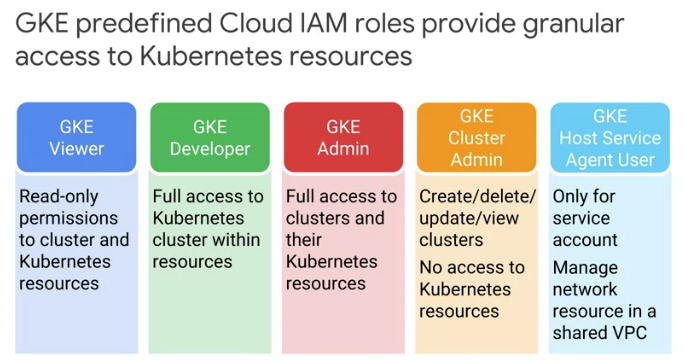

* **Custom**

Kubernetes RBAC - Roll Based Access Control
===========================================

In GKE environment, RBAC extends Cloud IAM security, by offering control over
Kubernetes resources within cluster, supplementing the control providing directly by Cloud IAM,
which allow you to control access of the GKE and cluster level.

Three main elements Kubernetes RBAC
-----------------------------------

* Subjects ( Who? )
* Verbs ( What? ) : operations ( get, watch, create, describe )
* Resources ( Which? ) : objects, resources ( pod, deployment, ... )

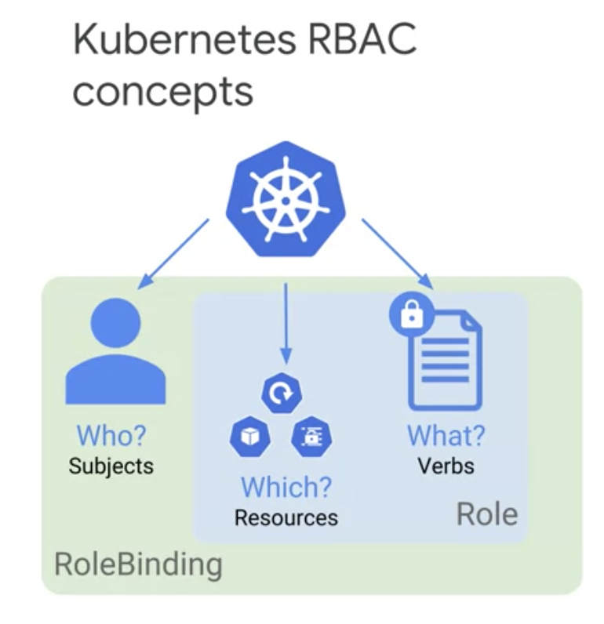

These three elements can be connected by creating two types of RBAC API objects:
""""""""""""""""""""""""""""""""""""""""""""""""""""""""""""""""""""""""""""""""

* Roles: connect API resources(which) and verbs(what)
* RoleBindings: connect Roles to subject(who)

Roles and RoleBindings can be applied at
""""""""""""""""""""""""""""""""""""""""

* cluster level
* namespace level

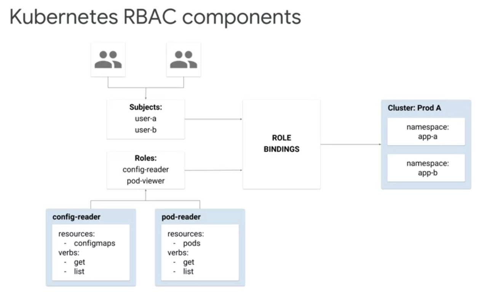

Two Types of RBAC roles
"""""""""""""""""""""""

* **RBAC Role:** defined at the namespace level
* **RBAC Cluster Role:** defined at the cluster level

Example: RBAC Role
""""""""""""""""""

* If **metadata.namespace** is default, the Role is applied to namespace level.
* For a Role, only a single namespace can be defined.
* Empty **rules.apiGroups** indicates the Roles applies to the core API group.
* It's common practice to allocate **get, list, watch** together.

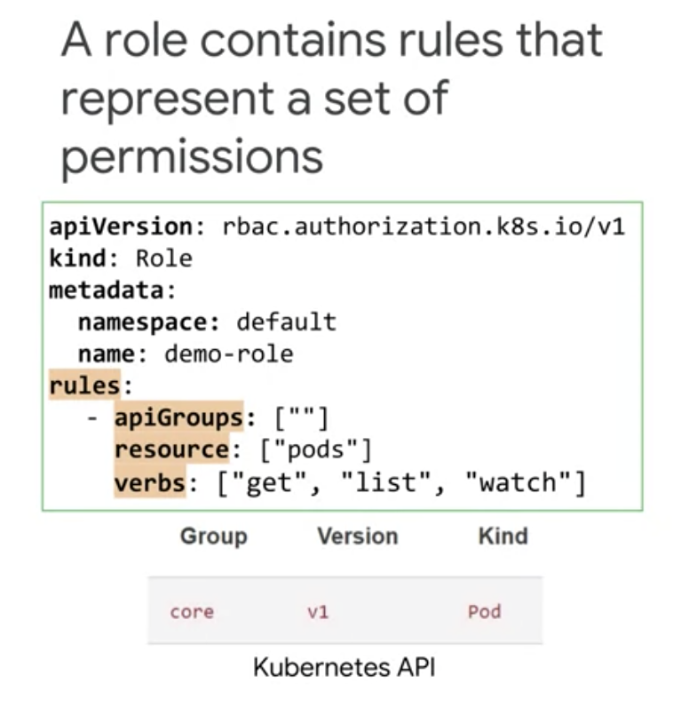

Example: RBAC Cluster Role
""""""""""""""""""""""""""

* no need to specify namespace

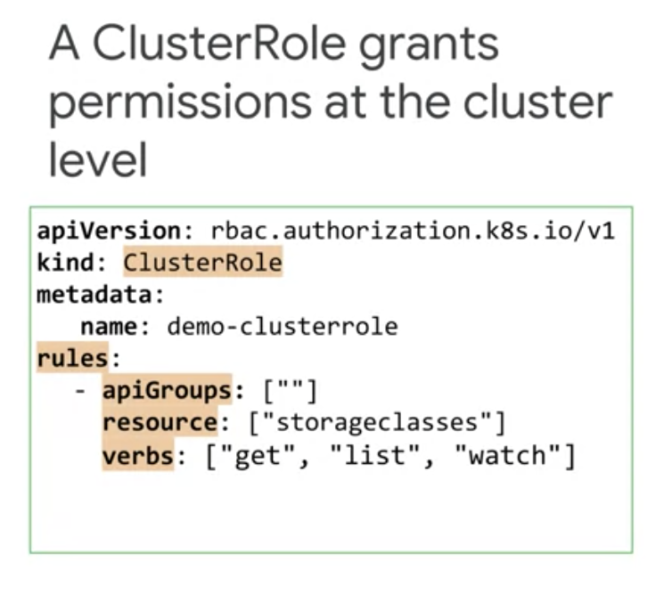

Attaching RBAC Roles
--------------------

* `subject.kind` can be User, Group, or ServiceAccount
* `subject.name` is case sensitive.

With RBAC and GKE, these type of accounts' access can be controlled by us.
They are identified by email address.

* Google account
* GCP service account
* Kubernetes service account

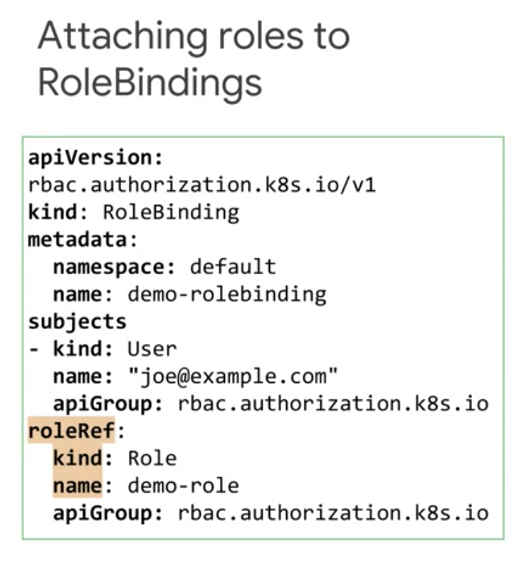

ClusterRoleBinding only refer ClusterRole, not to a role.

.. image:: ./images/gcp_k8s_production/RBAC_attaching_cluster_rolebinding.png

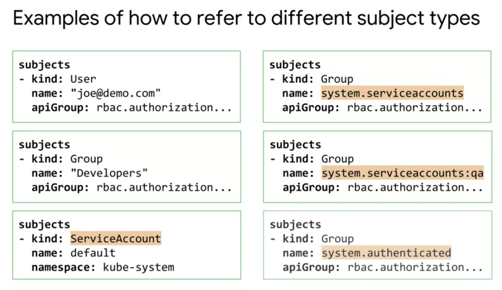

* Unable to assign Kubernetes RBAC permissions to Google Groups.
* Only able to assign Cloud IAM to Google Groups.
* Able to assign Kubernetes Control Plane Security

RBAC permissions to Kubernetes Group
====================================

Kubernetes RBAC summary
-----------------------

With Kubernetes RBAC, you can manage granular permissions for the people using users and groups,
and for containers using service accounts at both the namespace level and the cluster level.
Resources and verbs are bound using either roles or ClusterRoles.

Roles and ClusterRoles are then bound to subjects using
either a RoleBinding or a ClusterRoleBinding.

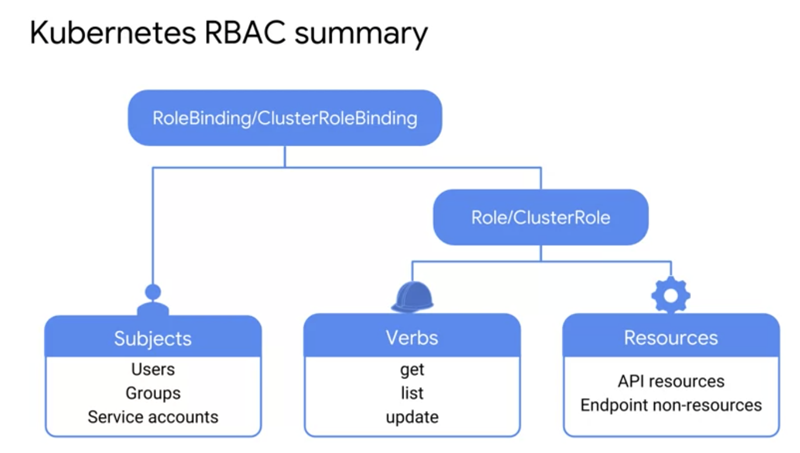

Not all resources are namespaced

.. code-block:: bash

  kubectl api-resources

Typically, cluster-level resources should be managed with ClusterRole
and, namespace resources should be managed with Role.
However, RBAC permissions across multiple namespaces, then it's better to use a ClusterRole.

Kubernetes Control Plane Security
=================================

Credential Rotation Steps
-------------------------

If rotation is not completed manually, then GKE will automatically complete
the rotation after seven days.

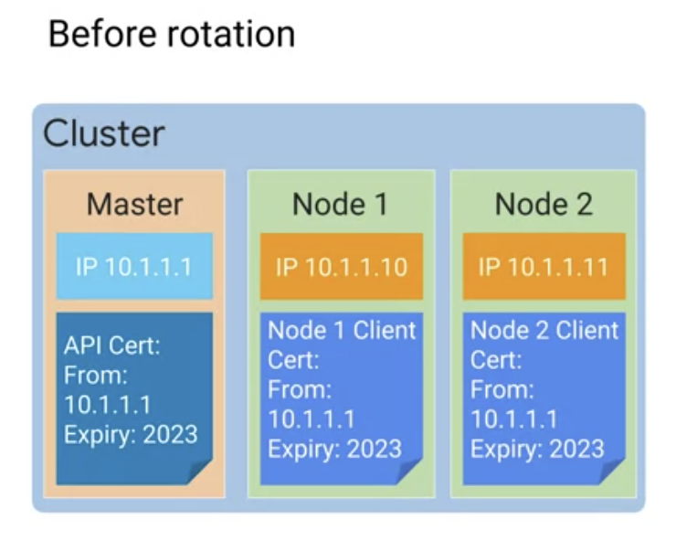

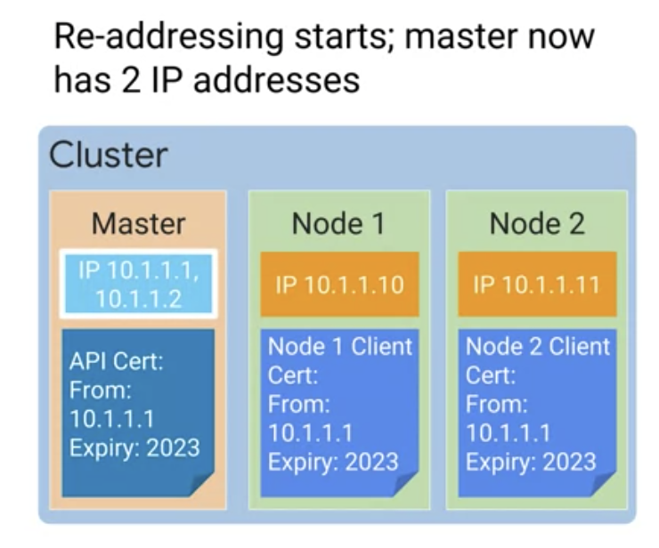

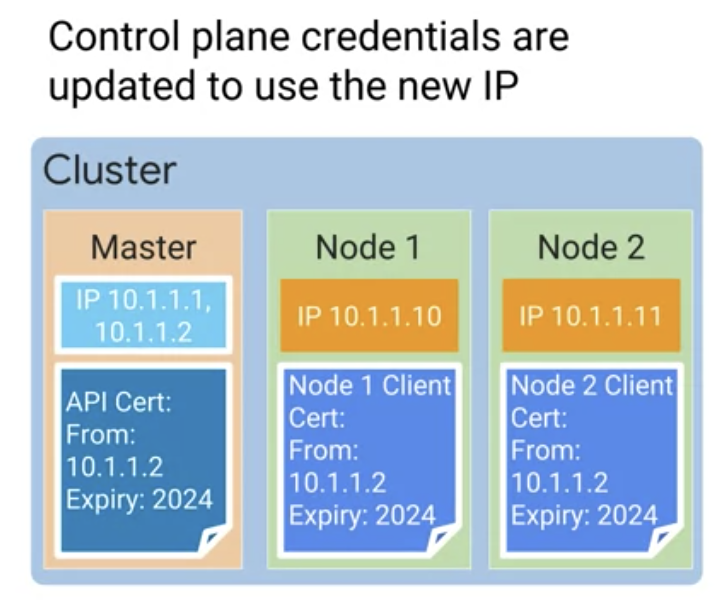

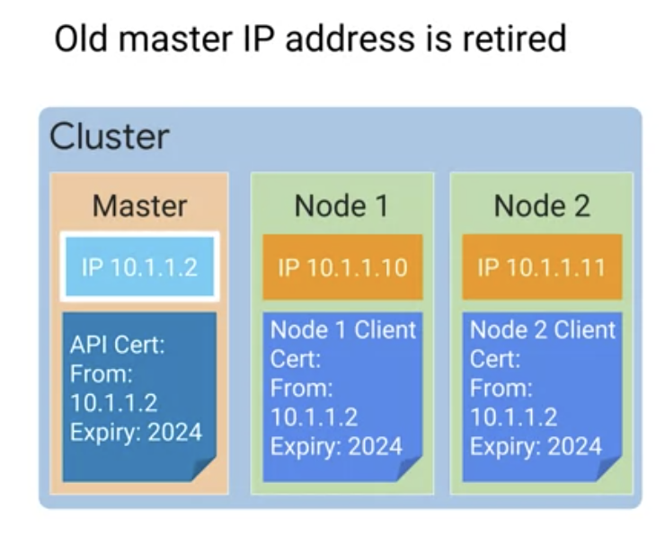

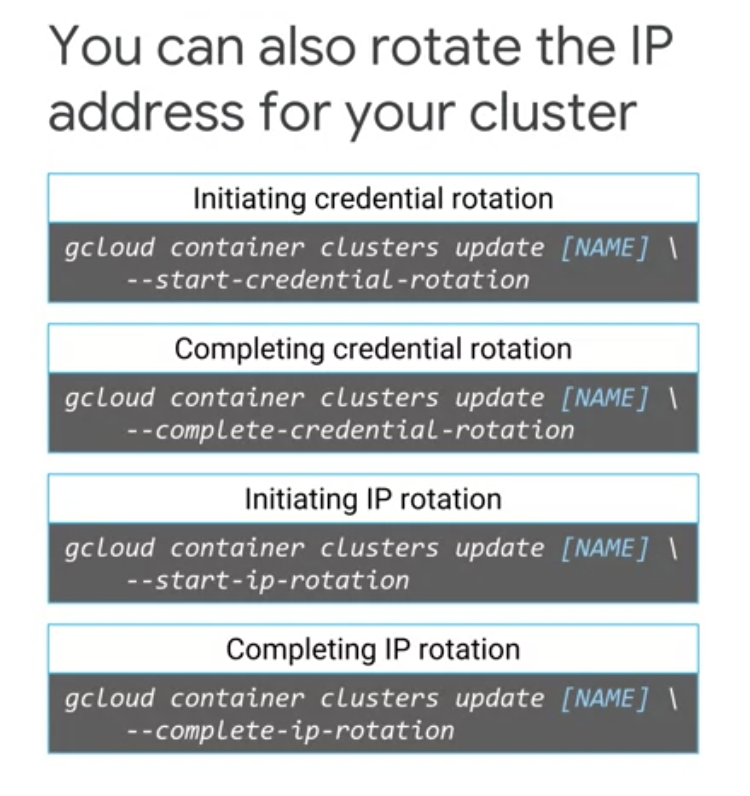

All clients outside the cluster must also be updated to use new credentials.

If Pod is compromised
---------------------

Pod can access metadata of the nodes where they are running.

* **Node Securet** used for node configuration

How to prevent
""""""""""""""

* configure Cloud IAM service account for Node with minimal permissions.
* don't use **compute.instances.get** permissions through service account.
* Omitting **compute.instances.get** blocks getting metdata on GKE node.
* Disable legacy Compute Engine API endpoint
* Enable metadata concealment. This is kind of firewall that prevents pod from accessing a node's metadata. ( temp )

Pod Security
============

Security Context
----------------

**Enforced by Container Runtime**

Restrictions can be defined what the containers in a pod can do by using security context.

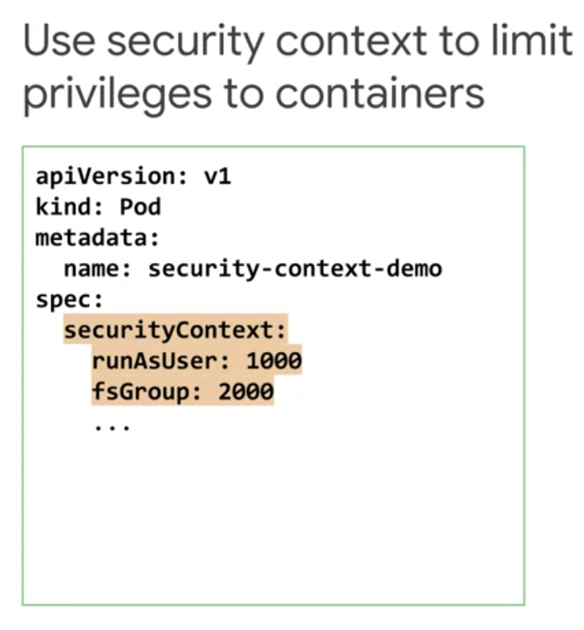

If security context is defined on pod level, it's applied to all containers in the pod.

Pod Security Policy
-------------------

**Enforced by creation or update of a pod**

Rather than defining security policies in Pod definition for each pod,
by defining PodSecurityPolicy, reuable security context can be created.

* A policy is a set of

  * restrictions
  * requirements
  * defaults

* All conditions must be fulfilled for a pod to be created or updated.
* PodSecurityPolicy controller is an admission controller
* The controller validates and modifies requests against one or more PodSecurityPolicies.

The pod security policy admission controller acts on these action on pod.

* Creation
* Modification

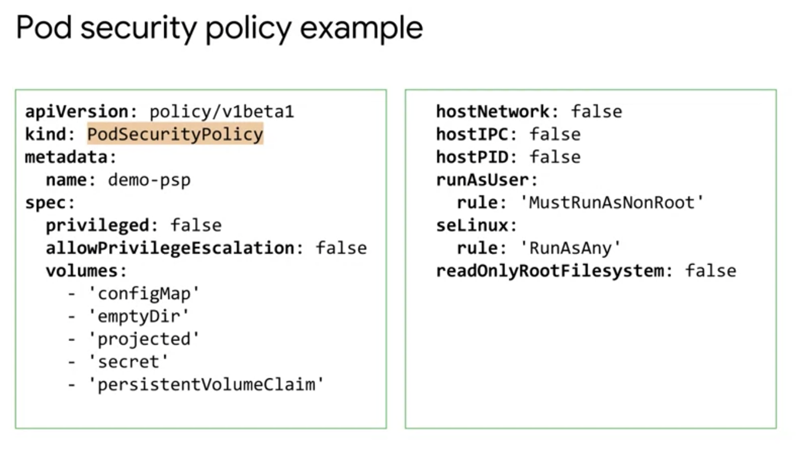

Applying pod security policies
------------------------------

After defining `PodSecurityPolicy`, it has to be authorized.
Otherwise, it will prevent any Pod from being created.

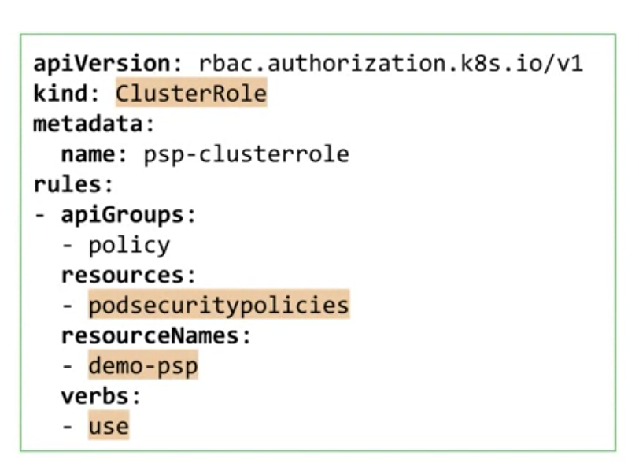

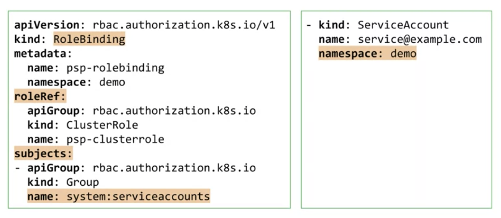

Enabling pod security policies
------------------------------

If pod-security-policy is enabled first without defining policies,
noting is allowed to be deployed.

.. code-block:: bash

  gcloud container clusters update [NAME] --enable-pod-security-policy

Kubernetes security best practice
---------------------------------

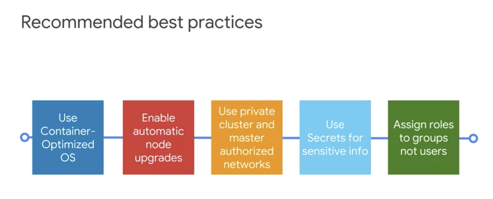

Stackdriver
===========

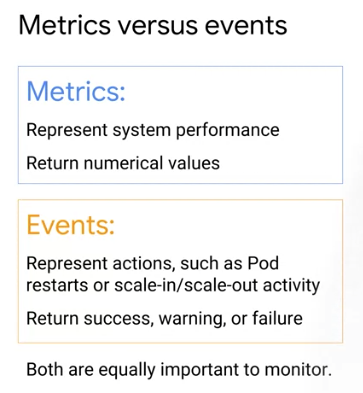

Recommended to create a project for Stackdriver ( Host project )
if there are multiple projects.

Stackdriver: Trace
------------------

Latency reporting in near real-time

Stackdriver: Error reporting
----------------------------

Aggregate and display errors for running cloud services

Stackdriver: Debuggger
-----------------------

Inspect applications while they are running

* capture snapshots of the call stack and variables
* Inject logging without stopping a service

Stackdriver Logging
===================

a passive form of systems monitoring

GKE automatically streams its logs to Stackdriver.

Viewing container logs
----------------------

.. code-block:: bash

  # viewing container logs
  kubectl logs [POD_NAME]

  # viewing container logs - most recent 20 lines
  kubectl logs --tail=20 [POD_NAME]

  # viewing container logs ( most recent 3hr )
  kubectl logs --since=3h [POD_NAME]

Stackdriver Monitoring
======================

Why does monitoring matter?

* Provides a complete picture
* Helps size and scale systems
* Provides focus on application's current state
* Help trobleshoot complex microservices solutions

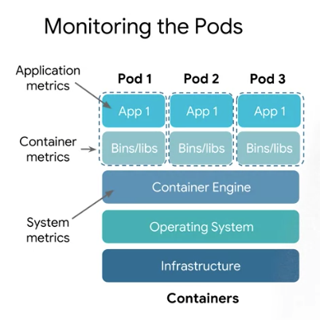

Liveness Probe / Readiness probe
=================================

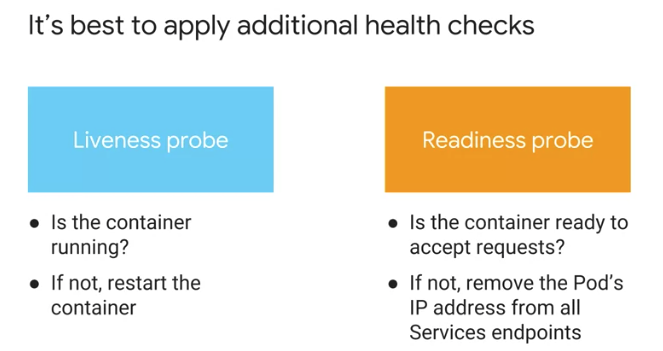

With the command probe handler, kubelet **runs a command inside the container**.

* `initialDelaySeconds`: waiting before liveness or readiness probes can be initiated.
* `periodSeconds`: defining interval between probe tests

Practice: Securing Kubernetes Engine with Cloud IAM and Pod Security Policies
=============================================================================

Task 1: Use Cloud IAM roles to grant administrative access to all the GKE clusters in the project
-------------------------------------------------------------------------------------------------

Adding Kubernetes Cluster

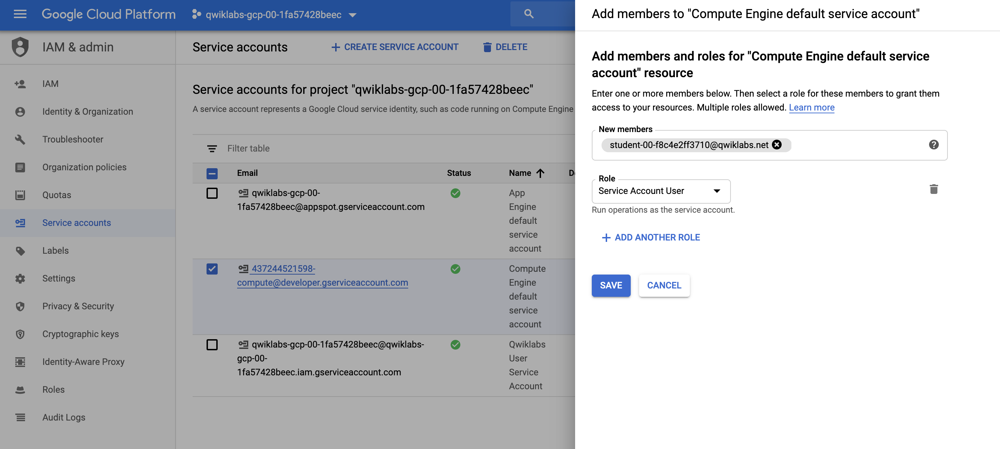

* IAM & admin > Service accounts
* Show Info Panel, click Add Member
* Type the username for Username 2 into the New members box
* In the Select a role box, choose Service Accounts > Service Account User.

Task 2. Create and Use Pod Security Policies
--------------------------------------------

In this task you create a Pod security policy that prohibits the creation of privileged Pods
in the default namespace of the cluster. Privileged Pods allow users to execute code as root,
and are granted access to all devices on the host.

You create a ClusterRole and binding that ties the policy to the service accounts used by
the Pods to prevent Pods being executed if they require privileged access.

Finally you will enable the PodSecurityPolicy controller, which enforces these policies.

Connect to GKE cluster
""""""""""""""""""""""

.. code-block:: bash

  export my_zone=us-central1-a
  export my_cluster=standard-cluster-1
  source <(kubectl completion bash)

  gcloud container clusters get-credentials $my_cluster --zone $my_zone

Create a Pod Security Policy
""""""""""""""""""""""""""""

You create a Pod Security Policy using the restricted-psp.yaml file that has been provided for you.
This policy does not allow privileged Pods and restricts runAsUser to non-root accounts only,
preventing the user of the Pod from escalating to root.

Setup Sample code
>>>>>>>>>>>>>>>>>

.. code-block:: bash

  git clone https://github.com/GoogleCloudPlatformTraining/training-data-analyst
  cd ~/training-data-analyst/courses/ak8s/14_IAM/
  kubectl apply -f restricted-psp.yaml

  $ cat restricted-psp.yaml
  apiVersion: policy/v1beta1
  kind: PodSecurityPolicy
  metadata:
    name: restricted-psp
  spec:
    privileged: false  # Don't allow privileged pods!
    seLinux:
      rule: RunAsAny
    supplementalGroups:
      rule: RunAsAny
    runAsUser:
      rule: MustRunAsNonRoot
    fsGroup:
      rule: RunAsAny
    volumes:
    - '*'

Create Policy
>>>>>>>>>>>>>

This policy has no effect until a cluster role is created and bound to a user or service account
with the permission to "use" the policy.

.. code-block:: bash

  $ create policy
  kubectl apply -f restricted-psp.yaml

Confirm that the Pod Security Policy
>>>>>>>>>>>>>>>>>>>>>>>>>>>>>>>>>>>>

.. code-block:: bash

  $ kubectl get podsecuritypolicy restricted-psp
  NAME             PRIV    CAPS   SELINUX    RUNASUSER          FSGROUP    SUPGROUP   READONLYROOTFS   VOLUMES
  restricted-psp   false          RunAsAny   MustRunAsNonRoot   RunAsAny   RunAsAny   false            *

Create a ClusterRole to a Pod Security Policy
"""""""""""""""""""""""""""""""""""""""""""""

The file psp-cluster-role.yaml creates a **ClusterRole** that includes the resource you created
in the last task, restricted-psp, and grants the subject the ability to use the restricted-psp resource.
The subject is the user or service account that is bound to this role.
You will bind an account to this role later to enable the use of the policy. psp-cluster-role.yaml has been provided for you.

However, before you can create a **Role**, the account you use to create the role
must already have the permissions granted in the role being assigned.
For cluster administrators this can be easily accomplished
by creating the necessary **RoleBinding** to grant your own user account the cluster-admin role.

Grant your user account cluster-admin privileges
>>>>>>>>>>>>>>>>>>>>>>>>>>>>>>>>>>>>>>>>>>>>>>>>

To grant your user account cluster-admin privileges, run the following command,
replacing [USERNAME_1_EMAIL] with the email address of the Username 1 account:

.. code-block:: bash

  kubectl create clusterrolebinding cluster-admin-binding --clusterrole cluster-admin --user [USERNAME_1_EMAIL]

create the ClusterRole with access to the security policy
>>>>>>>>>>>>>>>>>>>>>>>>>>>>>>>>>>>>>>>>>>>>>>>>>>>>>>>>>

.. code-block::

  $ cat psp-cluster-role.yaml
  kind: ClusterRole
  apiVersion: rbac.authorization.k8s.io/v1
  metadata:
    name: restricted-pods-role
  rules:
  - apiGroups:
    - extensions
    resources:
    - podsecuritypolicies
    resourceNames:
    - restricted-psp
    verbs:
    - use

  $ kubectl apply -f psp-cluster-role.yaml

Confirm created ClusterRole
>>>>>>>>>>>>>>>>>>>>>>>>>>>

.. code-block:: bash

  $ kubectl get clusterrole restricted-pods-role
  NAME                   AGE
  restricted-pods-role   5s

Create a ClusterRoleBinding for the Pod Security Policy
"""""""""""""""""""""""""""""""""""""""""""""""""""""""

The next step in the process involves binding the **ClusterRole** to a subject,
a user or service account, that would be responsible for creating Pods in the target namespace.
Typically these policies are assigned to service accounts because Pods are typically deployed
by replicationControllers in Deployments rather than as one-off executions by a human user.

The file psp-cluster-role-binding.yaml binds the restricted-pods-role created
in the last task to the system:serviceaccounts group in the default Namespace.

Bind the restricted-pods-role ClusterRole to the serviceaccounts group in the default namespace

.. code-block:: bash

  $ cat psp-cluster-role-binding.yaml
  apiVersion: rbac.authorization.k8s.io/v1
  kind: RoleBinding
  metadata:
    name: restricted-pod-rolebinding
    namespace: default
  roleRef:
    apiGroup: rbac.authorization.k8s.io
    kind: ClusterRole
    name: restricted-pods-role
  subjects:
  # Example: All service accounts in default namespace
  - apiGroup: rbac.authorization.k8s.io
    kind: Group
    name: system:serviceaccounts

  # Create binding
  kubectl apply -f psp-cluster-role-binding.yaml

Activate Security Policy
>>>>>>>>>>>>>>>>>>>>>>>>

The PodSecurityPolicy controller must be enabled to affect the admission control of new Pods in the cluster.

Caution!

  If you do not define and authorize policies prior to enabling the PodSecurityPolicy controller,
  no Pods will be permitted to execute on the cluster.

.. code-block:: bash

  # This process takes several minutes to complete.
  gcloud beta container clusters update $my_cluster --zone $my_zone --enable-pod-security-policy

Test the Pod Security Policy
"""""""""""""""""""""""""""""

The final step in the process involves testing to see if the Policy is active.
A sample Pod manifest called privileged-pod.yaml has been provided for you.
This Pod attempts to start an nginx container in a privileged context.

.. code-block:: bash

  $ cat privileged-pod.yaml
  kind: Pod
  apiVersion: v1
  metadata:
    name: privileged-pod
  spec:
    containers:
      - name: privileged-pod
        image: nginx
        securityContext:
          privileged: true

  # Attempt to run the privileged Pod
  # You should not be able to deploy the privileged Pod.
  $ kubectl apply -f privileged-pod.yaml

  # Update to this and try again.
  # succeeds because the container no longer requires a privileged security context.
  $ cat privileged-pod.yaml
  kind: Pod
  apiVersion: v1
  metadata:
    name: privileged-pod
  spec:
    containers:
      - name: privileged-pod
        image: nginx
        securityContext:
          privileged: true

Task 3. Rotate IP Address and Credentials
-----------------------------------------

You perform IP and credential rotation on your cluster. It is a secure practice to do so regularly to reduce credential lifetimes. While there are separate commands to rotate the serving IP and credentials, rotating credentials additionally rotates the IP as well.

.. code-block:: bash

  gcloud container clusters update $my_cluster --zone $my_zone --start-credential-rotation

After the command completes in the Cloud Shell the cluster will initiate the process to update each of the nodes.
That process can take up to 15 minutes for your cluster.
The process also automatically updates the kubeconfig entry for the current user.

The cluster master now temporarily serves the new IP address in addition to the original address.

Note:

  You must update the kubeconfig file on any other system that uses kubectl
  or API to access the master before completing rotation process to avoid losing access.

Complete the credential and IP rotation tasks
>>>>>>>>>>>>>>>>>>>>>>>>>>>>>>>>>>>>>>>>>>>>>

.. code-block:: bash

  gcloud container clusters update $my_cluster --zone $my_zone --complete-credential-rotation

Practice: Implementing Role-Based Access Control With Kubernetes Engine
=======================================================================

Overview
---------

In this lab, you will create namespaces within a GKE cluster,
and then use role-based access control to permit a non-admin user to work with Pods in a specific namespace.

Task 1: Create namespaces for users to access cluster resources
---------------------------------------------------------------

Create a GKE cluster
""""""""""""""""""""

Create GKE cluster
>>>>>>>>>>>>>>>>>>

.. code-block:: bash

  export my_zone=us-central1-a
  export my_cluster=standard-cluster-1
  source <(kubectl completion bash)

  # Create GKE cluster
  gcloud container clusters create $my_cluster --num-nodes 3 --enable-ip-alias --zone $my_zone

  # Configure access to your cluster for kubectl
  gcloud container clusters get-credentials $my_cluster --zone $my_zone

Prepare sample code
"""""""""""""""""""

.. code-block:: bash

  git clone https://github.com/GoogleCloudPlatformTraining/training-data-analyst
  cd ~/training-data-analyst/courses/ak8s/15_RBAC/

Create a Namespace
""""""""""""""""""

.. code-block:: bash

  $ cat my-namespace.yaml
  apiVersion: v1
  kind: Namespace
  metadata:
    name: production

  # Check existing namespaces
  $ kubectl get namespace
  NAME          STATUS   AGE
  default       Active   42s
  kube-public   Active   41s
  kube-system   Active   42s

  $ kubectl create -f ./my-namespace.yaml

  $ kubectl get namespace
  NAME          STATUS   AGE
  default       Active   100s
  kube-public   Active   99s
  kube-system   Active   100s
  production    Active   15s

  $ kubectl describe namespaces production
  Name:         production
  Labels:       <none>
  Annotations:  <none>
  Status:       Active

  No resource quota.

  No resource limits.

Create a Resource in a Namespace
""""""""""""""""""""""""""""""""

If you do not specify the namespace of a Pod it will use the namespace ‘default'.
In this task you specify the location of our newly created namespace when creating a new Pod.
A simple manifest file called my-pod.yaml that creates a Pod that contains an nginx container has been created for you.

.. code-block:: bash

  $ cat my-pod.yaml
  apiVersion: v1
  kind: Pod
  metadata:
    name: nginx
    labels:
      name: nginx
  spec:
    containers:
    - name: nginx
      image: nginx
      ports:
      - containerPort: 80

  kubectl get pods --namespace=production

Task 2. About Roles and RoleBindings
------------------------------------

In this task you will create a sample custom role, and then create a RoleBinding
that grants Username 2 the editor role in the production namespace.

The role is defined in the pod-reader-role.yaml file that is provided for you.
This manifest defines a role called pod-reader that provides create, get, list & watch permission
for Pod objects in the production namespace. Note that this role cannot delete Pods.

Create a custom Role
""""""""""""""""""""

Before you can create a Role, your account must have the permissions granted
in the role being assigned. For cluster administrators this can be easily accomplished
by creating the following RoleBinding to grant your own user account the cluster-admin role.

Grant account cluster-admin privileges
>>>>>>>>>>>>>>>>>>>>>>>>>>>>>>>>>>>>>>

To grant the Username 1 account cluster-admin privileges, run the following command,
replacing [USERNAME_1_EMAIL] with the email address of the Username 1 account:

.. code-block:: bash

  kubectl create clusterrolebinding cluster-admin-binding --clusterrole cluster-admin --user [USERNAME_1_EMAIL]

Create custom Role
>>>>>>>>>>>>>>>>>>

.. code-block:: bash

  $ cat pod-reader-role.yaml
  kind: Role
  apiVersion: rbac.authorization.k8s.io/v1
  metadata:
    namespace: production
    name: pod-reader
  rules:
  - apiGroups: [""]
    resources: ["pods"]
    verbs: ["create","get", "list", "watch"]

  $ kubectl apply -f pod-reader-role.yaml

  # List the roles to verify it was created
  $ kubectl get roles --namespace production
  NAME         AGE
  pod-reader   13s

Create a RoleBinding
""""""""""""""""""""

The role is used to assign privileges, but by itself it does nothing.
The role must be bound to a user and an object, which is done in the RoleBinding.

The username2-editor-binding.yaml manifest file creates a RoleBinding called username2-editor
for the second lab user to the pod-reader role you created earlier.
That role can create and view Pods but cannot delete them.

.. code-block:: bash

  # UPDATE `username2-editor` value
  $ cat username2-editor-binding.yaml
  kind: RoleBinding
  apiVersion: rbac.authorization.k8s.io/v1
  metadata:
    name: username2-editor
    namespace: production
  subjects:
  - kind: User
    name: student-00-c2db77015e33@qwiklabs.net
    apiGroup: rbac.authorization.k8s.io
  roleRef:
    kind: Role
    name: pod-reader
    apiGroup: rbac.authorization.k8s.io

Test Access
-----------

Now you will test whether Username 2 can create a Pod in the production namespace
by using Username 2 to create a Pod using the manifest file production-pod.yaml.
This manifest deploys a simple Pod with a single nginx container.

Test on User2
"""""""""""""

Get access to cluster / prepare sample code
>>>>>>>>>>>>>>>>>>>>>>>>>>>>>>>>>>>>>>>>>>>>

.. code-block:: bash

  export my_zone=us-central1-a
  export my_cluster=standard-cluster-1
  source <(kubectl completion bash)
  gcloud container clusters get-credentials $my_cluster --zone $my_zone
  git clone https://github.com/GoogleCloudPlatformTraining/training-data-analyst
  cd ~/training-data-analyst/courses/ak8s/15_RBAC/
  kubectl get namespaces

Create resource on production namespace
>>>>>>>>>>>>>>>>>>>>>>>>>>>>>>>>>>>>>>>

.. code-block:: bash
  # This will fail since user2 doesn't have correct permission.
  kubectl apply -f ./production-pod.yaml

Create RoleBinding on User1
"""""""""""""""""""""""""""

create the RoleBinding that grants Username 2 the pod-reader role that includes
the permission to create Pods in the production namespace:

.. code-block:: bash

  $ cat username2-editor-binding.yaml
  kind: RoleBinding
  apiVersion: rbac.authorization.k8s.io/v1
  metadata:
    name: username2-editor
    namespace: production
  subjects:
  - kind: User
    name: student-00-c2db77015e33@qwiklabs.net
    apiGroup: rbac.authorization.k8s.io
  roleRef:
    kind: Role
    name: pod-reader
    apiGroup: rbac.authorization.k8s.io

  $ kubectl apply -f username2-editor-binding.yaml

  $ kubectl get rolebinding --namespace production

Test on User2 - create resource
"""""""""""""""""""""""""""""""

Create resource on production namespace
>>>>>>>>>>>>>>>>>>>>>>>>>>>>>>>>>>>>>>>

.. code-block:: bash

  $ kubectl apply -f ./production-pod.yaml
  pod/production-pod created

Delete resource on production namespace
>>>>>>>>>>>>>>>>>>>>>>>>>>>>>>>>>>>>>>>

This fails because Username 2 does not have the delete permission for Pods.

.. code-block:: bash

  $ kubectl delete pod production-pod --namespace production
  Error from server (Forbidden): pods "production-pod" is forbidden: User "student-00-c2db77015e33@qwiklabs.net" cannot delete resource "pods" in API group "" in the namespace "production": Required "container.pods.delete" permission.

Practice: Configuring Kubernetes Engine Logging and Monitoring
==============================================================

Task 1. Getting ready for monitoring with Stackdriver
-----------------------------------------------------

Create GKE Cluster
""""""""""""""""""

.. code-block:: bash

  export my_zone=us-central1-a
  export my_cluster=standard-cluster-1
  source <(kubectl completion bash)
  gcloud container clusters create $my_cluster \
    --num-nodes 3 --enable-ip-alias --zone $my_zone

  # Configure access to your cluster for kubectl
  gcloud container clusters get-credentials $my_cluster --zone $my_zone

Set up Stackdriver for your project
"""""""""""""""""""""""""""""""""""

* Enable Stackdriver ( search monitoring )

Task 2. Using Liveness and Readiness probes for GKE Pods
--------------------------------------------------------

In this task you will deploy a liveness probe to detect applications that have transitioned
from a running state to a broken state. Sometimes, applications are temporarily unable to serve traffic.
For example, an application might need to load large data or configuration files during startup.
In such cases, you don't want to kill the application, but you don't want to send it requests either.
Kubernetes provides readiness probes to detect and mitigate these situations.
A Pod with containers reporting that they are not ready does not receive traffic through Kubernetes Services.

**Readiness** probes are configured similarly to liveness probes.
The only difference is that you use the readinessProbe field instead of the livenessProbe field.

A Pod definition file called exec-liveness.yaml has been provided for you
that defines a simple container called liveness running Busybox and a liveness probe
that uses the cat command against the file /tmp/healthy within the container to test for liveness every 5 seconds.
The startup script for the liveness container creates the **/tmp/healthy** on startup
and then deletes it 30 seconds later to simulate an outage that the Liveness probe can detect.

Create pod with liveness
""""""""""""""""""""""""

prepare sample code
>>>>>>>>>>>>>>>>>>>

.. code-block:: bash

  git clone https://github.com/GoogleCloudPlatformTraining/training-data-analyst
  cd ~/training-data-analyst/courses/ak8s/16_Logging/

Create pod resource
>>>>>>>>>>>>>>>>>>>

.. code-block:: bash

  $ cat exec-liveness.yaml
  apiVersion: v1
  kind: Pod
  metadata:
    labels:
      test: liveness
    name: liveness-exec
  spec:
    containers:
    - name: liveness
      image: k8s.gcr.io/busybox
      args:
      - /bin/sh
      - -c
      - touch /tmp/healthy; sleep 30; rm -rf /tmp/healthy; sleep 600
      livenessProbe:
        exec:
          command:
          - cat
          - /tmp/healthy
        initialDelaySeconds: 5
        periodSeconds: 5

  $ kubectl create -f exec-liveness.yaml

  $ kubectl describe pod liveness-exec

  $ kubectl get pod liveness-exec
  NAME            READY   STATUS    RESTARTS   AGE
  liveness-exec   1/1     Running   3          4m36s

Task 3: Use Stackdriver Logging with GKE
----------------------------------------

In this task, you deploy a GKE cluster and demo application using Terraform
that creates sample stackdriver logging events. You view the logs for GKE resources
in Logging and then create and monitor a custom monitoring metric created using
a Stackdriver log filter.

Install Terraform
"""""""""""""""""

.. code-block:: bash

  cd
  wget https://releases.hashicorp.com/terraform/0.12.3/terraform_0.12.3_linux_amd64.zip
  unzip terraform_0.12.3_linux_amd64.zip
  export PATH=$PATH:$PWD

Download Sample Logging Tool
""""""""""""""""""""""""""""

You download a Terraform configuration that creates a GKE cluster
and then deploy a sample web application to that cluster to generate Logging events.

.. code-block:: bash

  mkdir ~/terraform-demo
  cd ~/terraform-demo
  git clone https://github.com/GoogleCloudPlatformTraining/gke-logging-sinks-demo
  cd ~/terraform-demo/gke-logging-sinks-demo/

Deploy The Sample Logging Tool
""""""""""""""""""""""""""""""

.. code-block:: bash

  gcloud config set compute/region us-central1
  gcloud config set compute/zone us-central1-a

  # Instruct Terraform to run the sample logging tool
  make create

Generate Logs
"""""""""""""

The sample application that Terraform deployed serves up a simple web page.
You connect to the external address for the web page and connect to it to generate some log events.
To get the URL for the web page you must perform the following steps:

* Go to Network service > Load balancing
* Get IP:Port from TCP load balancer launched by Terraform
* by using browser, make serveral requests

Configuring Stackdriver Logging
"""""""""""""""""""""""""""""""

* Go to Logging > Log Viewer

Practice: Exploring Stackdriver Kubernetes Monitoring
=====================================================

Create cluster
--------------

.. code-block:: bash

  export my_zone=us-central1-a
  export my_cluster=standard-cluster-1
  source <(kubectl completion bash)

  gcloud container clusters create $my_cluster \
   --num-nodes 3 --enable-ip-alias --zone $my_zone

  # Configure access to your cluster for kubectl
  gcloud container clusters get-credentials $my_cluster --zone $my_zone

Setup sample code
-----------------

.. code-block:: bash

  git clone https://github.com/GoogleCloudPlatformTraining/training-data-analyst
  cd ~/training-data-analyst/courses/ak8s/17_Stackdriver/

Update cluster properties
--------------------------

* Go to Kubernetes Engine on GCP
* Select your cluster
* Select `Edit`
* Disable `Legacy Stackdriver Logging` and `Legacy Stackdriver Monitoring`
* Enable `Stackdriver Kubernetes Engine Monitoring`
* Save

Setup Stackdriver for your project
----------------------------------

* Select Monitoring under Stackdriver section on GCP
* Stackdriver will create a new workspace for your project and will collect data for your workspace. ( 2-3min )
* Select `Resources > Kubernetes Engine` in Stackdriver View. If it doesn't exist, refresh page.

Create Deployment Resource to generate load
-------------------------------------------

.. code-block:: bash

  $ cat hello-v2.yaml
  apiVersion: extensions/v1beta1
  kind: Deployment
  metadata:
    name: hello-v2
  spec:
    replicas: 3
    selector:
      matchLabels:
        run: hello-v2
    template:
      metadata:
        labels:
          run: hello-v2
          name: hello-v2
      spec:
        containers:
        - image: gcr.io/google-samples/hello-app:2.0
          name: hello-v2
          ports:
          - containerPort: 8080
            protocol: TCP

  $ kubectl create -f hello-v2.yaml

Practice: Using Cloud SQL with Kubernetes Engine
================================================

Task 1. Create a GKE cluster
----------------------------

.. code-block:: bash

  export my_zone=us-central1-a
  export my_cluster=standard-cluster-1
  source <(kubectl completion bash)

  gcloud container clusters create $my_cluster \
   --num-nodes 3 --enable-ip-alias --zone $my_zone

  # Configure access to your cluster for kubectl
  gcloud container clusters get-credentials $my_cluster --zone $my_zone

  git clone https://github.com/GoogleCloudPlatformTraining/training-data-analyst
  cd ~/training-data-analyst/courses/ak8s/18_Cloud_SQL/

Task 2. Enable Cloud SQL APIs
-----------------------------

* Go to APIs & Services on GCP
* Enable Cloud SQL and Cloud SQL Admin API

Task 3. Create a Cloud SQL Instance
-----------------------------------

Create SQL Instance
"""""""""""""""""""

.. code-block:: bash

  gcloud sql instances create sql-instance --tier=db-n1-standard-2 --region=us-central1

Create User in SQL
""""""""""""""""""

* user: sqluser
* password: sqlpassword
* Host name option set to Allow any host (%)

Create database
"""""""""""""""

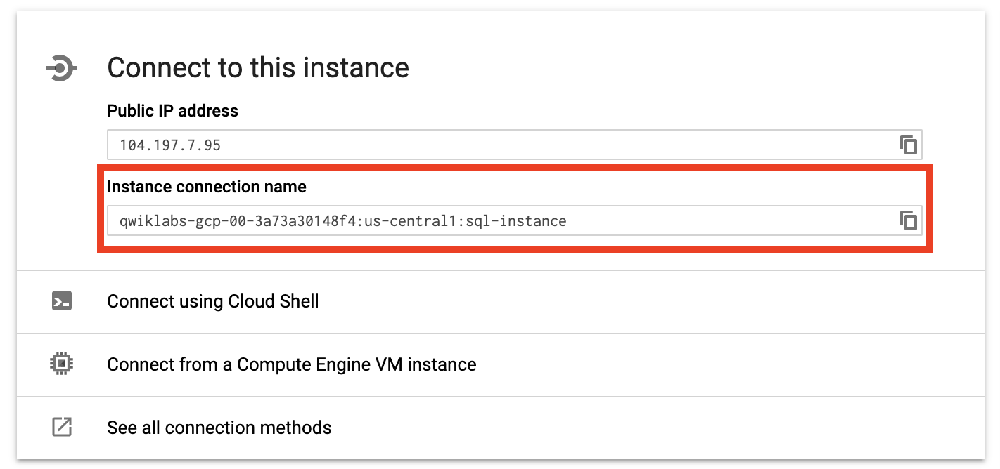

.. code-block:: bash

  export SQL_NAME=qwiklabs-gcp-00-3a73a30148f4:us-central1:sql-instanc

  # When prompted to enter the root password press enter.
  # The root SQL user password is blank by default.
  gcloud sql connect sql-instance

  create database wordpress;

Task 4. Prepare a Service Account with Permission to Access Cloud SQL
---------------------------------------------------------------------

* IAM & admin> Service accounts
* Create Service Account

  * Service account name: sql-access
  * Role: Cloud SQL Client

* Create JSON key / Rename it to `credentials.json`
* Upload `credentials.json` to Clould Console
* mv ~/credentials.json .

Task 5. Create Secrets
----------------------

You create two Kubernetes Secrets:

* one to provide the MySQL credentials
* one to provide the Google credentials (the service account).

create a Secret for your MySQL credentials
""""""""""""""""""""""""""""""""""""""""""

.. code-block:: bash

  kubectl create secret generic sql-credentials \
    --from-literal=username=sqluser\
    --from-literal=password=sqlpassword

Create a Secret for your GCP Service Account credentials
""""""""""""""""""""""""""""""""""""""""""""""""""""""""

Note that the file is uploaded to the Secret using the name key.json.
That is the file name that a container will see when this Secret is attached as a Secret Volume.

.. code-block:: bash

  kubectl create secret generic google-credentials\
    --from-file=key.json=credentials.json

Task 6. Deploy the SQL Proxy agent as a sidecar container
---------------------------------------------------------

A sample deployment manifest file called sql-proxy.yaml has been provided for you
that deploys a demo Wordpress application container with the SQL Proxy agent as a sidecar container.

In the Wordpress container environment settings the WORDPRESS_DB_HOST is specified
using the localhost IP address. The cloudsql-proxy sidecar container is configured
to point to the Cloud SQL instance you created in the previous task.
The database username and password are passed to the Wordpress container as secret keys,
and the JSON credentials file is passed to the container using a Secret volume.

A Service is also created to allow you to connect to the Wordpress instance from the internet.

Deploy

In the Wordpress env section the variable WORDPRESS_DB_HOST is set to 127.0.0.1:3306. This will connect to a container in the same Pod listening on port 3306. This is the port that the SQL-Proxy listens on by default.

In the Wordpress env section the variables WORDPRESS_DB_USER and WORDPRESS_DB_PASSWORD are set using values stored in the sql-credential Secret you created in the last task.

In the cloudsql-proxy container section the command switch that defines the SQL Connection name, "-instances=<INSTANCE_CONNECTION_NAME>=tcp:3306", contains a placeholder variable that is not configured using a ConfigMap or Secret and so must be updated directly in this example manifest to point to your Cloud SQL instance.

In the cloudsql-proxy container section the JSON credential file is mounted using the Secret volume in the directory /secrets/cloudsql/ . The command switch "-credential_file=/secrets/cloudsql/key.json" points to the filename in that directory that you specified when creating the google-credentials Secret.

The Service section at the end creates an external LoadBalancer called "wordpress-service" that allows the application to be accessed from external internet addresses.

.. code-block:: bash

  $ cat  sql-proxy.yaml
  apiVersion: apps/v1
  kind: Deployment
  metadata:
    name: wordpress
    labels:
      app: wordpress
  spec:
    selector:
      matchLabels:
        app: wordpress
    template:
      metadata:
        labels:
          app: wordpress
      spec:
        containers:
          - name: web
            image: gcr.io/cloud-marketplace/google/wordpress
            #image: wordpress:4.8.2-apache
            ports:
              - containerPort: 80
            env:
              - name: WORDPRESS_DB_HOST
                value: 127.0.0.1:3306
              # These secrets are required to start the pod.
              # [START cloudsql_secrets]
              - name: WORDPRESS_DB_USER
                valueFrom:
                  secretKeyRef:
                    name: sql-credentials
                    key: username
              - name: WORDPRESS_DB_PASSWORD
                valueFrom:
                  secretKeyRef:
                    name: sql-credentials
                    key: password
              # [END cloudsql_secrets]
          # Change <INSTANCE_CONNECTION_NAME> here to include your GCP
          # project, the region of your Cloud SQL instance and the name
          # of your Cloud SQL instance. The format is
          # $PROJECT:$REGION:$INSTANCE
          # [START proxy_container]
          - name: cloudsql-proxy
            image: gcr.io/cloudsql-docker/gce-proxy:1.11
            command: ["/cloud_sql_proxy",
                      "-instances=<INSTANCE_CONNECTION_NAME>=tcp:3306",
                      "-credential_file=/secrets/cloudsql/key.json"]
            # [START cloudsql_security_context]
            securityContext:
              runAsUser: 2  # non-root user
              allowPrivilegeEscalation: false
            # [END cloudsql_security_context]
            volumeMounts:
              - name: cloudsql-instance-credentials
                mountPath: /secrets/cloudsql
                readOnly: true
          # [END proxy_container]
        # [START volumes]
        volumes:
          - name: cloudsql-instance-credentials
            secret:
              secretName: google-credentials
        # [END volumes]
  ---
  apiVersion: "v1"
  kind: "Service"
  metadata:
    name: "wordpress-service"
    namespace: "default"
    labels:
      app: "wordpress"
  spec:
    ports:
    - protocol: "TCP"
      port: 80
    selector:
      app: "wordpress"
    type: "LoadBalancer"
    loadBalancerIP: ""

Update INSTANCE_CONNECTION_NAME

.. code-block:: bash

  sed -i 's/<INSTANCE_CONNECTION_NAME>/'"${SQL_NAME}"'/g'\
    sql-proxy.yaml

Deploy application

.. code-block:: bash

  kubectl apply -f sql-proxy.yaml

  $ kubectl get deployment wordpress
  NAME        READY   UP-TO-DATE   AVAILABLE   AGE
  wordpress   1/1     1            1           25s

  $ kubectl get services
  NAME                TYPE           CLUSTER-IP    EXTERNAL-IP   PORT(S)        AGE
  kubernetes          ClusterIP      10.12.0.1     <none>        443/TCP        43m
  wordpress-service   LoadBalancer   10.12.6.179   <pending>     80:32462/TCP   44s

Connect to your Wordpress instance
""""""""""""""""""""""""""""""""""

test / r#FR!dZFCtfVS@eTbG

The initialization process has created new database tables and data in the wordpress database on your Cloud SQL instance. You will now validate that these new database tables have been created using the SQL proxy container.

gcloud sql connect sql-instance
show tables;
