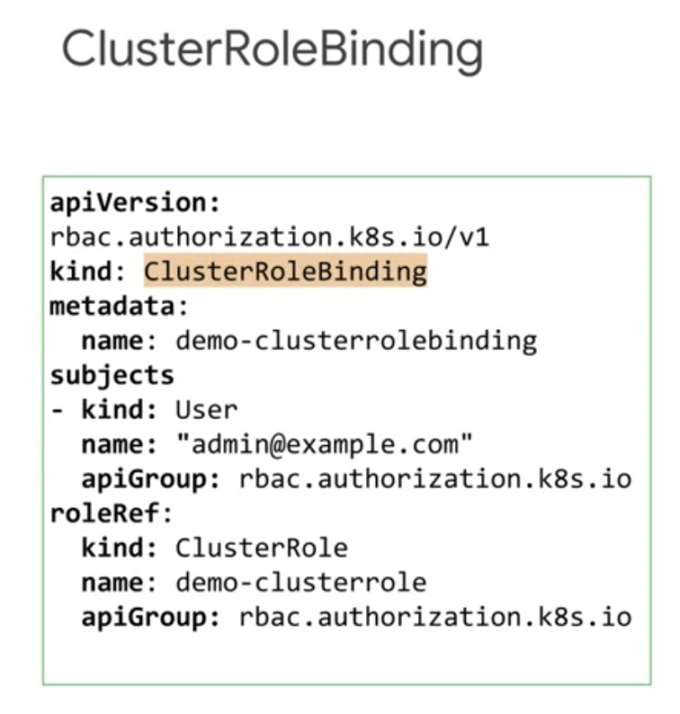

Google Cloud Kubernetes Production
##################################

Authentication and authorization
================================

In Kubernetes, there are two main types of user
-----------------------------------------------

* **Normal users:** In GKE, managed by **Cloud IAM**

  * manged ouside of Kubernetes
  * Kubernetes relies on external identity services.
  * G Suite domain or Google Cloud identity domain.
  Google Cloud identity domain gives much more organizational control than
  using consumer Google accounts for all of employees.

* Service accounts: mananged by Kubernetes

  * different from GCP Service account
  * able to configure GCP service accounts as a normal Kubernetes users if necessary.
  * In Kubernetes, every namespace has a default Kubernetes service account.

TWo main ways to authorize in GKE
---------------------------------

Two main ways to authorize what account can do. ( In fact, we need both )

* Cloud Identity and Access Management or Cloud IAM

  * Project level
  * Cluster levels ( GKE )

* Kubernetes role-based access control or **RBAC**

  * Cluster level ( Kubernetes objects )
  * Namespace level

Cloud IAM
=========

Three elements defined in Cloud IAM access control
--------------------------------------------------

* **Who?** : user identity
* **What?** : set of granted permissions
* **Which?** : resources this policy applies to

How a Cloud IAM policy grants roles to users
--------------------------------------------

* Organization
* Folder
* Project
* Resources

**There's no way to grant a permission at a higher level in the hierarchy and then take it away below**
Therefore, apply very few policies at higher level.

Types of IAM roles
------------------

* **Primitive roles** ( can be granted global, project-level )

  * Viewer roles ( read-only permissions )
  * Editor role

    * Write permissions
    * All permissions of a viewer role

  * Owner role

    * manage roles and permissions
    * Setup up project billing
    * All permissions of an editor role

* **Pre-defined roles**

  * GKE Viewer ( Read-only permissions to cluster and K8s resources )
  * GKE Developer ( Full access to K8s within resources )
  * GKE Admin ( Full access to cluster and Kubernetes resources )
  * GKE Cluster Admin ( CRUD clusters. no access to K8s resources )
  * GKE Host Service Agent User ( Only for service account. manage network resource in shared VPC )

.. image:: ./images/gcp_k8s_production/gke_predefined_roles.png

* **Custom**

Kubernetes RBAC - Roll Based Access Control
===========================================

In GKE environment, RBAC extends Cloud IAM security, by offering control over
Kubernetes resources within cluster, supplementing the control providing directly by Cloud IAM,
which allow you to control access of the GKE and cluster level.

Three main elements Kubernetes RBAC
-----------------------------------

* Subjects ( Who? )
* Verbs ( What? ) : operations ( get, watch, create, describe )
* Resources ( Which? ) : objects, resources ( pod, deployment, ... )

These three elements can be connected by creating two types of RBAC API objects:
>>>>>>>>>>>>>>>>>>>>>>>>>>>>>>>>>>>>>>>>>>>>>>>>>>>>>>>>>>>>>>>>>>>>>>>>>>>>>>>>

* Roles: connect API resources(which) and verbs(what)
* RoleBindings: connect Roles to subject(who)

Roles and RoleBindings can be applied at
>>>>>>>>>>>>>>>>>>>>>>>>>>>>>>>>>>>>>>>>

* cluster level
* namespace level

Two Types of RBAC roles
>>>>>>>>>>>>>>>>>>>>>>>

* **RBAC Role:** defined at the namespace level
* **RBAC Cluster Role:** defined at the cluster level

Example: RBAC Role
>>>>>>>>>>>>>>>>>>

* If **metadata.namespace** is default, the Role is applied to namespace level.
* For a Role, only a single namespace can be defined.
* Empty **rules.apiGroups** indicates the Roles applies to the core API group.
* It's common practice to allocate **get, list, watch** together.

Example: RBAC Cluster Role
>>>>>>>>>>>>>>>>>>>>>>>>>>

* no need to specify namespace

.. image:: ./images/gcp_k8s_production/RBAC_role_cluster_level_manifest.png

Attaching RBAC Roles
--------------------

* `subject.kind` can be User, Group, or ServiceAccount
* `subject.name` is case sensitive.

With RBAC and GKE, these type of accounts' access can be controlled by us.
They are identified by email address.

* Google account
* GCP service account
* Kubernetes service account

ClusterRoleBinding only refer ClusterRole, not to a role.

* Unable to assign Kubernetes RBAC permissions to Google Groups.
* Only able to assign Cloud IAM to Google Groups.
* Able to assign Kubernets RBAC permissions to Kubernetes Group.

Kubernetes RBAC summary
-----------------------

With Kubernetes RBAC, you can manage granular permissions for the people using users and groups,
and for containers using service accounts at both the namespace level and the cluster level.
Resources and verbs are bound using either roles or ClusterRoles.

Roles and ClusterRoles are then bound to subjects using
either a RoleBinding or a ClusterRoleBinding.

Not all resources are namespaced

.. code-block:: bash

  kubectl api-resources

Typically, cluster-level resources should be managed with ClusterRole
and, namespace resources should be managed with Role.
However, RBAC permissions across multiple namespaces, then it's better to use a ClusterRole.

