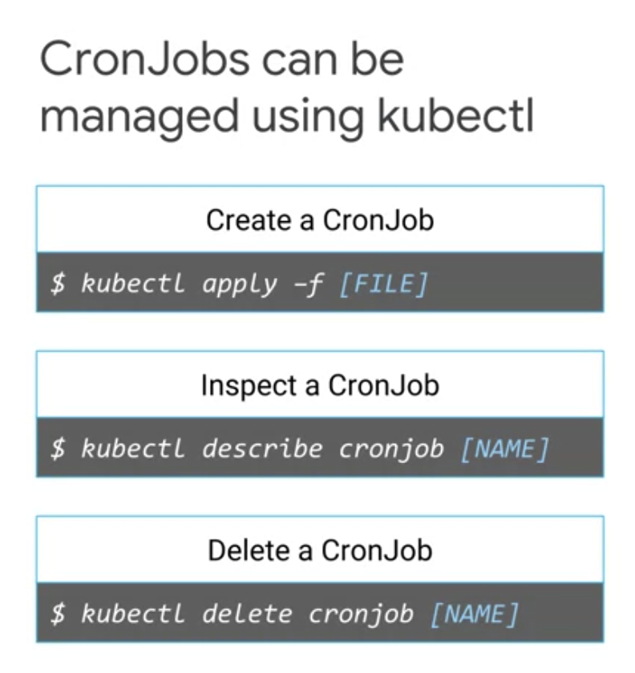
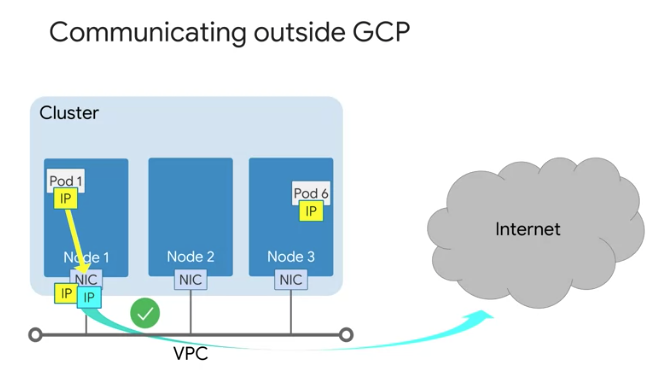

Google Cloud Kubernetes Workload
================================

kubectl autocomplete
--------------------

https://kubernetes.io/docs/reference/kubectl/cheatsheet/#kubectl-autocomplete

kubectl command
---------------

Summary
>>>>>>>

* kubectl is a utility used by admin to control Kubernetes cluster
* kubectl is composed of serveral parts, such as command, type, name, and optional flags

.. image:: ./images/gcp_k8s_workload/kubectl_cmd.png

.. image:: ./images/gcp_k8s_workload/kubectl_api.png

kubctl config
>>>>>>>>>>>>>

* relies on config file: **$HOME/.kube/config**
* config file contains

  * target cluster name
  * credentials for the cluster

* to see current config,

.. code-block:: bash

  kubectl config view

retrieve credentials for cluster
>>>>>>>>>>>>>>>>>>>>>>>>>>>>>>>>

.. code-block::

  gcloud containers clusters \
  get-credentials [cluster_name] \
  --zone [ZONE_NAME]

Introspection
-------------

kubectl get
>>>>>>>>>>>

* Pod phases:

  * Pending
  * Running
  * Successed
  * Failed
  * Unkown
  * CrahLoopBackOff

kubectl describe
>>>>>>>>>>>>>>>>

kubectl exec
>>>>>>>>>>>>

Running a command within a pod

.. code-block:: bash

  # kubectl exec -it [pod_name] -- [command]
  # -i is for std input
  # -t tells std input is TTY
  # -c is to attch to specfic pod
  kubectl exec -it demo -- /bin/bash

kubectl logs
>>>>>>>>>>>>

Cluster
-------

Create cluster
>>>>>>>>>>>>>>

.. code-block:: bash

  # ref: https://cloud.google.com/sdk/gcloud/reference/container/clusters/create
  gcloud container clusters create $my_cluster --num-nodes 3 --zone $my_zone --enable-ip-alias

Increase Node in cluster
>>>>>>>>>>>>>>>>>>>>>>>>

.. code-block:: bash

  gcloud container clusters resize $my_cluster --zone $my_zone --size=4

Connect to GKE cluster
>>>>>>>>>>>>>>>>>>>>>>

.. code-block:: bash

  $ gcloud container clusters get-credentials $my_cluster --zone $my_zone
  Fetching cluster endpoint and auth data.
  kubeconfig entry generated for standard-cluster-1.

Inspect GKE cluster
>>>>>>>>>>>>>>>>>>>

.. code-block:: bash

  # print content of the kubeconfig
  kubectl config view
  # print cluster information
  kubectl cluster-info
  # print out the active context
  kubectl config current-context
  # print out some details for all the cluster contexts in the kubeconfig file
  kubectl config get-contexts
  # change active context
  kubectl config use-context gke_${GOOGLE_CLOUD_PROJECT}_us-central1-a_standard-cluster-1

Enable kubectl command hint
>>>>>>>>>>>>>>>>>>>>>>>>>>>

.. code-block:: bash

  source <(kubectl completion bash)

Deploy Pods
>>>>>>>>>>>>

.. code-block:: bash

  $ kubectl run nginx-1 --image nginx:latest

  $ kubectl get pods
  NAME                      READY   STATUS    RESTARTS   AGE
  nginx-1-6866cfb98-ckpq8   1/1     Running   0          36s

  $ kubectl describe pod nginx-1-6866cfb98-ckpq8

Copy file to container
>>>>>>>>>>>>>>>>>>>>>>

.. code-block:: bash

  kubectl cp ~/test.html $my_nginx_pod:/usr/share/nginx/html/test.html

Expose Pod for testing
>>>>>>>>>>>>>>>>>>>>>>

.. code-block:: bash

  $ kubectl expose pod $my_nginx_pod --port 80 --type LoadBalancer
  service/nginx-1-6866cfb98-ckpq8 exposed

  $ kubectl get services
  NAME                      TYPE           CLUSTER-IP     EXTERNAL-IP   PORT(S)        AGE
  kubernetes                ClusterIP      10.12.0.1      <none>        443/TCP        21m
  nginx-1-6866cfb98-ckpq8   LoadBalancer   10.12.10.222   <pending>     80:31652/TCP   9s

Deploy Pods with config
>>>>>>>>>>>>>>>>>>>>>>>

.. code-block:: bash

    $ git clone https://github.com/GoogleCloudPlatformTraining/training-data-analyst
    $ cd ~/training-data-analyst/courses/ak8s/04_GKE_Shell/

    # sample config
    $ cat new-nginx-pod.yaml
    apiVersion: v1
    kind: Pod
    metadata:
      name: new-nginx
      labels:
        name: new-nginx
    spec:
      containers:
      - name: new-nginx
        image: nginx
        ports:
        - containerPort: 80

    # deploy pod
    $ kubectl apply -f ./new-nginx-pod.yaml

Check running pods
>>>>>>>>>>>>>>>>>>

.. code-block:: bash

  $ kubectl get pods
  NAME                      READY   STATUS    RESTARTS   AGE
  new-nginx                 1/1     Running   0          14s
  nginx-1-6866cfb98-ckpq8   1/1     Running   0          15m

Connect to container in pod
>>>>>>>>>>>>>>>>>>>>>>>>>>>

.. code-block:: bash

  # connecting container in pod
  # if there is more than one container, then -c can be used to connect to specific conatiner.
  $ kubectl exec -it new-nginx /bin/bash

Port-forwarding
>>>>>>>>>>>>>>>

.. code-block:: bash

  # port-forwarding
  $ kubectl port-forward new-nginx 10081:80

View logging
>>>>>>>>>>>>>>>

.. code-block:: bash

  # monitor logging
  $ kubectl port-forward new-nginx 10081:80

Deployments
-----------

Deployments defines/describe a desired of state of pods

.. image:: ./images/gcp_k8s_workload/deployment_twoparts_process.png

Once deployment config YAML is submitted Kubernetes master, Kubernetes creates **deployment controller**. Deployment Controller is
responsible for converting the desired state(config) to reality and keeping the desired state over time.

Deployment Usage
>>>>>>>>>>>>>>>>

.. image:: ./images/gcp_k8s_workload/deployment_usage.png

Three ways to create deployment
>>>>>>>>>>>>>>>>>>>>>>>>>>>>>>>

* create a deployment **declaratively** using a manifest file, such as a YAML

.. code-block:: bash

  kubectl apply -f [DEPLOYMENT_FILE]

* creates a deployment **imperatively**, using a kubectl run command

.. code-block:: bash

  kubectl run [DEPLOYMENT_NAME] \
  --image [IMAGE]:[TAG]
  --replicas 3 \
  --labels [KEY]=[VALUE] \
  --port 8080 \
  --generator deployment/app.v1 \
  --save-config

* using GCP Console

How to inspect Deployment
>>>>>>>>>>>>>>>>>>>>>>>>>

.. code-block:: bash

  kubectl get deployment [DEPLOYMENT_NAME]

How to print/output Deployment config in a YAML format
>>>>>>>>>>>>>>>>>>>>>>>>>>>>>>>>>>>>>>>>>>>>>>>>>>>>>>

.. code-block:: bash

  kubectl get deployment [DEPLOYMENT_NAME] -o yaml > this.yaml

How to get more details about Deployment
>>>>>>>>>>>>>>>>>>>>>>>>>>>>>>>>>>>>>>>>

.. code-block:: bash

  kubectl describe deployment [DEPLOYMENT_NAME]

Scaling deployments
>>>>>>>>>>>>>>>>>>>

.. code-block:: bash

  # manual-scaling a deployment
  kubectl scale deployemnt [DEPLOYMENT_NAME] --replicas=5

  # autos-caling a deployment
  kubectl autoscale deployemnt [DEPLOYMENT_NAME] --min=5 --max=15 --cpu-percent=75

How to udpate Deployment
>>>>>>>>>>>>>>>>>>>>>>>>

* update pod specification ( YAML )

  * automatic update rollout will happen
  * only applicable to the changes in port specifications

* use updated deployment YAML ( kubectl apply -f [DEPLOYMENT_FILE] )

  * allowing to update other specification of a deployment, such as number of replicas

* use `kubectl set`

  * allowing to change pod specifications for the deployment, such as images, resources, or selector values.

* use `kubectl edit`

  * once exit/saved, kubectl automatically applies the updated file.

* use GCP console

Deployment strategy - Rolling updates
>>>>>>>>>>>>>>>>>>>>>>>>>>>>>>>>>>>>>

* **max unavailable:** specific number or percentage

.. image:: ./images/gcp_k8s_workload/deployment_rollout_max_unavailable_percentage.png

* **max surge:** specifying max number of pods that can be created concurrently in a new replica set

.. image:: ./images/gcp_k8s_workload/deployment_rollout_max_max_surge.png

Deployment strategy - Blue/Green
>>>>>>>>>>>>>>>>>>>>>>>>>>>>>>>>

Deployment strategy - Canary
>>>>>>>>>>>>>>>>>>>>>>>>>>>>

.. image:: ./images/gcp_k8s_workload/deployment_apply_canary.png

Deployment strategy - Canary
>>>>>>>>>>>>>>>>>>>>>>>>>>>>

* All Old Pods will be deleted before createing new pods

Deployment Rollback
>>>>>>>>>>>>>>>>>>>

Deployemt Three lifecycle states
>>>>>>>>>>>>>>>>>>>>>>>>>>>>>>>>

* progressing state
* complete state
* failed state

Pausing a deployment
>>>>>>>>>>>>>>>>>>>>

New updates won't be applied to the deployment where it's paused.

.. code-block:: bash

  kubectl rollout pause deployment [DEPLOYMENT_NAME]

Pausing a deployment
>>>>>>>>>>>>>>>>>>>>

All updates blocked by `pausing` will be applied as a single revision.

.. code-block:: bash

  kubectl rollout resume deployment [DEPLOYMENT_NAME]

Checking a deployment status
>>>>>>>>>>>>>>>>>>>>>>>>>>>>>

.. code-block:: bash

  kubectl rollout status deployment [DEPLOYMENT_NAME]

Delete a deployment
>>>>>>>>>>>>>>>>>>>

.. code-block:: bash

  kubectl rollout delete deployment [DEPLOYMENT_NAME]

Practicing Kubernete Deployment
-------------------------------

preparation
>>>>>>>>>>>

.. code-block:: bash

  export my_zone=us-central1-a
  export my_cluster=standard-cluster-1
  source <(kubectl completion bash)

bring up cluster
>>>>>>>>>>>>>>>>

.. code-block:: bash

  gcloud container clusters create $my_cluster --num-nodes 3  --enable-ip-alias --zone $my_zone

get access to cluster for kubectl
>>>>>>>>>>>>>>>>>>>>>>>>>>>>>>>>>

.. code-block:: bash

  gcloud container clusters get-credentials $my_cluster --zone $my_zone

prepare sample code
>>>>>>>>>>>>>>>>>>>

.. code-block:: bash

  git clone https://github.com/GoogleCloudPlatformTraining/training-data-analyst
  cd ~/training-data-analyst/courses/ak8s/06_Deployments/

  # check deployment YAML file
  $ cat nginx-deployment.yaml
  apiVersion: apps/v1
  kind: Deployment
  metadata:
    name: nginx-deployment
    labels:
      app: nginx
  spec:
    replicas: 3
    selector:
      matchLabels:
        app: nginx
    template:
      metadata:
        labels:
          app: nginx
      spec:
        containers:
        - name: nginx
          image: nginx:1.7.9
          ports:
          - containerPort: 80

create deployment
>>>>>>>>>>>>>>>>>

.. code-block:: bash

  $ kubectl apply -f ./nginx-deployment.yaml

  $ kubectl get deployments
  NAME               READY   UP-TO-DATE   AVAILABLE   AGE
  nginx-deployment   3/3     3            3           56s

  $ kubectl get pods
  NAME                                READY   STATUS    RESTARTS   AGE
  nginx-deployment-76bf4969df-f2mk2   1/1     Running   0          62s
  nginx-deployment-76bf4969df-njjnz   1/1     Running   0          62s
  nginx-deployment-76bf4969df-rmfqd   1/1     Running   0          62s

scale down / up manually
>>>>>>>>>>>>>>>>>>>>>>>>

.. code-block:: bash

  kubectl scale --replicas=2 deployment nginx-deployment
  kubectl scale --replicas=3 deployment nginx-deployment

Trigger a deployment rollout
>>>>>>>>>>>>>>>>>>>>>>>>>>>>>>>>>>>>>>>>>>>>>>>>>>>>

A deployment's rollout is triggered if and only if

  * the deployment's Pod template (that is, .spec.template) is changed
  * for example, if the labels or container images of the template are updated.

Other updates, such as scaling the deployment, do NOT trigger a rollout.

.. code-block:: bash

  # update the version of nginx in the deployment
  kubectl set image deployment.v1.apps/nginx-deployment nginx=nginx:1.9.1 --record

  # check rollout status
  $ kubectl rollout status deployment.v1.apps/nginx-deployment
  deployment "nginx-deployment" successfully rolled out

  # check rollout history
  $ kubectl rollout history deployment nginx-deployment
  deployment.extensions/nginx-deployment
  REVISION  CHANGE-CAUSE
  1         <none>
  2         kubectl set image deployment.v1.apps/nginx-deployment nginx=nginx:1.9.1 --record=true

deployment rollback
>>>>>>>>>>>>>>>>>>>

.. code-block:: bash

  $ kubectl rollout undo deployments nginx-deployment
  deployment.extensions/nginx-deployment rolled back

  $ kubectl rollout history deployment nginx-deployment
  deployment.extensions/nginx-deployment
  REVISION  CHANGE-CAUSE
  2         kubectl set image deployment.v1.apps/nginx-deployment nginx=nginx:1.9.1 --record=true
  3         <none>

  # View the details of the latest deployment revision
  $ kubectl rollout history deployment/nginx-deployment --revision=3
  deployment.extensions/nginx-deployment with revision #3
  Pod Template:
    Labels:       app=nginx
          pod-template-hash=76bf4969df
    Containers:
     nginx:
      Image:      nginx:1.7.9
      Port:       80/TCP
      Host Port:  0/TCP
      Environment:        <none>
      Mounts:     <none>
    Volumes:      <none>

Define Service
>>>>>>>>>>>>>>

ClusterIP, NodePort or LoadBalancer types

.. code-block:: bash

  $ cat service-nginx.yaml
  apiVersion: v1
  kind: Service
  metadata:
    name: nginx
  spec:
    type: LoadBalancer
    selector:
      app: nginx
    ports:
    - protocol: TCP
      port: 60000
      targetPort: 80

  $ kubectl apply -f ./service-nginx.yaml

  $ kubectl get service
  NAME         TYPE           CLUSTER-IP   EXTERNAL-IP   PORT(S)           AGE
  kubernetes   ClusterIP      10.12.0.1    <none>        443/TCP           19m
  nginx        LoadBalancer   10.12.15.2   <pending>     60000:32516/TCP   16s

  $ kubectl get service nginx
  NAME    TYPE           CLUSTER-IP   EXTERNAL-IP     PORT(S)           AGE
  nginx   LoadBalancer   10.12.15.2   34.69.205.216   60000:32516/TCP   84s

  # open with http://[EXTERNAL_IP]:60000/

Canary deployment
>>>>>>>>>>>>>>>>>

.. code-block:: bash

  $ cat nginx-canary.yaml
  apiVersion: apps/v1
  kind: Deployment
  metadata:
    name: nginx-canary
    labels:
      app: nginx
  spec:
    replicas: 1
    selector:
      matchLabels:
        app: nginx
    template:
      metadata:
        labels:
          app: nginx
          track: canary
          Version: 1.9.1
      spec:
        containers:
        - name: nginx
          image: nginx:1.9.1
          ports:
          - containerPort: 80

  $ kubectl apply -f nginx-canary.yaml

  $ kubectl get deployments
  NAME               READY   UP-TO-DATE   AVAILABLE   AGE
  nginx-canary       1/1     1            1           18s
  nginx-deployment   2/2     2            2           21m

  # Switch back to the Cloud Shell and scale down the primary deployment to 0 replicas
  $ kubectl scale --replicas=0 deployment nginx-deployment

  $ kubectl get deployments
  NAME               READY   UP-TO-DATE   AVAILABLE   AGE
  nginx-canary       1/1     1            1           70s
  nginx-deployment   0/0     0            0           21m

**Note: Session affinity**

  The Service configuration used in the lab does not ensure that all requests from a single client will always connect to the same Pod. Each request is treated separately and can connect to either the normal nginx deployment or to the nginx-canary deployment. This potential to switch between different versions may cause problems if there are significant changes in functionality in the canary release. To prevent this you can set the sessionAffinity field to ClientIP in the specification of the service if you need a client's first request to determine which Pod will be used for all subsequent connections.

.. code-block:: bash

  apiVersion: v1
  kind: Service
  metadata:
    name: nginx
  spec:
    type: LoadBalancer
    sessionAffinity: ClientIP
    selector:
      app: nginx
    ports:
    - protocol: TCP
      port: 60000
      targetPort: 80

Job and Cronjob
---------------

In GKE, a Job is a controller object that represents a finite task.

Job
>>>

* Job is a Kubernete's object
* In simplest form, job creats a pod and track the task completion within the pod.
* when the task is completed, job will terminate the pod and then report that the job is completed successfully.
* jobs manages a task up to its completion rather than an open-ended desired state.

Two ways to define a job
>>>>>>>>>>>>>>>>>>>>>>>>

* Non-parallel job
* Parallel job

Non-parallel job
>>>>>>>>>>>>>>>>

* create only one pod at a time
* completed:

  * when pod is terminated successfully
  * OR a completion counter is defined.
  * OR the required number of completions is reachted.

.. image:: ./images/gcp_k8s_workload/non_parallel_job.png

* **restartPolicy**

  * Never: pod will be re-launched
  * OnFailure: pod will be remained, only container will be restarted.

* **backoffLimit**

  * specifies the number of retries before a job is considered to have failed entirely
  * failed pods are re-created with an exponetially increasing delay ( 10s, 20s, 40sec ... 6m )

* **activeDeadlineSeconds:**

  * activeDeadline Seconds has precedence over backoffLimit

Parallel job
>>>>>>>>>>>>

* Questions

  * With a Kubernetes Job configured with a parallelism value of 3 and no completion count what happens to the status of the Job when one of the Pods successfully terminates?

* creates multiple pods that work on the same task at the same time
* can be specified by setting the spec.parallelism value a job greater than one.
* two types

  * a fixed task completion count ( restarting pods until the completions count is reached )
  * processing a work queue

* completed:

  * when the number of pods that had terminated successfully reaches the completion count.

Inspect a job
>>>>>>>>>>>>>

.. code-block:: bash

  kubectl describe job [JOB_NAME]

  kubectl get pod -L [job-name=my-app-job]

Scale a job
>>>>>>>>>>>

.. code-block:: bash

  kubectl scale job [JOB_NAME} --replicas [VALUE]

Delete a job
>>>>>>>>>>>>

.. code-block:: bash

  kubectl delete -f [JOB_FILE]
  kubectl delete job [JOB_NAME]

  # retaining job pods
  kubectl delete job [JOB_NAME] --cascade false

Cronjobs
>>>>>>>>

* **kind:** CronJob
* **schedule:** "*/1 * * * *"
* what if job is not started at the scheduled time?

  * by default, CronJob looks at how many times the job has failed to run since it was last scheduled.
  *  If that failure count exceeds 100 and an error is logged, the the job is not scheduled.

* **startingDeadlineSeconds:**
* **concurrencyPolicy:**
* **suspend:**

  * suspended executions are counted as missed jobs

* **successfulJobHistoryLimit:**
* **failedJobHistoryLimit:**

Practice Deploying Jobs
-----------------------

Preparation / Launch Kubernete cluster
>>>>>>>>>>>>>>>>>>>>>>>>>>>>>>>>>>>>>>>

.. code-block:: bash

  export my_zone=us-central1-a
  export my_cluster=standard-cluster-1
  source <(kubectl completion bash)
  gcloud container clusters create $my_cluster --num-nodes 3  --enable-ip-alias --zone $my_zone

Configure access to cluster for kubectl
>>>>>>>>>>>>>>>>>>>>>>>>>>>>>>>>>>>>>>>

.. code-block:: bash

  gcloud container clusters get-credentials $my_cluster --zone $my_zone

Prepare sample code
>>>>>>>>>>>>>>>>>>>

.. code-block:: bash

  git clone https://github.com/GoogleCloudPlatformTraining/training-data-analyst
  cd ~/training-data-analyst/courses/ak8s/07_Jobs_CronJobs

  $ cat example-job.yaml
  apiVersion: batch/v1
  kind: Job
  metadata:
    # Unique key of the Job instance
    name: example-job
  spec:
    template:
      metadata:
        name: example-job
      spec:
        containers:
        - name: pi
          image: perl
          command: ["perl"]
          args: ["-Mbignum=bpi", "-wle", "print bpi(2000)"]
        # Do not restart containers after they exit
        restartPolicy: Never

Create Job with job spec
>>>>>>>>>>>>>>>>>>>>>>>>

.. code-block:: bash

  $ kubectl apply -f example-job.yaml

Check Job status
>>>>>>>>>>>>>>>>

.. code-block:: bash

  $ kubectl get jobs
  NAME          COMPLETIONS   DURATION   AGE
  example-job   1/1           36s        4m28s

  $ kubectl get pod -L job-name=example-job
  NAME                READY   STATUS      RESTARTS   AGE   JOB-NAME=EXAMPLE-JOB
  example-job-z664w   0/1     Completed   0          57s

  $ kubectl describe job example-job
  Name:           example-job
  Namespace:      default
  Selector:       controller-uid=15fbd3c0-ef60-11e9-9e59-42010a800062
  Labels:         controller-uid=15fbd3c0-ef60-11e9-9e59-42010a800062
                  job-name=example-job
  Annotations:    kubectl.kubernetes.io/last-applied-configuration:
                    {"apiVersion":"batch/v1","kind":"Job","metadata":{"annotations":{},"name":"example-job","namespace":"default"},"spec":{"template":{"me
  tada...
  Parallelism:    1
  Completions:    1
  Start Time:     Tue, 15 Oct 2019 08:25:57 -0700
  Completed At:   Tue, 15 Oct 2019 08:26:33 -0700
  Duration:       36s
  Pods Statuses:  0 Running / 1 Succeeded / 0 Failed
  Pod Template:
    Labels:  controller-uid=15fbd3c0-ef60-11e9-9e59-42010a800062
             job-name=example-job
    Containers:
     pi:
      Image:      perl
      Port:       <none>
      Host Port:  <none>
      Command:
        perl
      Args:
        -Mbignum=bpi
        -wle
        print bpi(2000)
      Environment:  <none>
      Mounts:       <none>
    Volumes:        <none>
  Events:
    Type    Reason            Age    From            Message
    ----    ------            ----   ----            -------
    Normal  SuccessfulCreate  2m48s  job-controller  Created pod: example-job-z664w

Get Logs from pod
>>>>>>>>>>>>>>>>>

.. code-block:: bash

  # kubectl logs [POD_NAME]
  kubectl logs example-job-z664w

Clean up / Delete the job
>>>>>>>>>>>>>>>>>>>>>>>>>

.. code-block:: bash

  kubectl delete job example-job

Create and run a CronJob
>>>>>>>>>>>>>>>>>>>>>>>>

* **schedule**

  * required
  * Unix standard crontab format
  * in UTC

.. code-block:: bash

  git clone https://github.com/GoogleCloudPlatformTraining/training-data-analyst
  cd ~/training-data-analyst/courses/ak8s/07_Jobs_CronJobs

  $ cat example-cronjob.yaml
  apiVersion: batch/v1beta1
  kind: CronJob
  metadata:
    name: hello
  spec:
    schedule: "*/1 * * * *"
    jobTemplate:
      spec:
        template:
          spec:
            containers:
            - name: hello
              image: busybox
              args:
              - /bin/sh
              - -c
              - date; echo "Hello, World!"
            restartPolicy: OnFailure

  $ kubectl apply -f example-cronjob.yaml

Check CronJob Status
>>>>>>>>>>>>>>>>>>>>

.. code-block:: bash

  $ kubectl get pods
  NAME                     READY   STATUS      RESTARTS   AGE
  hello-1571153940-sttr7   0/1     Completed   0          3m5s
  hello-1571154000-r72ls   0/1     Completed   0          2m5s
  hello-1571154060-thk62   0/1     Completed   0          65s
  hello-1571154120-nt2kv   0/1     Completed   0          5s

  $ kubectl get jobs
  NAME               COMPLETIONS   DURATION   AGE
  hello-1571154000   1/1           2s         2m19s
  hello-1571154060   1/1           1s         79s
  hello-1571154120   1/1           2s         19s

  $ kubectl describe job hello
  Name:           hello-1571153880
  Namespace:      default
  Selector:       controller-uid=c8b3d43d-ef61-11e9-9e59-42010a800062
  Labels:         controller-uid=c8b3d43d-ef61-11e9-9e59-42010a800062
                  job-name=hello-1571153880
  Annotations:    <none>
  Controlled By:  CronJob/hello
  Parallelism:    1
  Completions:    1
  Start Time:     Tue, 15 Oct 2019 08:38:07 -0700
  Completed At:   Tue, 15 Oct 2019 08:38:08 -0700
  Duration:       1s
  Pods Statuses:  0 Running / 1 Succeeded / 0 Failed
  Pod Template:
    Labels:  controller-uid=c8b3d43d-ef61-11e9-9e59-42010a800062
             job-name=hello-1571153880
    Containers:
     hello:
      Image:      busybox
      Port:       <none>
      Host Port:  <none>
      Args:
        /bin/sh
        -c
        date; echo "Hello, World!"
      Environment:  <none>
      Mounts:       <none>
    Volumes:        <none>
  Events:
    Type    Reason            Age   From            Message
    ----    ------            ----  ----            -------
    Normal  SuccessfulCreate  66s   job-controller  Created pod: hello-1571153880-rg4x6
  Name:           hello-1571153940
  Namespace:      default
  Selector:       controller-uid=ec8c2bf4-ef61-11e9-9e59-42010a800062
  Labels:         controller-uid=ec8c2bf4-ef61-11e9-9e59-42010a800062
                  job-name=hello-1571153940
  Annotations:    <none>
  Controlled By:  CronJob/hello
  Parallelism:    1
  Completions:    1
  Start Time:     Tue, 15 Oct 2019 08:39:07 -0700
  Completed At:   Tue, 15 Oct 2019 08:39:08 -0700
  Duration:       1s
  Pods Statuses:  0 Running / 1 Succeeded / 0 Failed
  Pod Template:
    Labels:  controller-uid=ec8c2bf4-ef61-11e9-9e59-42010a800062
             job-name=hello-1571153940
    Containers:
     hello:
      Image:      busybox
      Port:       <none>
      Host Port:  <none>
      Args:
        /bin/sh
        -c
        date; echo "Hello, World!"
      Environment:  <none>
      Mounts:       <none>
    Volumes:        <none>
  Events:
    Type    Reason            Age   From            Message
    ----    ------            ----  ----            -------
    Normal  SuccessfulCreate  6s    job-controller  Created pod: hello-1571153940-sttr7

Get Logs from pod
>>>>>>>>>>>>>>>>>

.. code-block:: bash

  # kubectl logs [POD_NAME]
  kubectl logs example-job-z664w

Clean up / Delete the CronJob
>>>>>>>>>>>>>>>>>>>>>>>>>>>>>

.. code-block:: bash

  kubectl delete cronjob hello

Cluster Scaling
---------------

ref: https://github.com/kubernetes/autoscaler/blob/master/cluster-autoscaler/FAQ.md

* by manually changing the number of nodes and node pools
* by configuring additional node pools

what is Node Pool
>>>>>>>>>>>>>>>>>

a node pool is a subset of node instances within a cluster

Reducing node
>>>>>>>>>>>>>

This process doesn't differentiate between Node running pods and Node running no pods.
Therefore, pods in being removed Node will be terminated gracefully.

How to resize cluster
>>>>>>>>>>>>>>>>>>>>>

* through GCP console
* through gcloud

.. code-block:: bash

  gcloud container clusters resize [CLUSTER_NAME] --node-pool [NODE_POOL_NAME] --size 6

Downscaling
>>>>>>>>>>>

Scale down a cluster with autoscaling happens only if

* There can be no scale-up events pending.
* can the node be deleted safely?

Pod conditions that prevent node deletion

* not run by a controller
* has local storage
* restricted by constraint rules
* pod has **cluster-autoscaler.kubernetes.io/safe-to-evict** is set to False. The Node where this pod is running won't be seleted to downscale.
* Restrictive **PodDisruptionBudget** also prevent a node from being deleted.
* **kubernetes.io/scale-down-disabled** set to True

.. image:: ./images/gcp_k8s_workload/best_practice_autoscaling.png

Node pools
>>>>>>>>>>

* node pool can be 0, but clsuter size can't be 0
* max = 1000 nodes x 30 pods
* increase quota limits to avoid disruption

Controlling pod placement
-------------------------

* When specifying a pod, optionally required RAM and CPU can be specified.
* **nodeSelector** can be set in **kind:Pod** object spec.
* If Node label is changed, the running pod won't be affected. Node selector is only used during pod scheduling.

Node Affinity and anti-affinity
>>>>>>>>>>>>>>>>>>>>>>>>>>>>>>>

* Like **nodeSelectors**, **nodeAffinity** also allow you to constrain which nodes your pod can be scheduled on based on labels. ( nodeAffinity is more expressive than nodeSelectors )
* it's possible to define affinity and anti-affinity preferences that won't prevent a pod from being launched if the preferences aren't met. ( Unlike nodeSelectors ) - Soft preference + Hard requirement
* denoted by

  * requiredDuringSchedulingIgnoredDuringExecution: hare requirement similar to nodeSelectors (must be met before scheduling)
  * preferredDuringSchedulingIgnoredDuringExecution

* Node affinity attracts pods
* Node anti-affinity refels pods

.. image:: ./images/gcp_k8s_workload/affinity_antiaffinity_rule_required.png

Pod Affinity and anti-affinity
>>>>>>>>>>>>>>>>>>>>>>>>>>>>>>

Inter-pod affinity and anti-affinity features extend the node affinity concept to include rules based on pod labels that are already running on the node. And instead of on labels of a node themselves

topologyKey to specify topology domains such as node, zone, and region.

The pod shown here has a pod anti-infinity rule with topologyKey set, so that it prefers not to be scheduled in the same zone that's already running one pod with label ke: and value of app: webserver.

.. image:: ./images/gcp_k8s_workload/pod_affinity_anttiaffinity.png

Pod Placement example
>>>>>>>>>>>>>>>>>>>>>

.. image:: ./images/gcp_k8s_workload/pod_affinity_and_affinity_example1.png

Taints
>>>>>>

* Node selector, affinity and anti-affinity rules on **POD**
* **Taints** on Node, these are applied to all **POD** in the cluster

Multiple taints can be applied to a node. In below example, all running pods in the node will be evicted.

.. image:: ./images/gcp_k8s_workload/taints.png

tolerations
>>>>>>>>>>>

Three effect settings

* **NoSchedule:** hard limit preventing scheduling pods unless there is pod toleration with the NoSchedule ettect that machtes.
* **Preferred NoSchedule:** soft limit

.. image:: ./images/gcp_k8s_workload/tolerations.png

Pracetice Configuring Pod Autoscaling and NodePools
---------------------------------------------------

preparation
>>>>>>>>>>>

.. code-block:: bash

  export my_zone=us-central1-a
  export my_cluster=standard-cluster-1
  source <(kubectl completion bash)

Create cluster
>>>>>>>>>>>>>>

.. code-block:: bash

  gcloud container clusters create $my_cluster \
   --num-nodes 2 --enable-ip-alias --zone $my_zone

Configure access to cluster for kubectl
>>>>>>>>>>>>>>>>>>>>>>>>>>>>>>>>>>>>>>>

.. code-block:: bash

  gcloud container clusters get-credentials $my_cluster --zone $my_zone

Prepare source code
>>>>>>>>>>>>>>>>>>>

.. code-block:: bash

    git clone https://github.com/GoogleCloudPlatformTraining/training-data-analyst
    cd ~/training-data-analyst/courses/ak8s/11_Autoscaling/

    $ cat web.yaml
    apiVersion: extensions/v1beta1
    kind: Deployment
    metadata:
    name: web
    spec:
    replicas: 1
    selector:
        matchLabels:
        run: web
    template:
        metadata:
        labels:
            run: web
        spec:
        containers:
        - image: gcr.io/google-samples/hello-app:1.0
            name: web
            ports:
            - containerPort: 8080
            protocol: TCP

Create deployment with web.yaml manifest
>>>>>>>>>>>>>>>>>>>>>>>>>>>>>>>>>>>>>>>>

.. code-block:: bash

  kubectl create -f web.yaml --save-config

  $ kubectl get deployments
  NAME   READY   UP-TO-DATE   AVAILABLE   AGE
  web    1/1     1            1           55s

  $ kubectl get pods
  NAME                   READY   STATUS    RESTARTS   AGE
  web-77656d79f8-h8rd4   1/1     Running   0          60s

Create service
>>>>>>>>>>>>>>

Create a service resource of type NodePort on port 8080 for the web deployment.

.. code-block:: bash

  kubectl expose deployment web --target-port=8080 --type=NodePort

  $ kubectl get services
  NAME         TYPE        CLUSTER-IP   EXTERNAL-IP   PORT(S)          AGE
  kubernetes   ClusterIP   10.12.0.1    <none>        443/TCP          31m
  web          NodePort    10.12.5.14   <none>        8080:30211/TCP   7s

  $ kubectl get services web
  NAME   TYPE       CLUSTER-IP   EXTERNAL-IP   PORT(S)          AGE
  web    NodePort   10.12.5.14   <none>        8080:30211/TCP   11s

Configure autoscaling on the cluster
>>>>>>>>>>>>>>>>>>>>>>>>>>>>>>>>>>>>

When you use kubectl autoscale, you specify a maximum and minimum number of replicas for your application,
as well as a CPU utilization target.

.. code-block:: bash

  kubectl autoscale deployment web --max 4 --min 1 --cpu-percent 1

Inspect the HorizontalPodAutoscaler object
>>>>>>>>>>>>>>>>>>>>>>>>>>>>>>>>>>>>>>>>>>

The `kubectl autoscale` command you used in the previous task creates a **HorizontalPodAutoscaler** object
that targets a specified resource, called the scale target, and scales it as needed.
The autoscaler periodically adjusts the number of replicas of the scale target to match the average CPU utilization
that you specify when creating the autoscaler.

To get the list of HorizontalPodAutoscaler resources

.. code-block:: bash

    $ kubectl get hpa
    NAME   REFERENCE        TARGETS   MINPODS   MAXPODS   REPLICAS   AGE
    web    Deployment/web   1%/1%     1         4         1          55s

    # To inspect the configuration of HorizontalPodAutoscaler in YAML form
    $ kubectl describe horizontalpodautoscaler web
    Name:                     web
    Namespace:                default
    Labels:                   <none>
    Annotations:              autoscaling.alpha.kubernetes.io/conditions:
                                [{"type":"AbleToScale","status":"True","lastTransitionTime":"2019-10-16T17:38:30Z","reason":"ScaleDownStabilized","message":"recent recomm...
                            autoscaling.alpha.kubernetes.io/current-metrics:
                                [{"type":"Resource","resource":{"name":"cpu","currentAverageUtilization":0,"currentAverageValue":"0"}}]
    CreationTimestamp:        Wed, 16 Oct 2019 10:38:15 -0700
    Reference:                Deployment/web
    Target CPU utilization:   1%
    Current CPU utilization:  0%
    Min replicas:             1
    Max replicas:             4
    Deployment pods:          1 current / 1 desired
    Events:                   <none>

    # To view the configuration of HorizontalPodAutoscaler in YAML
    $ kubectl get horizontalpodautoscaler web -o yaml
    apiVersion: autoscaling/v1
    kind: HorizontalPodAutoscaler
    metadata:
    annotations:
        autoscaling.alpha.kubernetes.io/conditions: '[{"type":"AbleToScale","status":"True","lastTransitionTime":"2019-10-16T17:38:30Z","reason":"ScaleDownStabilized","message":"recent
        recommendations were higher than current one, applying the highest recent recommendation"},{"type":"ScalingActive","status":"True","lastTransitionTime":"2019-10-16T17:38:30Z","reason":"ValidMetricFound","message":"the
        HPA was able to successfully calculate a replica count from cpu resource utilization
        (percentage of request)"},{"type":"ScalingLimited","status":"False","lastTransitionTime":"2019-10-16T17:38:30Z","reason":"DesiredWithinRange","message":"the
        desired count is within the acceptable range"}]'
        autoscaling.alpha.kubernetes.io/current-metrics: '[{"type":"Resource","resource":{"name":"cpu","currentAverageUtilization":0,"currentAverageValue":"0"}}]'
    creationTimestamp: "2019-10-16T17:38:15Z"
    name: web
    namespace: default
    resourceVersion: "8219"
    selfLink: /apis/autoscaling/v1/namespaces/default/horizontalpodautoscalers/web
    uid: bbd219cf-f03b-11e9-be2d-42010a8000ca
    spec:
    maxReplicas: 4
    minReplicas: 1
    scaleTargetRef:
        apiVersion: extensions/v1beta1
        kind: Deployment
        name: web
    targetCPUUtilizationPercentage: 1
    status:
    currentCPUUtilizationPercentage: 0
    currentReplicas: 1
    desiredReplicas: 1

Test the autoscale configuration
>>>>>>>>>>>>>>>>>>>>>>>>>>>>>>>>

.. code-block:: bash

    # Test code generating load
    $ cat loadgen.yaml
    apiVersion: apps/v1
    kind: Deployment
    metadata:
    name: loadgen
    spec:
    replicas: 4
    selector:
        matchLabels:
        app: loadgen
    template:
        metadata:
        labels:
            app: loadgen
        spec:
        containers:
        - name: loadgen
            image: k8s.gcr.io/busybox
            args:
            - /bin/sh
            - -c
            - while true; do wget -q -O- http://web:8080; done

    # create deployment of loadgen
    kubectl apply -f loadgen.yaml

Check autoscale status
>>>>>>>>>>>>>>>>>>>>>>

.. code-block:: bash

  $ kubectl get deployment
  NAME      READY   UP-TO-DATE   AVAILABLE   AGE
  loadgen   4/4     4            4           84s
  web       3/4     4            3           13m

  $ kubectl get hpa
  NAME   REFERENCE        TARGETS   MINPODS   MAXPODS   REPLICAS   AGE
  web    Deployment/web   83%/1%    1         4         4          7m37s

Stop loadgen by reducing replica to 0
>>>>>>>>>>>>>>>>>>>>>>>>>>>>>>>>>>>>>

.. code-block:: bash

  kubectl scale deployment loadgen --replicas 0

Create Node Pool
>>>>>>>>>>>>>>>>

.. code-block:: bash

  $ gcloud container node-pools create "temp-pool-1" \
  --cluster=$my_cluster --zone=$my_zone \
  --num-nodes "2" --node-labels=temp=true --preemptible

  # check nodes
  $ kubectl get nodes
  NAME                                                STATUS   ROLES    AGE   VERSION
  gke-standard-cluster-1-default-pool-80f148b0-1dch   Ready    <none>   11m   v1.13.10-gke.0
  gke-standard-cluster-1-default-pool-80f148b0-fpg4   Ready    <none>   11m   v1.13.10-gke.0
  gke-standard-cluster-1-temp-pool-1-e363dc46-gjm9    Ready    <none>   31s   v1.13.10-gke.0
  gke-standard-cluster-1-temp-pool-1-e363dc46-xp3d    Ready    <none>   25s   v1.13.10-gke.0

  # list nodes with label temp=true
  kubectl get nodes -l temp=true
  NAME                                               STATUS   ROLES    AGE    VERSION
  gke-standard-cluster-1-temp-pool-1-e363dc46-gjm9   Ready    <none>   100s   v1.13.10-gke.0
  gke-standard-cluster-1-temp-pool-1-e363dc46-xp3d   Ready    <none>   94s    v1.13.10-gke.0

Control scheduling with taints and tolerations
>>>>>>>>>>>>>>>>>>>>>>>>>>>>>>>>>>>>>>>>>>>>>>

To prevent the scheduler from running a Pod on the temporary nodes, you add a taint to each of the nodes in the temp pool.
Taints are implemented as a key-value pair with an effect (such as NoExecute) that determines whether Pods can run on a certain node.
**Only nodes that are configured to tolerate the key-value of the taint are scheduled to run on these nodes.**

.. code-block:: bash

  # To add a taint to each of the newly created nodes
  # temp=true label cab be used to apply this change across all the new nodes simultaneously.
  $ kubectl taint node -l temp=true nodetype=preemptible:NoExecute
  node/gke-standard-cluster-1-temp-pool-1-59855324-2j5x tainted
  node/gke-standard-cluster-1-temp-pool-1-59855324-c901 tainted

Update `web.yaml` to add following key in the template

.. code-block:: bash

  tolerations:
  - key: "nodetype"
    operator: Equal
    value: "preemptible"

To force the web deployment to use the new node-pool add a nodeSelector key in the template's spec section.

Note: GKE adds a custom label to each node called cloud.google.com/gke-nodepool that contains the name of the node-pool
that the node belongs to. This key can also be used as part of a nodeSelector to ensure Pods are only deployed to suitable nodes.

.. code-block:: bash

    nodeSelector:
      temp: "true"

`web.yaml` should be like this

.. code-block:: bash

  apiVersion: extensions/v1beta1
  kind: Deployment
  metadata:
    name: web
  spec:
    replicas: 1
    selector:
      matchLabels:
        run: web
    template:
      metadata:
        labels:
          run: web
      spec:
        tolerations:
        - key: "nodetype"
          operator: Equal
          value: "preemptible"
        nodeSelector:
          temp: "true"
        containers:
        - image: gcr.io/google-samples/hello-app:1.0
          name: web
          ports:
          - containerPort: 8080
            protocol: TCP

Apply updted web deployment

.. code-block:: bash

  kubectl apply -f web.yaml

Check pod status
>>>>>>>>>>>>>>>>

The output confirms that the Pods will tolerate the taint value on the new preemptible nodes,
and thus that they can be scheduled to execute on those nodes.

.. code-block:: bash

  $ kubectl get pods
  NAME                  READY   STATUS    RESTARTS   AGE
  web-ff9bc59cc-28492   1/1     Running   0          22s

  # To confirm the change, inspect the running web Pod(s) using the following command
  # A Tolerations section with `nodetype=preemptible` in the list should appear near the bottom of the (truncated) output.
  $ kubectl describe pods -l run=web

Generate Loads to test
>>>>>>>>>>>>>>>>>>>>>>

You could scale just the web application directly but using the loadgen app will allow you to see
how the different taint, toleration and nodeSelector settings that apply to the web
and loadgen applications affect which nodes they are scheduled on.

.. code-block:: bash

  kubectl scale deployment loadgen --replicas 4

Check where pods are created
>>>>>>>>>>>>>>>>>>>>>>>>>>>>

This shows that the loadgen app is running only on default-pool nodes
while the web app is running only the preemptible nodes in temp-pool-1.

The taint setting prevents Pods from running on the preemptible nodes
so the loadgen application only runs on the default pool.
The toleration setting allows the web application to run on the preemptible nodes
and the nodeSelector forces the web application Pods to run on those nodes.

.. code-block:: bash

  # Get the list of Pods using thewide output format to show the nodes running the Pods
  $ kubectl get pods -o wide
  NAME                       READY   STATUS    RESTARTS   AGE     IP          NODE                                                NOMINATED NODE   READINESS GATES
  loadgen-5b8f7f4f79-9thjb   1/1     Running   0          2m22s   10.8.1.10   gke-standard-cluster-1-default-pool-80f148b0-fpg4   <none>           <none>
  loadgen-5b8f7f4f79-c9sxc   1/1     Running   0          2m22s   10.8.0.13   gke-standard-cluster-1-default-pool-80f148b0-1dch   <none>           <none>
  loadgen-5b8f7f4f79-k2rlf   1/1     Running   0          2m22s   10.8.1.11   gke-standard-cluster-1-default-pool-80f148b0-fpg4   <none>           <none>
  loadgen-5b8f7f4f79-ndbhh   1/1     Running   0          2m22s   10.8.0.12   gke-standard-cluster-1-default-pool-80f148b0-1dch   <none>           <none>
  web-ff9bc59cc-28492        1/1     Running   0          4m51s   10.8.3.2    gke-standard-cluster-1-temp-pool-1-e363dc46-xp3d    <none>           <none>
  web-ff9bc59cc-bbs4l        1/1     Running   0          116s    10.8.2.3    gke-standard-cluster-1-temp-pool-1-e363dc46-gjm9    <none>           <none>
  web-ff9bc59cc-db4p4        1/1     Running   0          116s    10.8.2.2    gke-standard-cluster-1-temp-pool-1-e363dc46-gjm9    <none>           <none>
  web-ff9bc59cc-t9cb8        1/1     Running   0          116s    10.8.3.3    gke-standard-cluster-1-temp-pool-1-e363dc46-xp3d    <none>           <none>

Installing software info cluster via Helm
-----------------------------------------

How to get software
>>>>>>>>>>>>>>>>>>>>

* build it yourself and supply your own YAML
* Use Helm to install software into your cluster
* GCP Market Place to install both open-source and commercial software packages.

What is Helm?
>>>>>>>>>>>>>

Open source package managment for Kubernetes

What is Charts in Helm?
>>>>>>>>>>>>>>>>>>>>>>>

Managing the deployment of complex applications

Helm Architecture
>>>>>>>>>>>>>>>>>

* helm command line

  * allowing to develop new Helm charts
  * allowing to manage chart repositories

* helm server (Tiler)

  * running in kubernete cluster
  * Tiller interacts with Kubernetes API to install, upgrade, query, remove kubernetes resources.
  * storing objects that represent a Helm chart release

Practice Deploying Kubernetes Engine via Helm Charts
----------------------------------------------------

preparation
>>>>>>>>>>>

.. code-block:: bash

  export my_zone=us-central1-a
  export my_cluster=standard-cluster-1
  source <(kubectl completion bash)

  gcloud container clusters create $my_cluster --num-nodes 3  --enable-ip-alias --zone $my_zone
  gcloud container clusters get-credentials $my_cluster --zone $my_zone

setup Helm / Tiller
>>>>>>>>>>>>>>>>>>>

.. code-block:: bash

  $ wget https://storage.googleapis.com/kubernetes-helm/helm-v2.6.2-linux-amd64.tar.gz
  $ tar zxfv helm-v2.6.2-linux-amd64.tar.gz -C ~/
  $ cp linux-amd64/helm ~/
  $ ~/helm version

  # ensure the current account has the cluster-admin role in cluster
  $ kubectl create clusterrolebinding user-admin-binding \
   --clusterrole=cluster-admin \
   --user=$(gcloud config get-value account)

  # create a Kubernetes service account that is Tiller -
  # the server side of Helm, can be used for deploying charts.
  $ kubectl create serviceaccount tiller --namespace kube-system

  # Grant the Tiller service account the cluster-admin role in your cluster:
  $ kubectl create clusterrolebinding tiller-admin-binding \
   --clusterrole=cluster-admin \
   --serviceaccount=kube-system:tiller

  # initialize Helm using the service account
  ~/helm init --service-account=tiller

Update Helm repositories
>>>>>>>>>>>>>>>>>>>>>>>>

.. code-block:: bash

  ~/helm repo update

Inspect Helm chart
>>>>>>>>>>>>>>>>>>

.. code-block:: bash

  ~/helm inspect stable/redis

Create Redis service on cluster with dry-run ( showing template )
>>>>>>>>>>>>>>>>>>>>>>>>>>>>>>>>>>>>>>>>>>>>>>>>>>>>>>>>>>>>>>>>>

.. code-block:: bash

  ~/helm install --version=8.1.5 stable/redis --dry-run --debug

Create Redis service on cluster
>>>>>>>>>>>>>>>>>>>>>>>>>>>>>>>

.. code-block:: bash

    ~/helm install --version=8.1.5 stable/redis
    NAME:   falling-gopher
    LAST DEPLOYED: Fri Oct 18 20:07:17 2019
    NAMESPACE: default
    STATUS: DEPLOYED
    RESOURCES:
    ==> v1/Secret
    NAME                  TYPE    DATA  AGE
    falling-gopher-redis  Opaque  1     1s
    ==> v1/ConfigMap
    NAME                         DATA  AGE
    falling-gopher-redis         3     1s
    falling-gopher-redis-health  6     1s
    ==> v1/Service
    NAME                           CLUSTER-IP   EXTERNAL-IP  PORT(S)   AGE
    falling-gopher-redis-headless  None         <none>       6379/TCP  1s
    falling-gopher-redis-master    10.12.10.33  <none>       6379/TCP  1s
    falling-gopher-redis-slave     10.12.2.17   <none>       6379/TCP  1s
    ==> v1beta2/StatefulSet
    NAME                         KIND
    falling-gopher-redis-master  StatefulSet.v1beta2.apps
    falling-gopher-redis-slave   StatefulSet.v1beta2.apps
    NOTES:
    ** Please be patient while the chart is being deployed **
    Redis can be accessed via port 6379 on the following DNS names from within your cluster:
    falling-gopher-redis-master.default.svc.cluster.local for read/write operations
    falling-gopher-redis-slave.default.svc.cluster.local for read-only operations
    To get your password run:
        export REDIS_PASSWORD=$(kubectl get secret --namespace default falling-gopher-redis -o jsonpath="{.data.redis-password}" | base64 --decode)
    To connect to your Redis server:
    1. Run a Redis pod that you can use as a client:
       kubectl run --namespace default falling-gopher-redis-client --rm --tty -i --restart='Never' \
        --env REDIS_PASSWORD=$REDIS_PASSWORD \
       --image docker.io/bitnami/redis:5.0.5-debian-9-r36 -- bash
    2. Connect using the Redis CLI:
       redis-cli -h falling-gopher-redis-master -a $REDIS_PASSWORD
       redis-cli -h falling-gopher-redis-slave -a $REDIS_PASSWORD
    To connect to your database from outside the cluster execute the following commands:
        kubectl port-forward --namespace default svc/falling-gopher-redis 6379:6379 &
        redis-cli -h 127.0.0.1 -p 6379 -a $REDIS_PASSWORD

Cheeck created Redis Infra
>>>>>>>>>>>>>>>>>>>>>>>>>>>

.. code-block:: bash

  $ kubectl get node
  NAME                                                STATUS   ROLES    AGE   VERSION
  gke-standard-cluster-1-default-pool-8e510ec2-09xj   Ready    <none>   19m   v1.13.10-gke.0
  gke-standard-cluster-1-default-pool-8e510ec2-nzvp   Ready    <none>   19m   v1.13.10-gke.0
  gke-standard-cluster-1-default-pool-8e510ec2-q4l0   Ready    <none>   19m   v1.13.10-gke.0

  $ kubectl get pod -o wide
  NAME                            READY   STATUS    RESTARTS   AGE   IP         NODE                                                NOMINATED NODE   READI
  NESS GATES
  falling-gopher-redis-master-0   1/1     Running   0          14m   10.8.2.5   gke-standard-cluster-1-default-pool-8e510ec2-nzvp   <none>           <none>
  falling-gopher-redis-slave-0    1/1     Running   0          14m   10.8.1.4   gke-standard-cluster-1-default-pool-8e510ec2-q4l0   <none>           <none>
  falling-gopher-redis-slave-1    1/1     Running   0          13m   10.8.2.6   gke-standard-cluster-1-default-pool-8e510ec2-nzvp   <none>           <none>

  $ kubectl get service
  NAME                            TYPE        CLUSTER-IP    EXTERNAL-IP   PORT(S)    AGE
  falling-gopher-redis-headless   ClusterIP   None          <none>        6379/TCP   14m
  falling-gopher-redis-master     ClusterIP   10.12.10.33   <none>        6379/TCP   14m
  falling-gopher-redis-slave      ClusterIP   10.12.2.17    <none>        6379/TCP   14m
  kubernetes                      ClusterIP   10.12.0.1     <none>        443/TCP    19m

A Kubernetes StatefulSet manages the deployment and scaling of a set of Pods,
and provides guarantees about the ordering and uniqueness of these Pods.

.. code-block:: bash

    $ kubectl get statefulsets
    NAME                          READY   AGE
    falling-gopher-redis-master   1/1     18m
    falling-gopher-redis-slave    2/2     18m

Cheeck Redis config in ConfigMap
>>>>>>>>>>>>>>>>>>>>>>>>>>>>>>>>

.. code-block:: bash

    $ kubectl get configmaps
    NAME                          DATA   AGE
    falling-gopher-redis          3      19m
    falling-gopher-redis-health   6      19m

    $ kubectl describe configmaps falling-gopher-redis
    Name:         falling-gopher-redis
    Namespace:    default
    Labels:       app=redis
                  chart=redis-8.1.5
                  heritage=Tiller
                  release=falling-gopher
    Annotations:  <none>
    Data
    ====
    master.conf:
    ----
    dir /data
    rename-command FLUSHDB ""
    rename-command FLUSHALL ""
    redis.conf:
    ----
    # User-supplied configuration:
    # Enable AOF https://redis.io/topics/persistence#append-only-file
    appendonly yes
    # Disable RDB persistence, AOF persistence already enabled.
    save ""
    replica.conf:
    ----
    dir /data
    slave-read-only yes
    rename-command FLUSHDB ""
    rename-command FLUSHALL ""
    Events:  <none>

Check secrets
>>>>>>>>>>>>>

Kubernetes Secret specially intended for sensitive information such as passwords and authorization keys

.. code-block:: bash

    $ kubectl describe secrets falling-gopher-redis
    Name:         falling-gopher-redis
    Namespace:    default
    Labels:       app=redis
                  chart=redis-8.1.5
                  heritage=Tiller
                  release=falling-gopher
    Annotations:  <none>

    Type:  Opaque

    Data
    ====
    redis-password:  10 bytes

Test Redis
>>>>>>>>>>

.. code-block:: bash

  export REDIS_IP=$(kubectl get services -l app=redis -o json | jq -r '.items[].spec | select(.selector.role=="master")' | jq -r '.clusterIP')
  export REDIS_PW=$(kubectl get secret -l app=redis -o jsonpath="{.items[0].data.redis-password}"  | base64 --decode)

  echo Redis Cluster Address : $REDIS_IP
  echo Redis auth password   : $REDIS_PW

  kubectl run redis-test --rm --tty -i --restart='Never' \
    --env REDIS_PW=$REDIS_PW \
    --env REDIS_IP=$REDIS_IP \
    --image docker.io/bitnami/redis:4.0.12 -- bash

Pod Networking
--------------

Kubernetes networking model relies heavily on IP addresses.

Services, pods, containers, and nodes communicate using IP addresses and ports.

What is pod?
>>>>>>>>>>>>>

* Pod is a group of containers with shared storage and networking.
* This is based on the IP per Pod model of Kubernetes.

Networking in Pod
>>>>>>>>>>>>>>>>>

* IP per Pod model of Kubernetes.
* With this model, each pod is assigned a single IP address,
and the containers within a pod share the same network namespace, including that IP address.
* Each pod has unique IP address

Where does Node get IP?
>>>>>>>>>>>>>>>>>>>>>>>

Nodes get Pod IP addresses from address ranges assigned to VPC

Addressing Pods
>>>>>>>>>>>>>>>

.. image:: ./images/gcp_k8s_workload/addressing_pods.png

Communicating outside GCP
>>>>>>>>>>>>>>>>>>>>>>>>>

services
--------

Pod IP addresses are ephemeral.
Therefore, you need a more dependable way to locate the applications running in your cluster.

A Kubernetes service is an object that creates a dynamic collection of IP addresses
called end points that belong to pods matching the services labeled selector.

Finding Services ( Service Discovery )
>>>>>>>>>>>>>>>>>>>>>>>>>>>>>>>>>>>>>

* Environment Variables
* Kubernetes DNS ( recommended )
* Istio

Finding Services ( Service Discovery ) - Kubernetes DNS
>>>>>>>>>>>>>>>>>>>>>>>>>>>>>>>>>>>>>>>>>>>>>>>>>>>>>>>>

* DNS changes can be visible to pods during their lifetimes.
* Kubernetes DNS server watches the API server for the creation of new services.
* When a new service has created, kube DNS automatically creates a set of DNS records for it.
* A pod in any other name space can resolve the IP address of the service,
using the fully qualified domain name **lab.demo.service.cluster.local** or just the part of the name that includes the namespace, **lab.demo**.

Service Types and Load Balancers
---------------------------------

( Recommended, not required )
We should always create a service before creating any workloads that need to access that service.
If you create a service before its corresponding backend workloads,
such as deployments or stateful sets, the pods that make up that service get a nice bonus.
They get the host name and IP address of the service in an environment variable.

Service Types
>>>>>>>>>>>>>

* cluster IP
* Nort port
* load balancer

Cluster IP Service ( Default type )
>>>>>>>>>>>>>>>>>>>>>>>>>>>>>>>>>>>

* static IP
* operating as a traffie distributor **within cluster**
* not accessible by resource outside of cluster
* useful for internal communication in cluster

Node Port Service
>>>>>>>>>>>>>>>>>

* built on top of cluster
* cluster IP service is automatically created when Node Port Server is created.
* it can be reached outside of the cluster using the IP address of any node
and the corresponding node port number.
* NodePort Service can be useful to expose a service through an external load balancer
( my own load balancer )
* I have to deal with node managment to make sure there are no port collisions.
* In order to setup cluster IP service, a specific port is exposed on every node.
NodePort is automatically located from 30,000 to 32,767.
* User can manually specify NodePort which must be between 30,000 and 32,767 in Service manifest

Load Balancer Service
>>>>>>>>>>>>>>>>>>>>>

* built on top of Cluster IP and accessble to resources outside cluster.
* Using GCP Network LoadBalancer ( for inbound access )
* Steps

  * client traffic directly goes through LoadBalancer to nodes.
  * LoadBalancer randomly choose a Node in cluster and forwards traffic to it.
  * Kube Proxy selects a pod at random to handle the incoming traffic. ( to use evenly )

    * can cause double-hop(causing network latency)
    * can cause external network traffic
    * source IP is preserved.

To prevent double-hop ( forcing to local ), use externalTrafficPolicy to Local

Service types summery
>>>>>>>>>>>>>>>>>>>>>

Practice Configuring Kubernetes Private Cluster
-----------------------------------------------

Create Private Cluster
>>>>>>>>>>>>>>>>>>>>>>

* Name: private cluster
* Zone: us-central1-a
* Num of Nodes: 2
* Networking section, select Enable VPC-native (using alias IP)
* In the Network security section, select Private cluster and select Access master using its external IP address
* Deselect Enable master authorized networks ( kubectl only from within GCP Network. )
* For Master IP Range, enter 172.16.0.0/28

Inspect Cluster
>>>>>>>>>>>>>>>

.. code-block:: bash

  gcloud container clusters describe private-cluster --region us-central1-a

**The following values appear only under the private cluster:**

* privateEndpoint, an internal IP address. Nodes use this internal IP address to communicate with the cluster master.
* publicEndpoint, an external IP address. External services and administrators can use the external IP address to communicate with the cluster master.

Options to lock down cluster
>>>>>>>>>>>>>>>>>>>>>>>>>>>>

* The whole cluster can have external access.
* The whole cluster can be private.
* The nodes can be private while the cluster master is public,
and you can limit which external networks are authorized to access the cluster master.

Accessing public IP address
>>>>>>>>>>>>>>>>>>>>>>>>>>>

Without public IP addresses, code running on the nodes can't access
the public internet unless you configure a NAT gateway such as Cloud NAT.

Ingress Resource
----------------

* not service
* It's a collection of rules that direct external inbound connections to a set of services within the cluster
* exposed with a single external IP
* On GKE, Ingress Resource is implemented using HTTP/HTTPS LoadBalancer to route traffic to cluster.

Ingress manifest example1
>>>>>>>>>>>>>>>>>>>>>>>>>

Ingress manifest example2 - multiple hostname
>>>>>>>>>>>>>>>>>>>>>>>>>>>>>>>>>>>>>>>>>>>>>

* Ingress supports **multiple hostname** for the same IP address

Ingress manifest example2 - multiple path
>>>>>>>>>>>>>>>>>>>>>>>>>>>>>>>>>>>>>>>>>>>>>

How to update an ingress
>>>>>>>>>>>>>>>>>>>>>>>>

.. code-blokc:: bash

  kubectl edit ingress [NAME]
  kubectl replace -f [FILE]

Backend Config
>>>>>>>>>>>>>>

Backend config is a custom resource used by ingress controller to define
configuration for all these services.

Ingress additional ingress features
>>>>>>>>>>>>>>>>>>>>>>>>>>>>>>>>>>>

Container-Native Load Balancing
-------------------------------

Dobule-Hop Dilemma
>>>>>>>>>>>>>>>>>>

* Two Level of Balancing ( causing multiple hops )

  * LoadBalancer
  * Kube Proxy

Container-Native Load Balancing details
>>>>>>>>>>>>>>>>>>>>>>>>>>>>>>>>>>>>>>>

* relies on a data model called Network Endpoint Groups or NEGs.
* NEGs are a set of network endpoints representing IP to pod pairs which means that,
Pods can't simply be just another endpoint, within that group, equal in standing, to compute instance BMs.
* Every connection is made directly between the load balancer, and the intended Pod.

Benefits
>>>>>>>>

* Traffic goes directly to pods
* Support for load balancer features
* Increased visibility
* Improved network performance ( less hop )
* Support for other GCP networking services

Network Security
----------------

* One Pod can commumicate with all pods, but what if we don't restrict it.
* By default, if there is no Network Policy exists, then all ingress/egress traffic will be allowed
between pods in the the namespace
* A drawback of network policies is that they can be a lot of work to manage.
( consider to use SDO: https://cloud.google.com/istio/ )

Network Policy
>>>>>>>>>>>>>>

A pod-level firewall restricting access to other Pods and Services

Must be enabled:

* Requires at least 2 nodes of n1-standard-1 or higher ( recommended minimum is 3 )

  * f1-micro and g1-small instances are not supported.

* Network Policy is enabled on the creation of the cluser and will always apply.
* If Network Policy is applied after cluster is created, Node must be recreated.

  * GKE does this during an active maintenance window. ( What is this? )

Enabling a network policy
>>>>>>>>>>>>>>>>>>>>>>>>>

**Enabling Network Policy Enforement consumes additional resources in Node**

Enable a network policy for a new cluster

.. code-block:: bash

  gcloud container clusters create [NAME] --enable-network-policy

Enable a netowrk policy for an existing cluster

.. code-block:: bash

  # [NAME] is cluster name
  gcloud container clusters update [NAME] --update-addons-NetworkPolicy=ENABLED
  gcloud container clusters update [NAME] --enable-network-policy

Disabling a network policy
>>>>>>>>>>>>>>>>>>>>>>>>>>

Disabling a network policy is a two step process

* disable network policy for nodes
* disable network policy for master

.. code-block:: bash

  gcloud container clusters create [NAME] --no-enable-network-policy

How to write a network policy
>>>>>>>>>>>>>>>>>>>>>>>>>>>>>

* If `podSelector` is not provided or is empty, network policy will be applied to all Pod is the namespace.
* If `policyTypes` is not provided, `Ingress` is defined as default
* Allowed Traffic is defined `ingress` from section. ( inbound on TCP port 6379 )

  * ipBlock
  * namespaceSelector
  * podSelector

Default Network Policy
>>>>>>>>>>>>>>>>>>>>>>

Pratice Creating a cluster network policy
-----------------------------------------

Preparation
>>>>>>>>>>>>

.. code-block:: bash

  export my_zone=us-central1-a
  export my_cluster=standard-cluster-1
  source <(kubectl completion bash)
  gcloud container clusters create $my_cluster --num-nodes 2 --enable-ip-alias --zone $my_zone --enable-network-policy
  gcloud container clusters get-credentials $my_cluster --zone $my_zone

Sample application
>>>>>>>>>>>>>>>>>>

.. code-block:: bash

  kubectl run hello-web --labels app=hello \
    --image=gcr.io/google-samples/hello-app:1.0 --port 8080 --expose

Create Network Policy
>>>>>>>>>>>>>>>>>>>>>

**Restrict incoming traffic to Pods**

.. code-block:: bash

  git clone https://github.com/GoogleCloudPlatformTraining/training-data-analyst
  cd ~/training-data-analyst/courses/ak8s/09_GKE_Networks/

  $ cat hello-allow-from-foo.yaml
  kind: NetworkPolicy
  apiVersion: networking.k8s.io/v1
  metadata:
    name: hello-allow-from-foo
  spec:
    policyTypes:
    - Ingress
    podSelector:
      matchLabels:
        app: hello
    ingress:
    - from:
      - podSelector:
          matchLabels:
            app: foo

  $ kubectl apply -f hello-allow-from-foo.yaml

  $ kubectl get networkpolicy
  NAME                   POD-SELECTOR   AGE
  hello-allow-from-foo   app=hello      9s

Validate the ingress policy
>>>>>>>>>>>>>>>>>>>>>>>>>>>

Run a temporary Pod

.. code-block:: bash

  # --stdin ( alternatively -i ) creates an interactive session attached to STDIN on the container.
  # --tty ( alternatively -t ) allocates a TTY for each container in the pod.
  # --rm instructs Kubernetes to treat this as a temporary Pod that will be removed as soon as
  #  it completes its startup task. As this is an interactive session it will be removed as soon as the user exits the session.
  # --label ( alternatively -l ) adds a set of labels to the pod.
  # --restart defines the restart policy for the Pod

  kubectl run test-1 --labels app=foo --image=alpine --restart=Never --rm --stdin --tty

  ( install wget in alpine OS )
  apk add ca-certificates wget

  wget -qO- --timeout=2 http://hello-web:8080

Try with pod with different label

.. code-block:: bash

  kubectl run test-1 --labels app=other --image=alpine --restart=Never --rm --stdin --tty

  ( install wget in alpine OS )
  apk add ca-certificates wget

  wget -qO- --timeout=2 http://hello-web:8080

Restrict outgoing traffic from the Pods
>>>>>>>>>>>>>>>>>>>>>>>>>>>>>>>>>>>>>>>

.. code-block:: bash

    $ cat foo-allow-to-hello.yaml
    kind: NetworkPolicy
    apiVersion: networking.k8s.io/v1
    metadata:
      name: foo-allow-to-hello
    spec:
      policyTypes:
      - Egress
      podSelector:
        matchLabels:
          app: foo
      egress:
      - to:
        - podSelector:
            matchLabels:
              app: hello
      - to:
        ports:
        - protocol: UDP
          port: 53

    # create egress policy
    $ kubectl apply -f foo-allow-to-hello.yaml

    # Verify that the policy was created
    $ kubectl get networkpolicy
    NAME                   POD-SELECTOR   AGE
    foo-allow-to-hello     app=foo        4s
    hello-allow-from-foo   app=hello      15m

Validate the egress policy
>>>>>>>>>>>>>>>>>>>>>>>>>>

Sample application

.. code-block:: bash

  kubectl run hello-web-2 --labels app=hello-2 \
    --image=gcr.io/google-samples/hello-app:1.0 --port 8080 --expose

Create temporary Pod

.. code-block:: bash

  kubectl run test-3 --labels app=foo --image=alpine --restart=Never --rm --stdin --tty

  ( install wget in alpine OS )
  apk add ca-certificates wget
