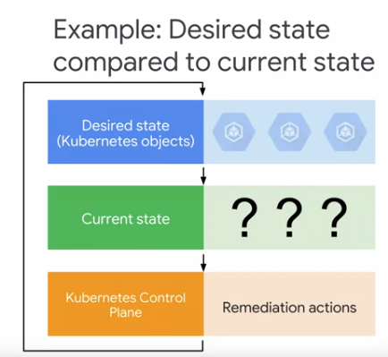
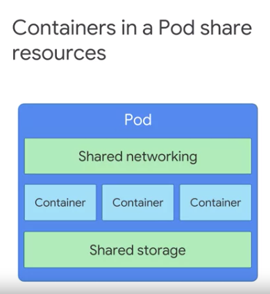
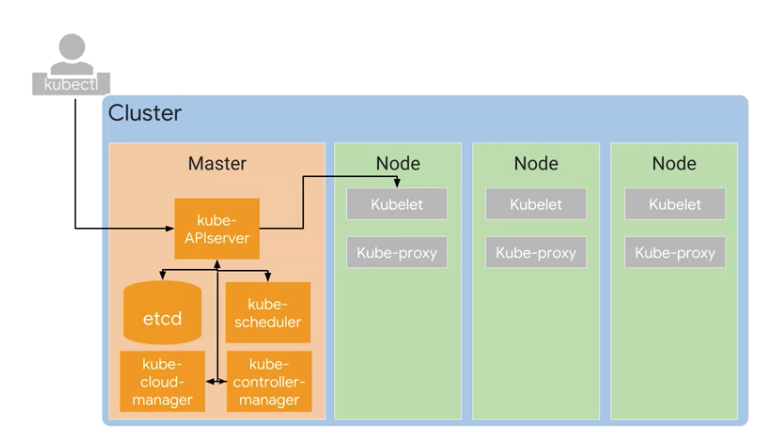
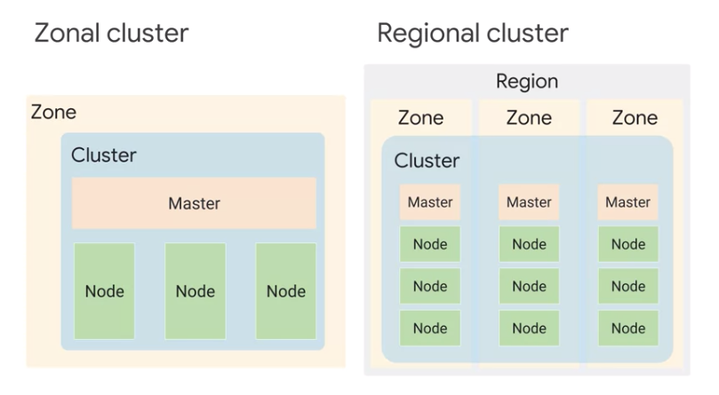

Kubernetes Concept
==================

* Kubernetes object model
* Principle of declartive managment

Kubernetes objects
------------------

Persistent entities representing the state of the cluster ( desired states and current state )

Elements
>>>>>>>>

* **Object Spec:** Desired state described by us
* **Object Status:** Current state described by Kubernetes

**Pods** are the basic building block
-------------------------------------

* Smallest deployable kubernetes object
* Pod can contain more than one container

  * In this case, containers in a pod is tightly coupled
  * sharing resources including `network` and `storage`
  
    * each Pod is allocated unique ip address by Kubernetes
    * containers in a pod shares network namespaces like ip address and network port
    * containers in a pod can communicate through local host
    * containers in a pod can share storage volume in a pod
    
* pod can share storage with other pod as well

Kubernetes Control Plane
------------------------

Master
>>>>>>

* kube-APIServer

  * Handling commands such as viewing, changing state of cluster
  * autheticating incoming requests
  * managing admmision control
  
* etcd

  * cluster's database
  * storing state of cluster
  * storing all of cluster configuration data
  * User doesn't interact with `etcd`
  * kube-APIServer interact with `etcd`
  
* kube scheduler

  * scheduling pods onto nodes
  * but, this doesn't actually launch pod on node

* kube controller manager

  * monitoring state of cluster through kube-APIServer
  
  
* kube cloud manager

  * interacting with underlying cloud providers
  
  
Node
>>>>

* kubelet

  * `container runtime` is a software that knows how to launch container from a container image.
  * In Linux distribution, GKE use `Container D`, the runtime component of Docker.
  
* kube-proxy

  * maintaining network connectivty among pods in cluster
  * using firewall and ip table
  

Google Kubernetes Engines Concept
---------------------------------

GKE: More about Node
>>>>>>>>>>>>>>>>>>>>

* Kubernetes doesn't create node.
* Admin creats nodes and add them into Kubernetes

Benefits of using GKE

  * GKE manages deploying and registring Compute Engines as nodes
  * Compute Engine as node can be configured with custom CPU and memory
  * GKE provide node pool ( what is this? )

GKE: Zonal / Regional
>>>>>>>>>>>>>>>>>>>>>

