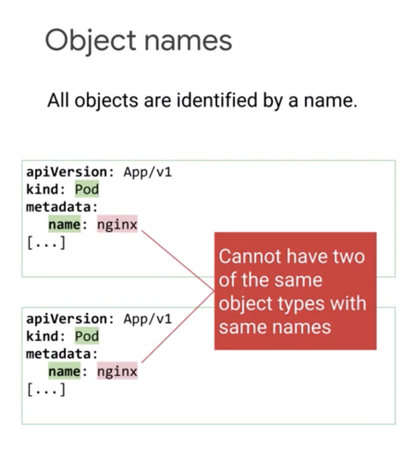
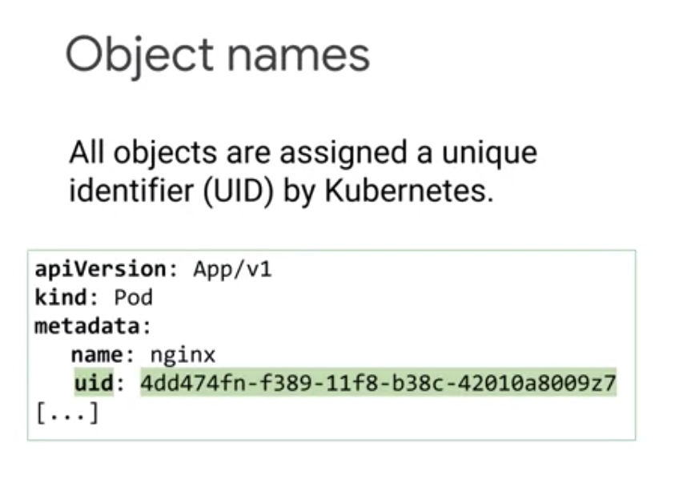
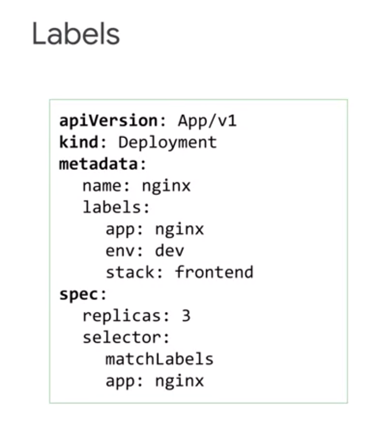
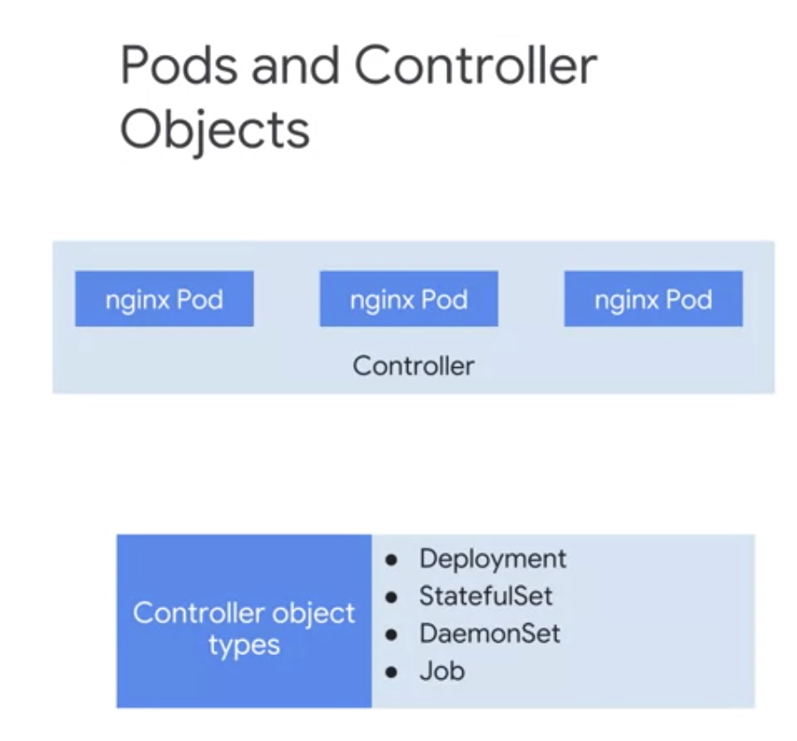
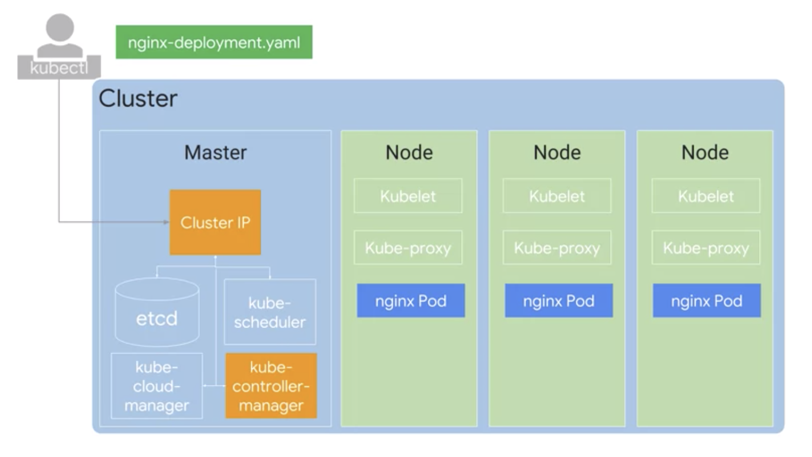
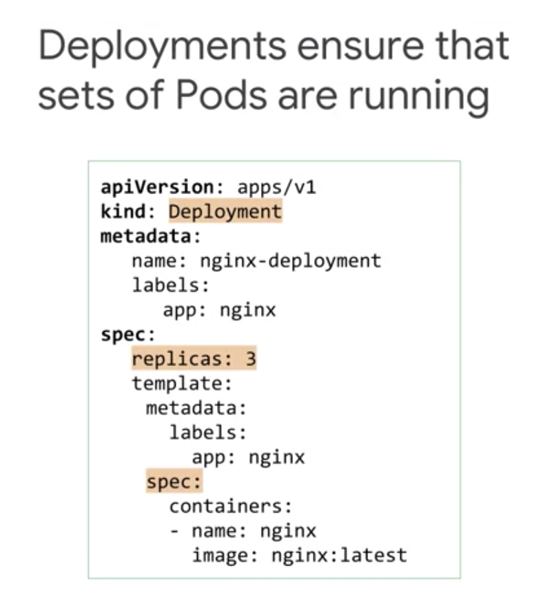
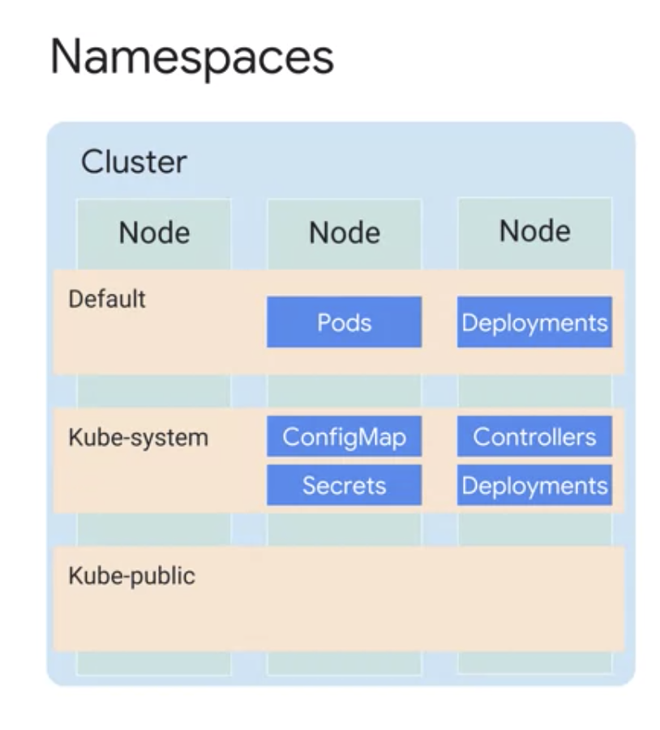
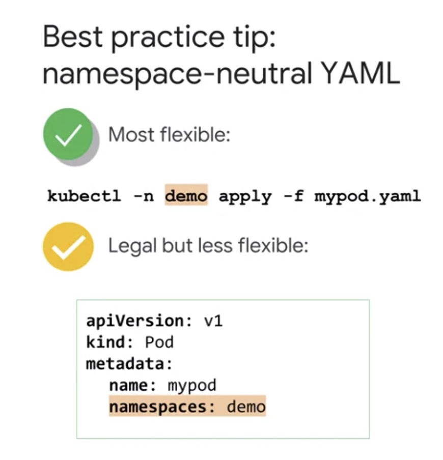
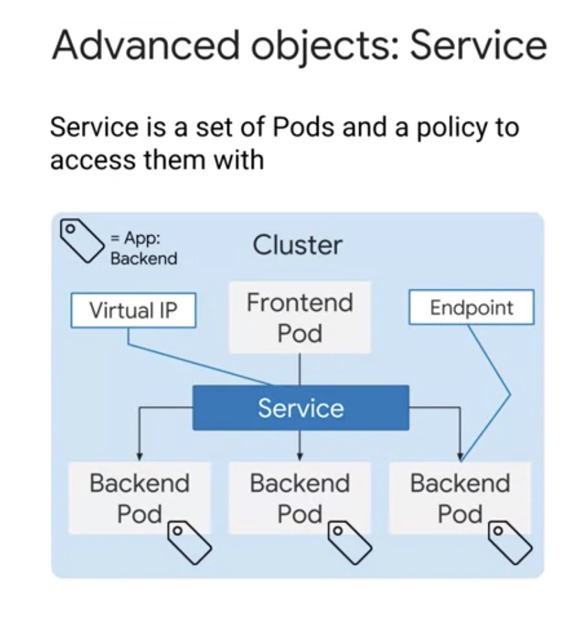

Kubernetes Concept
==================

* Kubernetes object model
* Principle of declartive managment

Kubernetes objects
------------------

Persistent entities representing the state of the cluster ( desired states and current state )

Elements
>>>>>>>>

* **Object Spec:** Desired state described by us
* **Object Status:** Current state described by Kubernetes

.. image:: ./images/k8e-concept/k8e_compare_state.png

**Pods** are the basic building block
-------------------------------------

.. image:: ./images/k8e-concept/k8e_pod.png

* Smallest deployable kubernetes object
* Pod can contain more than one container

  * In this case, containers in a pod is tightly coupled
  * sharing resources including `network` and `storage`
  
    * each Pod is allocated unique ip address by Kubernetes
    * containers in a pod shares network namespaces like ip address and network port
    * containers in a pod can communicate through local host
    * containers in a pod can share storage volume in a pod
    
* pod can share storage with other pod as well

Kubernetes Control Plane
------------------------

.. image:: ./images/k8e-concept/k8e_master_and_node.png

Master
>>>>>>

* kube-APIServer

  * Handling commands such as viewing, changing state of cluster
  * autheticating incoming requests
  * managing admmision control
  
* etcd

  * cluster's database
  * storing state of cluster
  * storing all of cluster configuration data
  * User doesn't interact with `etcd`
  * kube-APIServer interact with `etcd`
  
* kube scheduler

  * scheduling pods onto nodes
  * but, this doesn't actually launch pod on node

* kube controller manager

  * monitoring state of cluster through kube-APIServer
  
  
* kube cloud manager

  * interacting with underlying cloud providers
  
  
Node
>>>>

* kubelet

  * `container runtime` is a software that knows how to launch container from a container image.
  * In Linux distribution, GKE use `Container D`, the runtime component of Docker.
  
* kube-proxy

  * maintaining network connectivty among pods in cluster
  * using firewall and ip table
  

Google Kubernetes Engines Concept
---------------------------------

GKE: More about Node
>>>>>>>>>>>>>>>>>>>>

* Kubernetes doesn't create node.
* Admin creats nodes and add them into Kubernetes

Benefits of using GKE

  * GKE manages deploying and registring Compute Engines as nodes
  * Compute Engine as node can be configured with custom CPU and memory
  * GKE provide node pool ( what is this? )

GKE: Zonal / Regional
>>>>>>>>>>>>>>>>>>>>>

.. image:: ./images/k8e-concept/k8e_zonal_regional_cluster.png

Kubernetes Object Management
----------------------------

* Objects are defined in a YAML file
* This YAML file defines a desired state for a pod
* it's possible and recommended to define serveral related objects in one YAML file

Object Name
>>>>>>>>>>>

Label
>>>>>

Key-Value

Pods and Controller Object
>>>>>>>>>>>>>>>>>>>>>>>>>>>

Deployment Object
>>>>>>>>>>>>>>>>>

Deployment object would create a ReplicaSet object to manage the Pods.

About Namespace
>>>>>>>>>>>>>>>

* Kubernetes allows you to abstract a single physical cluster into multiple clusters known as namespaces.
* Object names need only be unique within a namespace, not acroess all namespaces.
* Resource quotas can be set acroess cluster. This quotas define limits for reource consumtion within a namespace.

Initial Namespaces

And best pratice

Kubernetes Controller Objects
-----------------------------

Service
>>>>>>>

* Service is

  * a static ip address that represents as server or function
  * network abstraction for set of pods that deliver the service
  * hiding ephemeral nature of the IP addresses of the individual Pods

* whenever service is created, Kubenetes creates **Endpoint** for selected pod by creating Endpoint resoures.
* By default, Master assign **Virtual IP** (a.k.a.: ClusterIP ) to server from Internal IP table

Service Type
>>>>>>>>>>>>

Services provide **load-balanced access** to specified Pods. There are three primary types of Services:

* **ClusterIP:** Exposes the service on an IP address that is **only accessible from within this cluster**. This is the default type.
* **NodePort:** Exposes the service on the IP address of each node in the cluster, at a specific port number.
* **LoadBalancer:** Exposes the service externally, using a load balancing service provided by a cloud provider.

In Google Kubernetes Engine, LoadBalancers give you access to a regional Network Load Balancing configuration by default. To get access to a global HTTP(S) Load Balancing configuration, you can use an Ingress object.

Volume
>>>>>>>

* a directory that is accessble to all containers in a Pod
* Requirements of the Volume can be specified using **Pod** specification
* Volumes must be mounted on each container within a Pod (This Volume will be lost when Pod is terminated)
* If Volume need to be kept although Pod is terminated, set up Volume using external storage outside of Pods
  

More details about Kubernetes controller objects
------------------------------------------------

* ReplicaSets
* Deployments
* Replication Controllers
* StatefulSets
* DaemonSets
* Jobs

A ReplicaSet controller ensures that a population of Pods, all identical to one another, are running at the same time. Deployments let you do declarative updates to ReplicaSets and Pods. In fact, Deployments manage their own ReplicaSets to achieve the declarative goals you prescribe, so you will most commonly work with Deployment objects.

Deployments let you create, update, roll back, and scale Pods, using ReplicaSets as needed to do so. For example, when you perform a rolling upgrade of a Deployment, the Deployment object creates a second ReplicaSet, and then increases the number of Pods in the new ReplicaSet as it decreases the number of Pods in its original ReplicaSet.

Replication Controllers perform a similar role to the combination of ReplicaSets and Deployments, but their use is no longer recommended. Because Deployments provide a helpful "front end" to ReplicaSets, this training course chiefly focuses on Deployments.

If you need to deploy applications that maintain local state, StatefulSet is a better option. A StatefulSet is similar to a Deployment in that the Pods use the same container spec. The Pods created through Deployment are not given persistent identities, however; by contrast, Pods created using StatefulSet have unique persistent identities with stable network identity and persistent disk storage.

If you need to run certain Pods on all the nodes within the cluster or on a selection of nodes, use DaemonSet. DaemonSet ensures that a specific Pod is always running on all or some subset of the nodes. If new nodes are added, DaemonSet will automatically set up Pods in those nodes with the required specification. The word "daemon" is a computer science term meaning a non-interactive process that provides useful services to other processes. A Kubernetes cluster might use a DaemonSet to ensure that a logging agent like fluentd is running on all nodes in the cluster.

The Job controller creates one or more Pods required to run a task. When the task is completed, Job will then terminate all those Pods. A related controller is CronJob, which runs Pods on a time-based schedule.

