Serverless Data Processing with Dataflow: Develop Pipelines
===========================================================

Summary of the learning

Beam Concepts Review
====================

Beam Basics
-----------

Providing a structure that unifies "Batch" and "Streaming" processing concepts.

Fore main concepts
>>>>>>>>>>>>>>>>>>

* **PTransforms:** holding "input", "transformation(actions)", "output"
* **PCollections:**

  * "the data held on a distributed data structure"
  * Immutable

* **Pipelines:** Identifies "the date to be processed" and "the action to be taken on the data"
* **Pipeline Runners:**

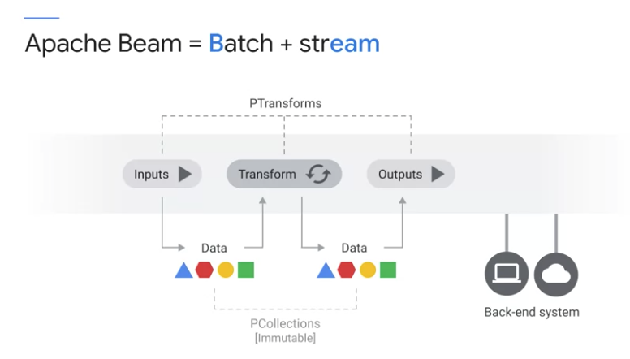

Utility Transforms
------------------

References: https://beam.apache.org/documentation/transforms/python/overview/

* **ParDo:**
* **ParalleDo:**
* **GroupByKey:** we can put all the elements with the same key together in the same worker.
* **Combine:** if group is very large or data is very skewed. This is betther than "GroupByKey"
* **CoGroupByKey:** Left/Right Outer Join, Inner Join ( different value type )
* **Flatten:** merge more than two PCollections ( for exactly the same type )
* **Partition:** opposite of "Flatten". This divides PCollection to several PCollections by applying a function that assigns a group ID to each element in the input PCollection.

DoFn Lifecycle
--------------

ParDo: kind of simple "map" or "filter"

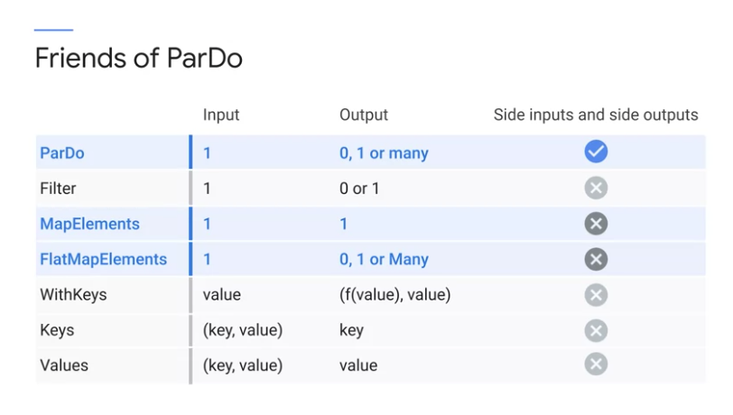
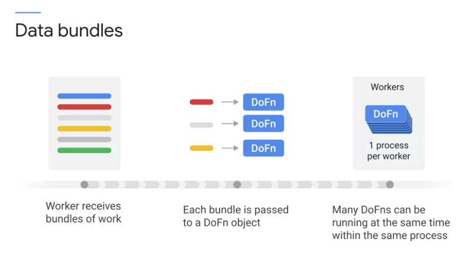
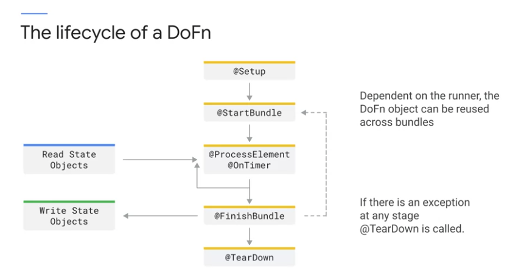

references

  * https://beam.apache.org/documentation/basics/
  * https://beam.apache.org/documentation/programming-guide/
  * https://beam.apache.org/documentation/resources/learning-resources/
  * https://beam.apache.org/documentation/patterns/overview/

.. code-block:: python

    # we can override function to control how to interact with each data bundle.
    # Runner may recycle Do Function or process the same bundle in different workers for redundancy.
    # so, do not mutate external state from your process method.
    # Ensure any state variable is clear in the start bundle method
    # otherwise, the state variable might have one from prev. bundle.
    # FYI, bundle may contain several keys, so store state in maps based on that key.
    class MyDoFn(beam.DoFn):
        def setup(self):
            # google palce to setup db connection / helper process
            pass
        def start_bundle(self):
            pass
        def process(self, element):
            # this is main function
            # this is where tranform happens.
            pass
        def finish_bundle(self):
            pass
        def teardown(self):
            pass

Windows, Watermarks, Triggers
=============================

Data processing in a streaming with Dataflow.
These are three concepts to know.

* How to group data in Windows
* The importance of Watermarks
* When / How many times the Windows will emit output.

Windows in Beam
---------------

* as a way to divide data in groups to transform the data.
* dividing data into time-base finite chunks.
* Required when doing aggregatios over unbounded data using Beam primitives ( GroupByKey, Combiners )

    * It's possible to aggregate based on state and timers

* Two dimensions of times

    * Processing time
    * Event Time

* deciding where(window) to put the msg ( by processing time or event time )

Processing time
>>>>>>>>>>>>>>>

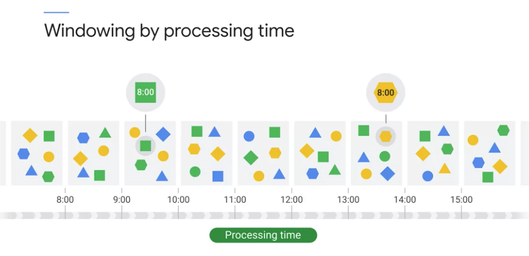

* Using `current timestamp` assigned to every new message by Dataflow.
* This is the same as micro batching.

    * the msg will be assigned to different batches if msg arrives out of order.

Event Time
>>>>>>>>>>

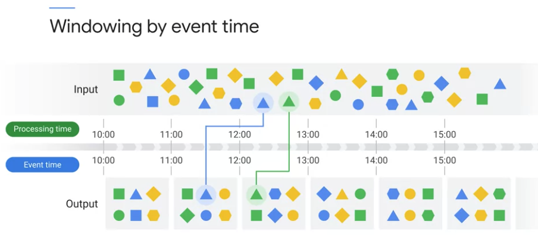

Using timestamp in the orginal message

Types of windows in Beam
>>>>>>>>>>>>>>>>>>>>>>>>

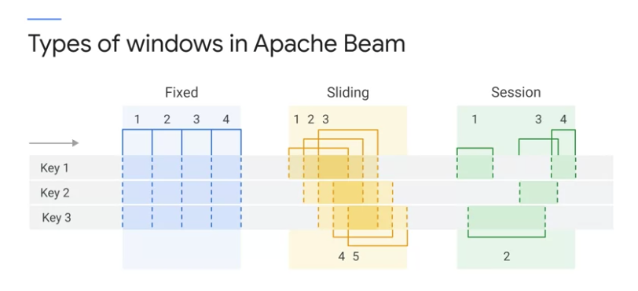

* **Fixed:** none-overlapping interval
* **Sliding:** may overlap interval, calculating a moving average
* **Session:** capturing user activities.

    * timing is triggered by another element.
    * data dependent

* **Custom:**

Watermarks
----------

* Decide when the window emits the results
* simply maybe when the window closes. ( intuitive for fixed window )

    * not so obvious for Session window
    * there could be late data
    * how to define late data?

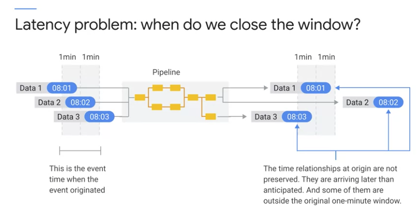
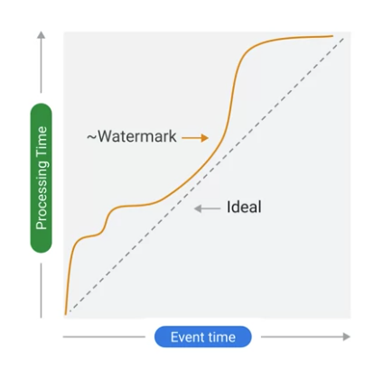

* The relationship between `processing timestamp` and `event timestamp` defines the watermark.
* Any msg before the watermak is considered to be `early`
* Watermark defines if the msg is late or not.
* Watermark can't be calculated because it is for msg that have not been seen.

  * Dataflow estimates it with the oldest timestamp waiting to be processed.
  * The watermark estimation is continuously updated with every new received msg.

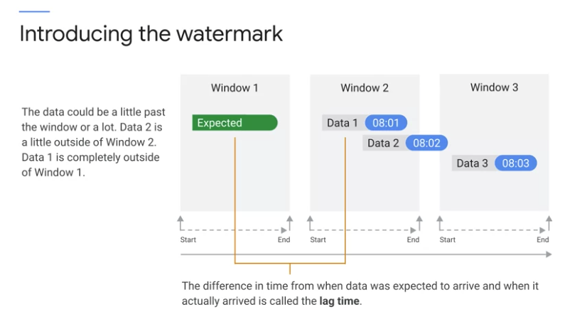

* **Lag time:** the difference between expected and actual arriving time.
* the deviation from the ideal expectation(lag time) is `watermark`.

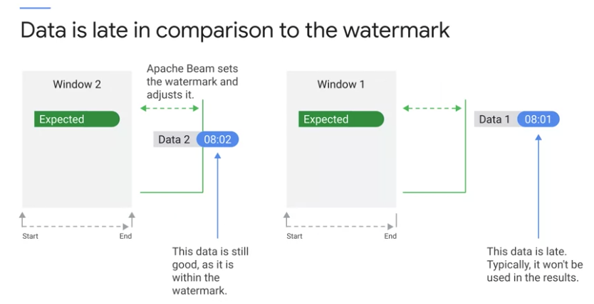

* I have to make a decision what I would do with the late data.
* The default behavior is to drop the late data.

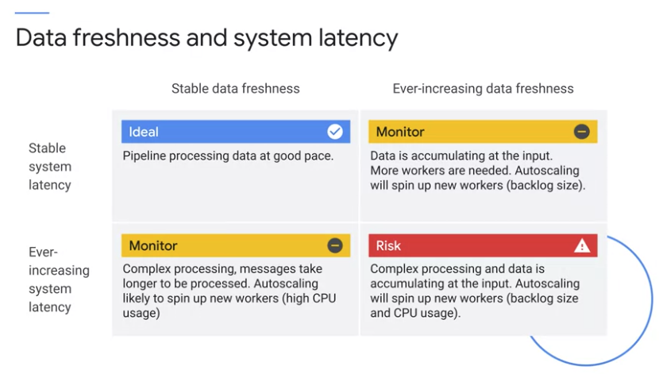

Triggers
--------
