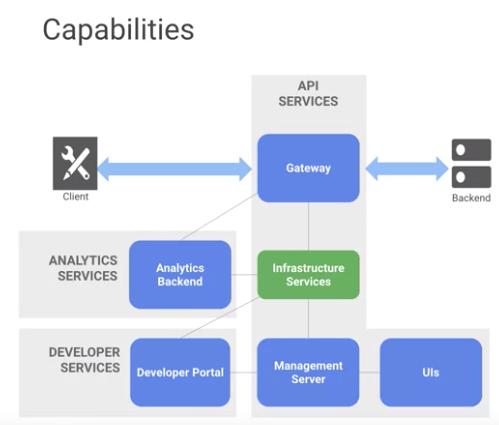
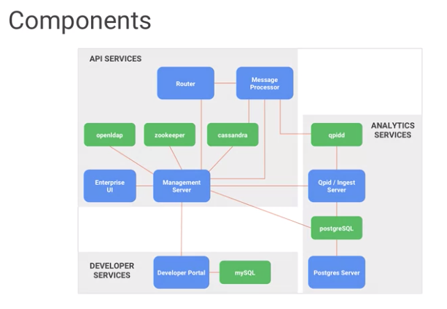
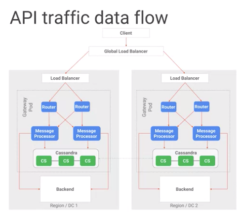
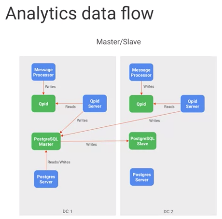
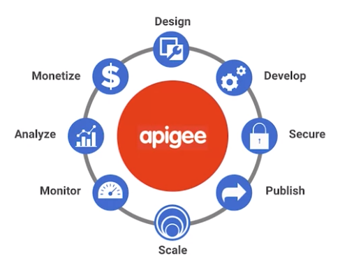

API Design and Fundamentals of Google Cloud's Apigee API Platform
=================================================================

* https://www.coursera.org/learn/api-design-apigee-gcp

Apigee Product Suite
--------------------

* Apigee Sense
* API Monetization
* Apigee Edge

Apigee Edge
-----------

* as a platfrom, horizontally scalable
* can be configured single zone or acoress zones

API Service
>>>>>>>>>>>

* API Gateway
* Policies / Programmability
* OAuth / Security
* Versioning / Goverance

Developer Service
>>>>>>>>>>>>>>>>>

* API Potal
* Smart Docs
* Monetization

Analytics Service
>>>>>>>>>>>>>>>>>

* Developer Analytics
* Ops & Business Metrics
* App performance
* Custom Reports

Apigee API Platform Technology Stack
------------------------------------

* Gateway

  * Routing
  * Processing(?)

* UIs for

  * Enterprise admin
  * Developer potals
  
* Infrastructure services

  * handling persistence of runtime
  * analytics data
  
* Management server provides APIs for

  * all configuration
  * management activities
  

Components
----------

API Traffic data flow
---------------------

1. Router receive/send client request to Message Processors
2. Message Processor execute policies within API proxy Implementation and forward the request to the backend system.
3. Message Processor interacts with Cassandra for token validation and other policies.
4. Message Processor waits for response from backend system
5. Message Processor sends response back to client via Router

Analytics data flow
-------------------

* Message Processor process and asynchronously send message to Qpid server.
* Qpid server consumes the analytics raw data and writes it onto the PostgreSQL database

API Life Cycle
--------------

Design
>>>>>>

* OpenAPI
* Upload API Specs
* Generate API Proxies
* Pre-built API Proxies ( Proxy Managment, Mediation, Security, Extension )
* API Proxies debugging tool

Secure
>>>>>>

* End-to-End Security
* PCI Compliance
* HIPAA Compliance

Publish
>>>>>>>

* API Potal integration
* Testable documentation
* Version management

Scale
>>>>>

* Centralized control, decentralized development, and multi-tenant architecture
* High availablity ( scaliing horizotally within a data center or multiple data centers )
* Zero downtime

Monitor / Analyze
>>>>>>>>>>>>>>>>>

* Performance visibility
* Usage Information
