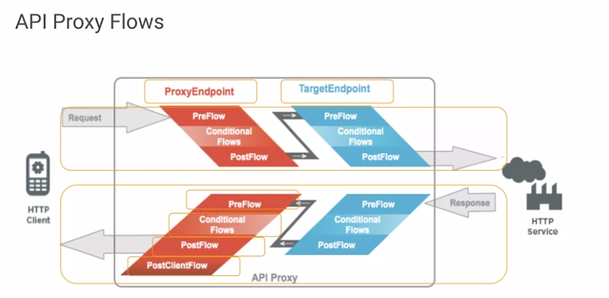
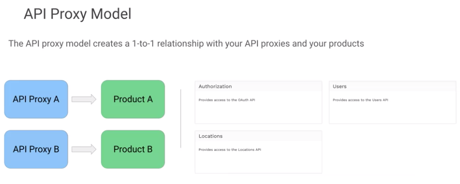
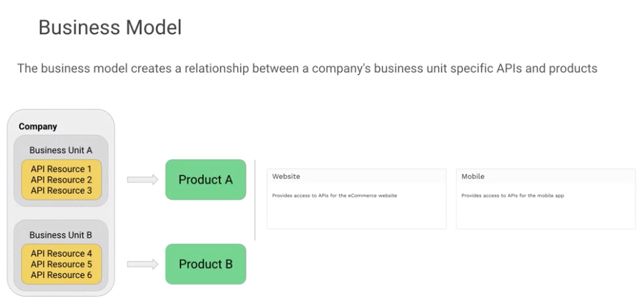
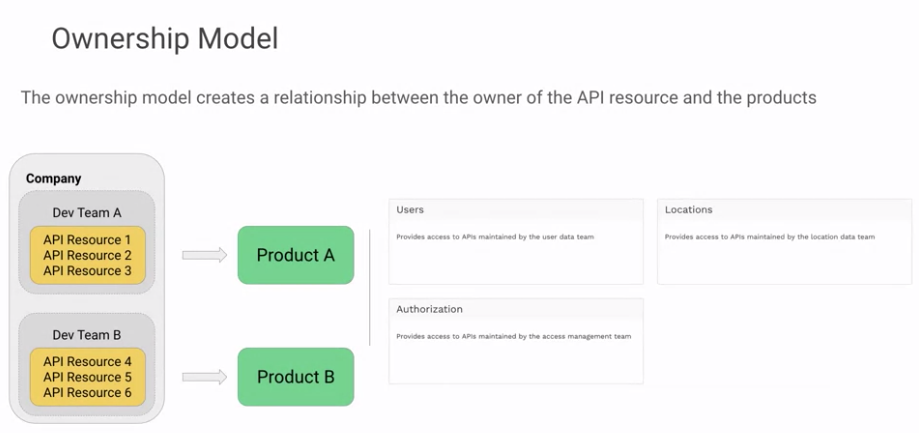
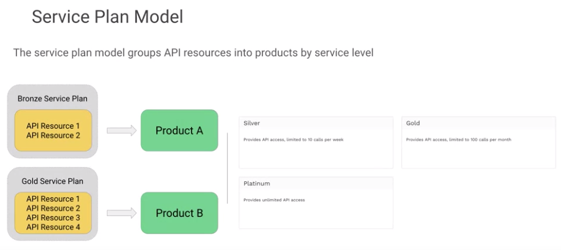

API Design and Fundamentals of Google Cloud's Apigee API Platform
=================================================================

* https://www.coursera.org/learn/api-design-apigee-gcp

Apigee Product Suite
--------------------

* Apigee Sense
* API Monetization
* Apigee Edge

Apigee Edge
-----------

* as a platfrom, horizontally scalable
* can be configured single zone or acoress zones

API Service
>>>>>>>>>>>

* API Gateway
* Policies / Programmability
* OAuth / Security
* Versioning / Goverance

Developer Service
>>>>>>>>>>>>>>>>>

* API Potal
* Smart Docs
* Monetization

Analytics Service
>>>>>>>>>>>>>>>>>

* Developer Analytics
* Ops & Business Metrics
* App performance
* Custom Reports

Apigee API Platform Technology Stack
------------------------------------

.. image:: images/gcp_apigee/apigee_api_platform_tech_stack.png

* Gateway

  * Routing
  * Processing(?)

* UIs for

  * Enterprise admin
  * Developer potals
  
* Infrastructure services

  * handling persistence of runtime
  * analytics data
  
* Management server provides APIs for

  * all configuration
  * management activities
  

Components
----------

.. image:: images/gcp_apigee/apigee_components.png

API Traffic data flow
---------------------

1. Router receive/send client request to Message Processors
2. Message Processor execute policies within API proxy Implementation and forward the request to the backend system.
3. Message Processor interacts with Cassandra for token validation and other policies.
4. Message Processor waits for response from backend system
5. Message Processor sends response back to client via Router

.. image:: images/gcp_apigee/apigee_api_traffic_data_flow.png

Analytics data flow
-------------------

* Message Processor process and asynchronously send message to Qpid server.
* Qpid server consumes the analytics raw data and writes it onto the PostgreSQL database

.. image:: images/gcp_apigee/apigee_analytics_data_flow.png

API Life Cycle
--------------

.. image:: images/gcp_apigee/apigee_api_lifecycle.png

Design
>>>>>>

* OpenAPI
* Upload API Specs
* Generate API Proxies
* Pre-built API Proxies ( Proxy Managment, Mediation, Security, Extension )
* API Proxies debugging tool

Secure
>>>>>>

* End-to-End Security
* PCI Compliance
* HIPAA Compliance

Publish
>>>>>>>

* API Potal integration
* Testable documentation
* Version management

Scale
>>>>>

* Centralized control, decentralized development, and multi-tenant architecture
* High availablity ( scaliing horizotally within a data center or multiple data centers )
* Zero downtime

Monitor / Analyze
>>>>>>>>>>>>>>>>>

* Performance visibility
* Usage Information

Monetize
>>>>>>>>

* Flexible Rate Plans
* Internationalization support
* Usage tracking
* Limits & Notification

Fundmental Concepts and Keywords
--------------------------------

* Pre Flow
* Conditional Flows ( zero or more )
* Post Flow

Create OpenAPI Spec through Apigee Edge UI
------------------------------------------

* Develip > Specs, Click `+Spec`
* Develop > API Proxies, Click `+Proxy`

  * Select `Reverse Proxy` ( Click `Use OpenAPI` )
  * Select OAuth 2.0 in Security, Check `Add CORS headers` option

Package, Publish, and Manage API
--------------------------------

Under **Publish** menu

* `Developer` in menu indicates App developer, not API developer
* `Apps` is the application created by App developer
* `API Product` is a collection or bundle of APIs to achieve a certain set of functionality.
* `Portal` provides ( typically one `Potal` for a org )

  * API documentation
  * allow App developer to try API,
  * allow App developer to register App
  * allow App developer to obtain key in secret
  * allow App developer to view analytics about their App, such as number of calls.
  
  
Analyze your APIs
-----------------

Under **Analyze** menu

* API Metrics > API Proxy Performance

  * Total traffic / Success and Error rate / Avg. response time
  * Each Proxy Performance can be viewed
  
* Developers > Developer Engagement : adoption rate of my service can be measured.

API Desgin
----------

* What is REST?

  * Representational State Transfer
  * Architectural style for distributed information system
  * HATEOAS: Hypermedia as the Engine of Application State: This means response payload should include hyperlinks instructing the developer application on what action can be performed next.

* Pragmatic REST?

  * HTTP verb driven: GET/POST/PUT/DELETE
  * Rsource oriented
  
    * /v1/customers - a collection of or search for customers
    * /v1/customers/{id} - a specific customer 

  
Best Pratice in API Design
--------------------------

* Self Question: "Why are these APIs are being implemented"
* outside-in(consumption model) rather than inside-out (exposure model)

Sample Mission
>>>>>>>>>>>>>>

Reduce time to market for new Apps

* More than just wrapping existing services
* Development teams need:

  * Consistency
  * Sandboxes to test theories
  * Google Documentation
  * Uninterrupted Workflow
  * Stable Environments
  

Tips for Success
>>>>>>>>>>>>>>>>

* Spend 70% of your design effort on APIs that have consumers who can tell you if what you're designing is useful(or not)
* Spend more time thinking about **resources** that are used, not actions that are taken. ( Nones are preferred over verb )
* Before designing new API, evaluate the current one can be reused or modified.

None-oriented Resourcs
>>>>>>>>>>>>>>>>>>>>>>

* keep primary resources to 2 levels
* Use plural nouns for collections
* Prefer concreat names over abstractions

Use HTTP verp
>>>>>>>>>>>>>

* GET / POST / PUT / DELETE

Sweep complexity behind of `?`
>>>>>>>>>>>>>>>>>>>>>>>>>>>>>

* Relationships can be complex. Use query parameters instead of complex pathing.

Product Design
--------------

Products are how App developers and their apps access your API proxies and resources.

Prodct Strategies
>>>>>>>>>>>>>>>>>

* API Proxy Model
* Business Model
* Ownership Model
* Service Plan Model

API Proxy Model
>>>>>>>>>>>>>>>

Business Model
>>>>>>>>>>>>>>

Ownership Model
>>>>>>>>>>>>>>>

Service Plan Model
>>>>>>>>>>>>>>>>>>

API Versioning Strategy
-----------------------

Versioning is needed when
>>>>>>>>>>>>>>>>>>>>>>>>>

* change would break existing software
* new fields are required in payload
* previously available data is removed

Versioning approaches
>>>>>>>>>>>>>>>>>>>>>

Use a custom header

.. code-block:: text

  GET /1/accounts
  x-api-version: 1.1
  

Versiion indicator(v20) somewhere in the URI:

.. code-block:: text

  GET /v20/accounts
  

Versioning Communication
>>>>>>>>>>>>>>>>>>>>>>>>

* Proactive prior to release
* Leverage API Portal
* Provide details and context
* Provide deprecation details for older versions, if applicable

Maintain old version 6-12mo

