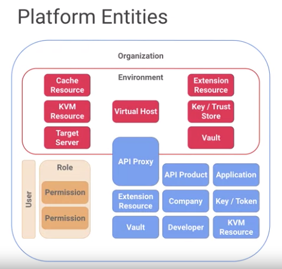

API Design and Fundamentals of Google Cloud's Apigee API Platform
=================================================================

* https://www.coursera.org/learn/api-design-apigee-gcp

Apigee Product Suite
--------------------

* Apigee Sense
* API Monetization
* Apigee Edge

Apigee Edge
-----------

* as a platfrom, horizontally scalable
* can be configured single zone or acoress zones

API Service
>>>>>>>>>>>

* API Gateway
* Policies / Programmability
* OAuth / Security
* Versioning / Goverance

Developer Service
>>>>>>>>>>>>>>>>>

* API Potal
* Smart Docs
* Monetization

Analytics Service
>>>>>>>>>>>>>>>>>

* Developer Analytics
* Ops & Business Metrics
* App performance
* Custom Reports

Apigee API Platform Technology Stack
------------------------------------

* Gateway

  * Routing
  * Processing(?)

* UIs for

  * Enterprise admin
  * Developer potals
  
* Infrastructure services

  * handling persistence of runtime
  * analytics data
  
* Management server provides APIs for

  * all configuration
  * management activities
  

Components
----------

.. image:: images/gcp_apigee/apigee_components.png

API Traffic data flow
---------------------

1. Router receive/send client request to Message Processors
2. Message Processor execute policies within API proxy Implementation and forward the request to the backend system.
3. Message Processor interacts with Cassandra for token validation and other policies.
4. Message Processor waits for response from backend system
5. Message Processor sends response back to client via Router

.. image:: images/gcp_apigee/apigee_api_traffic_data_flow.png

Analytics data flow
-------------------

* Message Processor process and asynchronously send message to Qpid server.
* Qpid server consumes the analytics raw data and writes it onto the PostgreSQL database

.. image:: images/gcp_apigee/apigee_analytics_data_flow.png

API Life Cycle
--------------

Design
>>>>>>

* OpenAPI
* Upload API Specs
* Generate API Proxies
* Pre-built API Proxies ( Proxy Managment, Mediation, Security, Extension )
* API Proxies debugging tool

Secure
>>>>>>

* End-to-End Security
* PCI Compliance
* HIPAA Compliance

Publish
>>>>>>>

* API Potal integration
* Testable documentation
* Version management

Scale
>>>>>

* Centralized control, decentralized development, and multi-tenant architecture
* High availablity ( scaliing horizotally within a data center or multiple data centers )
* Zero downtime

Monitor / Analyze
>>>>>>>>>>>>>>>>>

* Performance visibility
* Usage Information

Monetize
>>>>>>>>

* Flexible Rate Plans
* Internationalization support
* Usage tracking
* Limits & Notification

Fundmental Concepts and Keywords
--------------------------------

.. image:: images/gcp_apigee/apigee_api_proxy_flows.png

* Pre Flow
* Conditional Flows ( zero or more )
* Post Flow

Create OpenAPI Spec through Apigee Edge UI
------------------------------------------

* Develip > Specs, Click `+Spec`
* Develop > API Proxies, Click `+Proxy`

  * Select `Reverse Proxy` ( Click `Use OpenAPI` )
  * Select OAuth 2.0 in Security, Check `Add CORS headers` option

Package, Publish, and Manage API
--------------------------------

Under **Publish** menu

* `Developer` in menu indicates App developer, not API developer
* `Apps` is the application created by App developer
* `API Product` is a collection or bundle of APIs to achieve a certain set of functionality.
* `Portal` provides ( typically one `Potal` for a org )

  * API documentation
  * allow App developer to try API,
  * allow App developer to register App
  * allow App developer to obtain key in secret
  * allow App developer to view analytics about their App, such as number of calls.
  
  
Analyze your APIs
-----------------

Under **Analyze** menu

* API Metrics > API Proxy Performance

  * Total traffic / Success and Error rate / Avg. response time
  * Each Proxy Performance can be viewed
  
* Developers > Developer Engagement : adoption rate of my service can be measured.

API Desgin
----------

* What is REST?

  * Representational State Transfer
  * Architectural style for distributed information system
  * HATEOAS: Hypermedia as the Engine of Application State: This means response payload should include hyperlinks instructing the developer application on what action can be performed next.

* Pragmatic REST?

  * HTTP verb driven: GET/POST/PUT/DELETE
  * Rsource oriented
  
    * /v1/customers - a collection of or search for customers
    * /v1/customers/{id} - a specific customer 

  
Best Pratice in API Design
--------------------------

* Self Question: "Why are these APIs are being implemented"
* outside-in(consumption model) rather than inside-out (exposure model)

Sample Mission
>>>>>>>>>>>>>>

Reduce time to market for new Apps

* More than just wrapping existing services
* Development teams need:

  * Consistency
  * Sandboxes to test theories
  * Google Documentation
  * Uninterrupted Workflow
  * Stable Environments
  

Tips for Success
>>>>>>>>>>>>>>>>

* Spend 70% of your design effort on APIs that have consumers who can tell you if what you're designing is useful(or not)
* Spend more time thinking about **resources** that are used, not actions that are taken. ( Nones are preferred over verb )
* Before designing new API, evaluate the current one can be reused or modified.

None-oriented Resourcs
>>>>>>>>>>>>>>>>>>>>>>

* keep primary resources to 2 levels
* Use plural nouns for collections
* Prefer concreat names over abstractions

Use HTTP verp
>>>>>>>>>>>>>

* GET / POST / PUT / DELETE

Sweep complexity behind of `?`
>>>>>>>>>>>>>>>>>>>>>>>>>>>>>

* Relationships can be complex. Use query parameters instead of complex pathing.

Product Design
--------------

Products are how App developers and their apps access your API proxies and resources.

Prodct Strategies
>>>>>>>>>>>>>>>>>

* API Proxy Model
* Business Model
* Ownership Model
* Service Plan Model

API Proxy Model
>>>>>>>>>>>>>>>

Business Model
>>>>>>>>>>>>>>

Ownership Model
>>>>>>>>>>>>>>>

Service Plan Model
>>>>>>>>>>>>>>>>>>

API Versioning Strategy
-----------------------

Versioning is needed when
>>>>>>>>>>>>>>>>>>>>>>>>>

* change would break existing software
* new fields are required in payload
* previously available data is removed

Versioning approaches
>>>>>>>>>>>>>>>>>>>>>

Use a custom header

.. code-block:: text

  GET /1/accounts
  x-api-version: 1.1
  

Versiion indicator(v20) somewhere in the URI:

.. code-block:: text

  GET /v20/accounts
  

Versioning Communication
>>>>>>>>>>>>>>>>>>>>>>>>

* Proactive prior to release
* Leverage API Portal
* Provide details and context
* Provide deprecation details for older versions, if applicable

Maintain old version 6-12mo

Response code and Pagination
----------------------------

Return 404(Not Found) rather than 403(Forbidden)
>>>>>>>>>>>>>>>>>>>>>>>>>>>>>>>>>>>>>>>>>>>>>>>>

In order to prevent malicious user to get idea that a certain id doesn't / exist.

Seven most commonly used status code
>>>>>>>>>>>>>>>>>>>>>>>>>>>>>>>>>>>>

* 200 (OK)
* 201 (Created)
* 304 (Not modified)
* 400 (Bad request)
* 401 (Unauthorized)
* 404 (Not found)
* 500 (server error)

Avoiding response
>>>>>>>>>>>>>>>>>

* 200(OK), but response message has 400(Bad Request)
* response has server application info

Suggested response
>>>>>>>>>>>>>>>>>>

* For 400(Bad request), return doclink, so App developer get more detail.
* For 500(Server Error), email contact or correlationId

Pagination
>>>>>>>>>>

OpenAPI Spec
------------

Formally known as Swagger

SpenAPI Specification (OAS) 
>>>>>>>>>>>>>>>>>>>>>>>>>>>

* standard format
* easy to understand
* vendor neutral
* machine readable

Elements
>>>>>>>>

* base path
* path
* verbs
* headers
* query parameters
* content types
* request / response payload
* etc.

Key benefits
>>>>>>>>>>>>

* build mock service
* generate client SDKs
* source controlled
* generate docs and tests
* use spec as code

API Development on Google Cloud's Apigee API Platform
=====================================================

Why Proxy?
----------

Anatomy of an API Proxy
-----------------------

Build First API
---------------

* https://docs.apigee.com/api-platform/fundamentals/build-simple-api-proxy
* https://docs.apigee.com/api-platform/fundamentals/best-practices-api-proxy-design-and-development
* https://docs.apigee.com/api-platform/debug/using-trace-tool-0

Conditions & Route Rules
-------------------------

Conditions
>>>>>>>>>>

* Dynamic processing at runtime
* Define operations on variables
* Results are boolean
* Allows chaining

Condition Chaning
>>>>>>>>>>>>>>>>>

Condition Format
>>>>>>>>>>>>>>>>

Condition - Policy Execution
>>>>>>>>>>>>>>>>>>>>>>>>>>>>

If `flow variable` is accessed outside of scope, Null value will be returned.

Condtion - Flow Execution
>>>>>>>>>>>>>>>>>>>>>>>>>

* Only first matched condition will be executed. 
* Since conditions are evaluated top-bottom, put catch-all-flow at last

Condtion - Target End Point Route Selection
>>>>>>>>>>>>>>>>>>>>>>>>>>>>>>>>>>>>>>>>>>>

Condtion - Pattern matching
>>>>>>>>>>>>>>>>>>>>>>>>>>>

* Matches

  * Case sensitive
  * string literal, wildcard match with asterix, 
  * tilt and `LIKE` does same thing

* JavaRegex

  * double tilts does same thing

* MatchesPath

  * similar to `Matches`
  * support double `asterix`
  * single `asterix` matches one path element
  * double `asterix` matche one or many path elements
  
 
Route Rules
>>>>>>>>>>>
 

API Policy
----------

API Policy - Traffic managment
------------------------------

* https://docs.apigee.com/api-platform/develop/comparing-quota-spike-arrest-and-concurrent-rate-limit-policies
* https://docs.apigee.com/api-platform/develop/rate-limiting

Spike Arrest
>>>>>>>>>>>>

* Help protect API proxy's target backend against severe traffic skikes and denial of service attack
* Used to control requests by second and minite
* Typically used in **preflow**

Quota
>>>>>

* Typically used in **preflow**
* Reset Quota is used to reset quota

Concurrent Rate Limit
>>>>>>>>>>>>>>>>>>>>>

* Throttles inbound connections from Edge to backend serviers
* used to limit the number of concurrent connections
* Not typically used, but available
* Need to be attached to both the request and response flows in the Target Endpoint

Response Cache
>>>>>>>>>>>>>>

* used to cache the whole HTTP response
* improve performance
* Policy attached in both the request and response flows
* Typically only used with GET calls

Cache
>>>>>

* Used to cache specfic pieces of data within the proxy
* Examples of using cache

  * tokens, service callout response, data from previous calls, etc

* Use the `populate`, `lookup`, and `invalidate` policies to control the cache

API Policy - Mediation
----------------------

* Format Trasform policy ( e.g.: XML > JSON )
* Message Validation
* Policay can be used at any point in the proxy
* Assign Message ( Create or Update )
  
  * Request
  * Response
  * Flow variables
  
* Extrac variables

  * Extract data from:

    * Request
    * Response
    * JSON or XML objects
  
  * Use a text pattern to extract the data

* Access Entity

  * Access profiles for
  
    * Developer
    * Developer App
    * API Product
    * Company
    * Company developer
    * Consumer ID
    
* Key value Map ( KVM ) Operations

  * Access KV storaged in Apigee Edge:
  
    * GET, PUT, DELETE
    

API Policy - Security
---------------------

* Base64 Auth
* XML/JSON/Regex Threat Protection
* Verify API Key
* OAuth v1.0a
* OAuth 2
* SAML
* Access Control

Target Servers
---------------

Buildling Target Authentication
>>>>>>>>>>>>>>>>>>>>>>>>>>>>>>>

* Hard Code
* Replace at build time
* Node.js valut
* Encrypted KV

Setting up Named Target Server
>>>>>>>>>>>>>>>>>>>>>>>>>>>>>>

If Target servers' hostanme is different depending on test or prod environment, Target Servers' hostname can be configured through Admin > Environments > Target Servers

Multiple Target servers
>>>>>>>>>>>>>>>>>>>>>>>

Load Balancer

* RoundRobin
* Weighted
* LeastConnections
* Others

  * MaxFailures:
  * RetryEnabled: retry after I/O error
  * IsFallback: if all others are unavailable, the use fallback server
  
  
Fault Rules and Error Responses
-------------------------------

Terminology
>>>>>>>>>>>

1. Raise Fault policy
2. Apigee raises an error during policy execution
3. Fault Rule == Fault Handler ( error flow )

* Raising Fault policy ( raising exception )
* Fault Handler ( try-catch )

Fault Handling
>>>>>>>>>>>>>>

* Proxy Endpoint evaluates Error bottom to top
* Target Endpoint evaluates Error top to bottom

* If Fault Rule doesn't have condition, then it will be executed always.
* DefaultFaultRule has `<AlwaysEnforce>`. If this is set to true, then although other FaultRule is executed, the default FaultRule is executed as well.

Shared Flow
-----------

What is Shared Flow?

* A collectino of policies and resouces that can be reused acroess API proxies
* Typically used for common operation flows ( authetication, logging, etc. )

Shared Flow can be created through **Develop > Shared Flow**

How to add Shared Flow into API Proxy
>>>>>>>>>>>>>>>>>>>>>>>>>>>>>>>>>>>>>

API Proxy > Develop

* Add Policy
* Under extension > Flow callout, select Sahred Flow

Flow Hook
>>>>>>>>>

* Pre-proxy Flow hook: BEFORE a proxy endpoint executes
* Pre-target Flow hook: BEFORE a target endpoint executes
* Post-target Flow hook: AFTER a target endpoint executes
* Post-proxy Flow hook: AFTER a proxy endpoint executes and right before the response is sent out to the client

Admin > Environments > Flow Hooks Tab

Service Callout and Mash Ups
----------------------------

Service Callout
>>>>>>>>>>>>>>>

When to use? Anytime, when more than one request need to be made to backend service.

* Adds another service call to API Proxy flow
* Supports requests over HTTP & HTTPS
* Typically used with:

  * Assign Message Policy
  * Extract Message Policy
  
Service Callout Target
>>>>>>>>>>>>>>>>>>>>>>

* HTTP Target Connection

  * URL
  * Target Server
  
* Local Target Connection

  * API Proxy
  * Proxy Endpoint
  * Path

Caching
-------

Why Use Caching?

* Performance
* Stability
* Scalability
* Persistence
* Security

Caching Two Levels
>>>>>>>>>>>>>>>>>>

* In-memory Cache (L1)

  * fast access
  * certain percentage of memory per message processor
  * entries are removed in the order of time since last access
  
* Persistent Cache (L2)

  * cache datastore per message processor
  * persisted even if removed from L1
  * no limit on the number of cache entries
  * expired only on the basis of expiration settings
  
Distributed Caching
>>>>>>>>>>>>>>>>>>>

Any Message Processor can access same cached data.

Caching Policies
>>>>>>>>>>>>>>>>

* Response cache

  * caches the entire HTTP response (headers, payload, etc. )
  * configure time-to-live
  * honor HTTP cache headers
  * caching of multiple formats
  * attached at request and response segments
  

* Populate Cache/Lookup Cache

  * runtime persistence of data across requests
  * full control over caching, store any objects
  * configure time-to-live
  * add/update and read entries using separate policies
  

Which caching policy to use?
>>>>>>>>>>>>>>>>>>>>>>>>>>>>

* Use **response cache**

  * identical request and response
  * reduce unnecessary traffice to backend
  * reduce latency for common requests
  
* Use Populate Cache/Lookup Cache

  * storing custom data objects
  * to persist across multiple API transactions
  

Cache Utilization and Optimization
>>>>>>>>>>>>>>>>>>>>>>>>>>>>>>>>>>

* use only when needed
* ensure if cache key is built correctly
* take advantage of the cache scopre for re-use
* use the built-in Cache performance dashboard in Analytics

Clearing Cache
>>>>>>>>>>>>>>

* UI
* Management API
* InvalidateCache Policy

API Security on Google Cloud's Apigee API Platform
==================================================

API Security Fundmentala
------------------------

Protection Against Content Based Attack
>>>>>>>>>>>>>>>>>>>>>>>>>>>>>>>>>>>>>>>

* Content Based Attack

  * Message content is a significant attack vector
  * Policies to mitigate the risk of your backend being compromised by malicious request payloads

* Content Based Security ( putting load into JSON/XML/Regexp Parser )

  * JSON Threat Protection Policy
  * XML Threat Protection Policy
  * Regular Expression Threat Protection Policy
  

OAuth Introduction
------------------

OAuth Role
>>>>>>>>>>

* **Resource Owner**

  Owns access to protected resources

* **Resource Server**

  Protected server; accepts access tokens

* **Client**

  application making requests to protected resources

* **Authorization Server**

  Issue access token to client

OAuth Review
>>>>>>>>>>>>

* In OAuth 2.0

  * Client grant access to server resources without sharing resource owner's credentials

* `Client IDs` and `Secrets`

  * used to identify and autheticate application

* Token

  * `Client IDs` and `Secrets` are exchanged for `Access Token`
  * Grant client access to a resource server
  * Time bound ( to prevent unauthorized access if token is stolen )
  
* Scope

  * limits the tokens access for a resource
  
* 4 Grant Type

  * client credentials
  * password
  * authorization code
  * implicit

* Require TLS

  * OAuth 2.0 must be protected via TLS
  

Getting Access Token
>>>>>>>>>>>>>>>>>>>>

Refreshing Access Token
>>>>>>>>>>>>>>>>>>>>>>>

Scope
>>>>>

* Read
* Updte

OAuth Grant Type
----------------

Actors
>>>>>>

* client credentials

  * client
  * resouce server
  
* owner password

  * User
  * client
  * Apigee Edge
  * Authetication server
  * Resource server
  
* authorization code

  * User
  * User Agent
  * client
  * Apigee Edge ( Authorization server )
  * Authetication server (Login App)
  * Resource server 

* implicit

  * User
  * User Agent
  * client
  * Apigee Edge ( Authorization server )
  * Authetication server (Login App)
  * Resource server 
  

Grant Type - client credentials
>>>>>>>>>>>>>>>>>>>>>>>>>>>>>>>

* simple, least secure
* when there is no user context
* when data doesn't belong to anybody ( like store location )

* **token on each subsequent API call has to be verified by access token policy**

Grant Type - Owner password
>>>>>>>>>>>>>>>>>>>>>>>>>>>

* more complex and secure than `client credentials grant type`
* owned by a particular user ( user login )
* resource owner's credential like username/password can be used directly as an authorization grant to obtain an access token
* This approach should only be used where

  * there is a high trust between resource owner and client(app)
  * other authorization grant types are not available

* resource owner is involved and the application is trusted
* migrate from basic auth to access tokens
* refresh token + access token

.. image:: images/gcp_apigee/password_grant_sequence_diagram.png

Grant Type - Authorization
>>>>>>>>>>>>>>>>>>>>>>>>>>>

* when to use?

  * Client wants to use third-party service
  

Grant Type - Implicit
>>>>>>>>>>>>>>>>>>>>>>>>>>>

* Browser based
* simplified version of `Authorization Grant Type`
* the main difference between `Authorization Grant Type` and `Implicit` is that `Implicit` doesn't return authorization code

Transport Security ( TLS )
--------------------------

Apigee Edge Support for TLS
>>>>>>>>>>>>>>>>>>>>>>>>>>>

* TLS: Public and private cloud
* One-way TLS: Client verifies server
* Two-way TLS: Mutual auth between client and server

What data is encrypted via TLS?
>>>>>>>>>>>>>>>>>>>>>>>>>>>>>>>

* Encrypted Data

  * URL
  * Headers
  * Query params
  * HTTP verbs
  * Payload
  
* Destination server & payload size known

Sensitive Data and TLS
>>>>>>>>>>>>>>>>>>>>>>

* Data encrypted in motion

  * not at rest
  
* no password in query parameters
* Avoid any sensitive info in URI

  * User can bookmark URI

* Put sensitive data in payload or headers

Apigee Edge Keystore and Truststore
>>>>>>>>>>>>>>>>>>>>>>>>>>>>>>>>>>>

* Keystore: Server Certificate
* Truststore: valid client certificates
* Keystore and Truststore are used to for client and target communication

Securing calls to the backend
>>>>>>>>>>>>>>>>>>>>>>>>>>>>>

* Generally, the backend is locked down

  * don't let APP to be able to call directly to backend
  
* Options for securing the communication to the backend server

  * credentials
  * OAuth ( too complex )
  * IP whitelisting
  * Two-way TLS
  

Data Masking
>>>>>>>>>>>>

SAML
----

* Exchange authetication and authorization information in XML format
* security assertions between:

  * Identity provider - generate SAML tokens
  * service provider - validate SAML tokens

* Apigee acts as `Identity provider` and `service provider`
