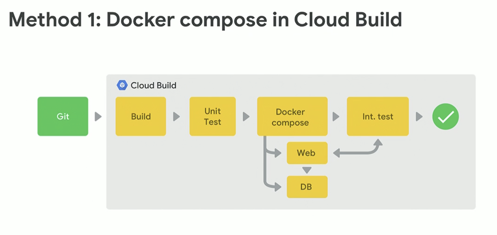
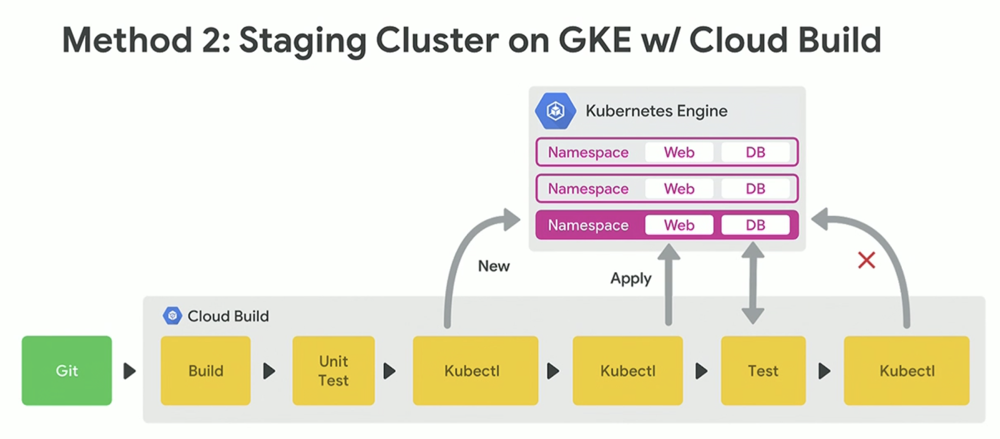
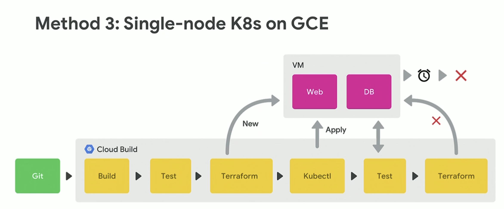
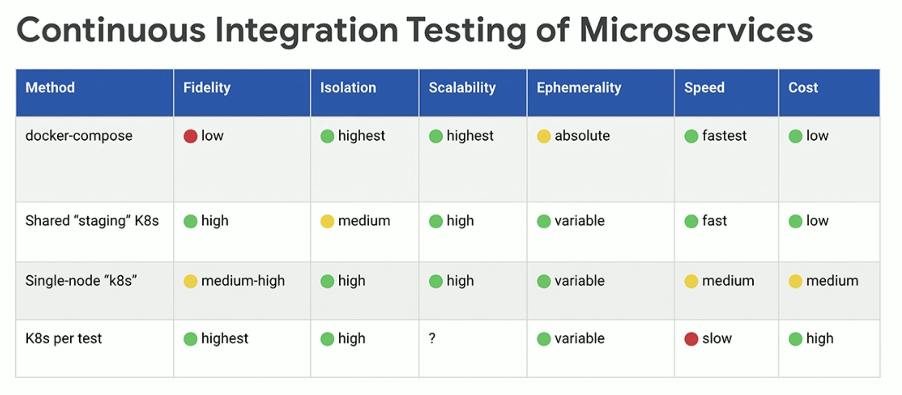

Cloud Build
###########

Shift Left: Continuous Integration Testing with Cloud Build
============================================================

references
----------

* Shift Left: Continuous Integration Testing with Cloud Build (Cloud Next '19)

  * https://www.youtube.com/watch?v=pqCq24aEka4

Testing Hierarchy
-----------------

* Unit Testing
* Integration Testing
* E2E ( End to End ) Testing

Integration Testing Goal
------------------------

1. High Fidelity: How smilar to prod
2. High Isolation
3. High Scalability
4. Appropriate Ephemerality: terminating resources
5. Spped
6. Affordability

Quality Gates
-------------

* Static analysis
* Code Styleguide
* Security Checks
* Linting
* Code Coverage

Build methods
-------------

cloudbuild-integration-testing
------------------------------

* https://github.com/GoogleCloudPlatform/cloudbuild-integration-testing
