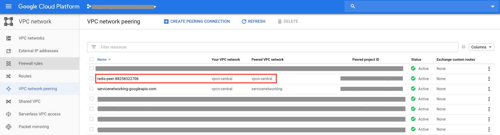
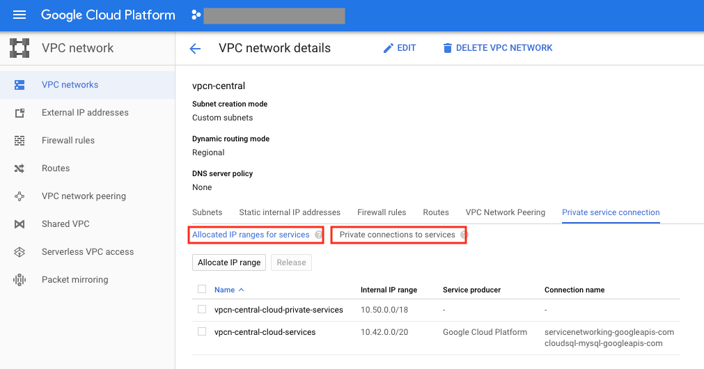

Google Memorystore Network
##########################

ref: https://cloud.google.com/memorystore/docs/redis/networking

Supported two connection modes
==============================

Regardless connection mode, Memorystore instance will use Internal IP AND use /29.

* direct peering
* private service access

Check used connection mode
==========================

.. code-block:: bash

    $ gcloud redis instances describe test-ms --region us-east1
    alternativeLocationId: us-east1-b
    authorizedNetwork: projects/test-project/global/networks/vpcn-central
    connectMode: DIRECT_PEERING
    createTime: '2019-06-04T15:01:25.746673550Z'
    currentLocationId: us-east1-c
    host: 10.41.0.4
    locationId: us-east1-c
    memorySizeGb: 1
    name: projects/test-project/locations/us-east1/instances/test-ms
    persistenceIamIdentity: serviceAccount:882322706-compute@developer.gserviceaccount.com
    port: 6379
    redisVersion: REDIS_4_0
    reservedIpRange: 10.41.0.0/29
    state: READY
    tier: STANDARD_HA

Connection modes
================

direct peering
--------------

* created automatically during instance creation
* requires no additional steps from the user. ( like for private services access, allocating IP range and create connection )
* Other Google Cloud services do not share the peering.
* Memorystore for Redis used the direct peering connection mode before the availability of the private services access connection mode.
* By default, new instances are created using the direct peering connection mode.

private services access
-----------------------

* you MUST first Establish a private services access connection for your VPC network.
* Establishing a private services access connection for a VPC network creates a peering between that `VPC network` and the `Google services network`.
( VPC Network and Google services network is ONE-TO-ONE mapping )
* ref: https://cloud.google.com/memorystore/docs/redis/creating-managing-instances#creating_a_redis_instance_with_a_centralized_ip_address_range

.. code-block:: bash

    $ gcloud redis instances create hell-world --size=1 --region=us-east1 --project=test-project \
        --network=projects/test-project/global/networks/vpcn-central \
        --connect-mode=private_service_access

    $ gcloud redis instances describe hell-world --region us-east1
    authorizedNetwork: projects/test-project/global/networks/vpcn-central
    connectMode: PRIVATE_SERVICE_ACCESS
    createTime: '2020-03-04T23:19:58.907507339Z'
    currentLocationId: us-east1-d
    host: 10.42.0.3
    locationId: us-east1-d
    memorySizeGb: 1
    name: projects/test-project/locations/us-east1/instances/hell-world
    persistenceIamIdentity: serviceAccount:559042557292-compute@developer.gserviceaccount.com
    port: 6379
    redisVersion: REDIS_4_0
    reservedIpRange: 10.42.0.0/29
    state: READY
    tier: BASIC

private services access
=======================

Using private services access enables you to use the following capabilities for your Redis instance:

* Provision a Memorystore for Redis instance in a service project using Shared VPC.
* Centrally manage IP address ranges across multiple Google services. - this can be shared for Google managed service requiring Internal IP ( VPC peering )
* Connect from external sources to your VPC network over a VPN tunnel or Cloud Interconnect to your VPC network.

