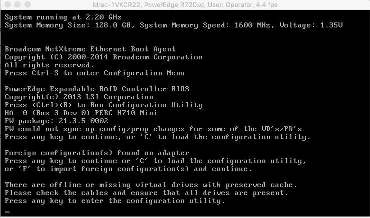
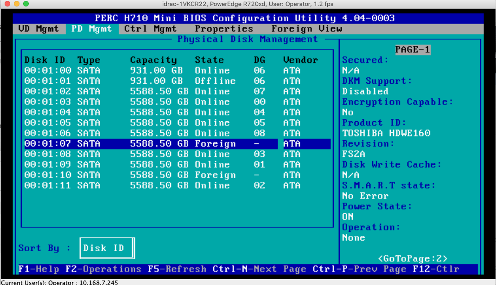
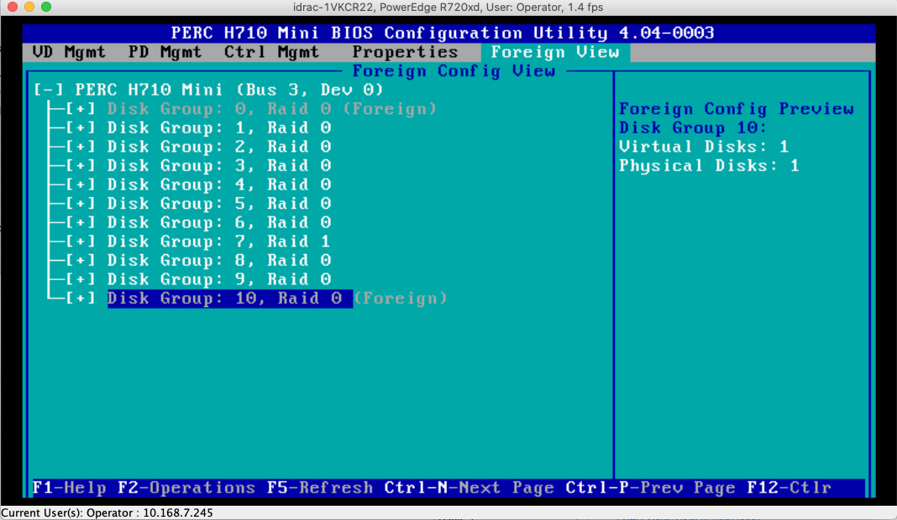
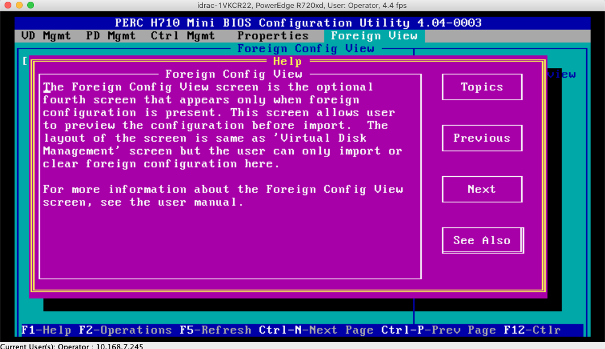

Onprem CentOS6 Disk Issue - Foreign State
#########################################

Context
=======

* One of Hadoop worker(data) had issue with disk.
* CentOS6
* fireformat EXT4

Content in /var/log/messages
----------------------------

.. code-block:: text

    Dec 29 03:23:02 hadoop1-wn2 rsyslogd: [origin software="rsyslogd" swVersion="8.1907.0" x-pid="3515" x-info="https://www.rsyslog.com"] rsyslogd was HUPed
    Dec 29 23:39:05 hadoop1-wn2 kernel: sd 0:2:6:0: [sdg]  Result: hostbyte=DID_BAD_TARGET driverbyte=DRIVER_OK
    Dec 29 23:39:05 hadoop1-wn2 kernel: sd 0:2:6:0: [sdg] CDB: Read(16): 88 00 00 00 00 02 b0 7f 36 00 00 00 02 00 00 00
    Dec 29 23:39:05 hadoop1-wn2 kernel: end_request: I/O error, dev sdg, sector 11551061504
    Dec 29 23:39:05 hadoop1-wn2 kernel: sd 0:2:6:0: [sdg]  Result: hostbyte=DID_BAD_TARGET driverbyte=DRIVER_OK
    Dec 29 23:39:05 hadoop1-wn2 kernel: sd 0:2:6:0: [sdg] CDB: Read(16): 88 00 00 00 00 02 b0 7f 34 00 00 00 02 00 00 00
    Dec 29 23:39:05 hadoop1-wn2 kernel: end_request: I/O error, dev sdg, sector 11551060992
    Dec 29 23:39:05 hadoop1-wn2 kernel: sd 0:2:6:0: [sdg]  Result: hostbyte=DID_BAD_TARGET driverbyte=DRIVER_OK
    Dec 29 23:39:05 hadoop1-wn2 kernel: sd 0:2:6:0: [sdg] CDB: Read(16): 88 00 00 00 00 02 b0 7f 32 00 00 00 02 00 00 00
    Dec 29 23:39:05 hadoop1-wn2 kernel: end_request: I/O error, dev sdg, sector 11551060480
    Dec 29 23:39:05 hadoop1-wn2 kernel: sd 0:2:6:0: [sdg]  Result: hostbyte=DID_BAD_TARGET driverbyte=DRIVER_OK
    Dec 29 23:39:05 hadoop1-wn2 kernel: sd 0:2:6:0: [sdg] CDB: Read(16): 88 00 00 00 00 02 b0 7f 30 00 00 00 02 00 00 00
    Dec 29 23:39:05 hadoop1-wn2 kernel: end_request: I/O error, dev sdg, sector 11551059968
    Dec 29 23:39:05 hadoop1-wn2 kernel: sd 0:2:6:0: [sdg]  Result: hostbyte=DID_BAD_TARGET driverbyte=DRIVER_OK
    Dec 29 23:39:05 hadoop1-wn2 kernel: sd 0:2:6:0: [sdg] CDB: Read(16): 88 00 00 00 00 02 b0 7f 2e 00 00 00 02 00 00 00
    Dec 29 23:39:05 hadoop1-wn2 kernel: end_request: I/O error, dev sdg, sector 11551059456
    Dec 29 23:39:05 hadoop1-wn2 kernel: sd 0:2:6:0: [sdg]  Result: hostbyte=DID_BAD_TARGET driverbyte=DRIVER_OK
    Dec 29 23:39:05 hadoop1-wn2 kernel: sd 0:2:6:0: [sdg] CDB: Read(16): 88 00 00 00 00 02 b0 7f 2c 00 00 00 02 00 00 00
    Dec 29 23:39:05 hadoop1-wn2 kernel: end_request: I/O error, dev sdg, sector 11551058944
    Dec 29 23:39:05 hadoop1-wn2 kernel: sd 0:2:6:0: [sdg]  Result: hostbyte=DID_BAD_TARGET driverbyte=DRIVER_OK
    Dec 29 23:39:05 hadoop1-wn2 kernel: sd 0:2:6:0: [sdg] CDB: Read(16): 88 00 00 00 00 02 b0 7f 2a 00 00 00 02 00 00 00
    Dec 29 23:39:05 hadoop1-wn2 kernel: end_request: I/O error, dev sdg, sector 11551058432
    Dec 29 23:39:05 hadoop1-wn2 kernel: sd 0:2:6:0: [sdg]  Result: hostbyte=DID_BAD_TARGET driverbyte=DRIVER_OK
    Dec 29 23:39:05 hadoop1-wn2 kernel: sd 0:2:6:0: [sdg] CDB: Read(16): 88 00 00 00 00 02 b0 7f 28 00 00 00 02 00 00 00
    Dec 29 23:39:05 hadoop1-wn2 kernel: end_request: I/O error, dev sdg, sector 11551057920
    Dec 29 23:39:05 hadoop1-wn2 kernel: sd 0:2:6:0: [sdg]  Result: hostbyte=DID_BAD_TARGET driverbyte=DRIVER_OK
    Dec 29 23:39:05 hadoop1-wn2 kernel: sd 0:2:6:0: [sdg] CDB: Read(16): 88 00 00 00 00 02 b0 7f 26 00 00 00 02 00 00 00
    Dec 29 23:39:05 hadoop1-wn2 kernel: end_request: I/O error, dev sdg, sector 11551057408
    Dec 29 23:39:05 hadoop1-wn2 kernel: megaraid_sas 0000:03:00.0: scanning for scsi0...
    Dec 29 23:39:07 hadoop1-wn2 kernel: JBD2: Detected IO errors while flushing file data on sdg1-8
    Dec 29 23:39:07 hadoop1-wn2 kernel: Aborting journal on device sdg1-8.
    Dec 29 23:39:07 hadoop1-wn2 kernel: JBD2: I/O error detected when updating journal superblock for sdg1-8.
    Dec 29 23:39:07 hadoop1-wn2 kernel: journal commit I/O error
    Dec 29 23:39:07 hadoop1-wn2 kernel: EXT4-fs error (device sdg1): ext4_journal_start_sb: Detected aborted journal
    Dec 29 23:39:07 hadoop1-wn2 kernel: EXT4-fs (sdg1): Remounting filesystem read-only
    Dec 29 23:39:13 hadoop1-wn2 kernel: EXT4-fs error (device sdg1): __ext4_get_inode_loc: unable to read inode block - inode=105436352, block=421530987
    Dec 29 23:39:13 hadoop1-wn2 kernel: EXT4-fs error (device sdg1): __ext4_get_inode_loc: unable to read inode block - inode=105436352, block=421530987
    Dec 29 23:39:14 hadoop1-wn2 kernel: EXT4-fs error (device sdg1): __ext4_get_inode_loc: unable to read inode block - inode=105436352, block=421530987
    Dec 29 23:39:15 hadoop1-wn2 kernel: EXT4-fs error (device sdg1): __ext4_get_inode_loc: unable to read inode block - inode=96543132, block=385880633
    Dec 29 23:39:15 hadoop1-wn2 kernel: EXT4-fs error (device sdg1): __ext4_get_inode_loc: unable to read inode block - inode=96543132, block=385880633
    Dec 29 23:39:15 hadoop1-wn2 kernel: EXT4-fs error (device sdg1): __ext4_get_inode_loc: unable to read inode block - inode=96543132, block=385880633
    Dec 29 23:39:15 hadoop1-wn2 kernel: EXT4-fs error (device sdg1): __ext4_get_inode_loc: unable to read inode block - inode=96543134, block=385880633
    Dec 29 23:39:15 hadoop1-wn2 kernel: EXT4-fs error (device sdg1): __ext4_get_inode_loc: unable to read inode block - inode=96543134, block=385880633
    Dec 29 23:39:15 hadoop1-wn2 kernel: EXT4-fs error (device sdg1): __ext4_get_inode_loc: unable to read inode block - inode=96543134, block=385880633
    Dec 29 23:39:15 hadoop1-wn2 kernel: EXT4-fs error (device sdg1): __ext4_get_inode_loc: unable to read inode block - inode=102410673, block=409471675
    Dec 29 23:39:15 hadoop1-wn2 kernel: EXT4-fs error (device sdg1): __ext4_get_inode_loc: unable to read inode block - inode=102410673, block=409471675
    Dec 29 23:39:15 hadoop1-wn2 kernel: EXT4-fs error (device sdg1): __ext4_get_inode_loc: unable to read inode block - inode=102410673, block=409471675
    Dec 29 23:39:15 hadoop1-wn2 kernel: EXT4-fs error (device sdg1): __ext4_get_inode_loc: unable to read inode block - inode=102410675, block=409471675
    Dec 29 23:39:15 hadoop1-wn2 kernel: EXT4-fs error (device sdg1): __ext4_get_inode_loc: unable to read inode block - inode=102410675, block=409471675
    Dec 29 23:39:15 hadoop1-wn2 kernel: EXT4-fs error (device sdg1): __ext4_get_inode_loc: unable to read inode block - inode=102410675, block=409471675
    Dec 29 23:39:15 hadoop1-wn2 kernel: EXT4-fs error (device sdg1): __ext4_get_inode_loc: unable to read inode block - inode=102410683, block=409471675
    Dec 29 23:39:15 hadoop1-wn2 kernel: EXT4-fs error (device sdg1): __ext4_get_inode_loc: unable to read inode block - inode=102410683, block=409471675
    Dec 29 23:39:15 hadoop1-wn2 kernel: EXT4-fs error (device sdg1): __ext4_get_inode_loc: unable to read inode block - inode=102410683, block=409471675
    Dec 29 23:39:15 hadoop1-wn2 kernel: EXT4-fs error (device sdg1): __ext4_get_inode_loc: unable to read inode block - inode=102410685, block=409471675
    Dec 29 23:39:15 hadoop1-wn2 kernel: EXT4-fs error (device sdg1): __ext4_get_inode_loc: unable to read inode block - inode=102410685, block=409471675
    Dec 29 23:39:15 hadoop1-wn2 kernel: EXT4-fs error (device sdg1): __ext4_get_inode_loc: unable to read inode block - inode=102410685, block=409471675
    Dec 29 23:39:15 hadoop1-wn2 kernel: EXT4-fs error (device sdg1): __ext4_get_inode_loc: unable to read inode block - inode=102410687, block=409471675
    Dec 29 23:39:15 hadoop1-wn2 kernel: EXT4-fs error (device sdg1): __ext4_get_inode_loc: unable to read inode block - inode=102410687, block=409471675
    Dec 29 23:39:15 hadoop1-wn2 kernel: EXT4-fs error (device sdg1): __ext4_get_inode_loc: unable to read inode block - inode=102410687, block=409471675
    Dec 29 23:39:15 hadoop1-wn2 kernel: EXT4-fs error (device sdg1): __ext4_get_inode_loc: unable to read inode block - inode=102410679, block=409471675
    Dec 29 23:39:15 hadoop1-wn2 kernel: EXT4-fs error (device sdg1): __ext4_get_inode_loc: unable to read inode block - inode=102410679, block=409471675
    Dec 29 23:39:15 hadoop1-wn2 kernel: EXT4-fs error (device sdg1): __ext4_get_inode_loc: unable to read inode block - inode=102410679, block=409471675
    Dec 29 23:39:16 hadoop1-wn2 kernel: megaraid_sas 0000:03:00.0: 10286 (631006687s/0x0001/FATAL) - VD 06/4 is now OFFLINE
    Dec 29 23:39:16 hadoop1-wn2 kernel: EXT4-fs error (device sdg1): ext4_find_entry: reading directory #75366409 offset 0
    Dec 29 23:39:17 hadoop1-wn2 kernel: EXT4-fs error (device sdg1): ext4_find_entry: reading directory #75366410 offset 0
    Dec 30 03:32:45 hadoop1-wn2 kernel: EXT4-fs error (device sdg1): ext4_find_entry: reading directory #2 offset 0
    Dec 30 03:32:48 hadoop1-wn2 kernel: EXT4-fs error (device sdg1): ext4_find_entry: reading directory #2 offset 0

Reocovering Process
===================

1. Reboot machine
-----------------

* rebooted machine from CLI, but the machine didn't come to normal. Not reachable through SSH

2. Reached out to Machine through iDRAC
---------------------------------------

System was stuck. By clicking any key, I could enter configuratino view.

3. Importing foreign state disks
--------------------------------

* Go to `Foreign View` Tab
* Select the root of tree ( PERC H710 Mini )
* F2 key
* import foreign state configuration

4. Rebooting machines
---------------------

* rebooting machine and check if disks are back.
